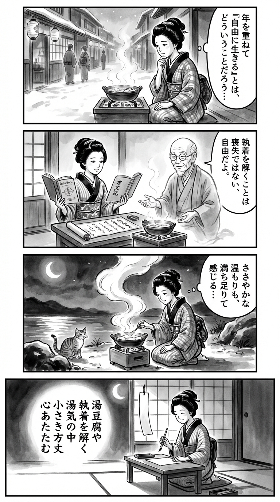

> **Language**: [日本語](../ja/70歳、これからは湯豆腐――私の方丈記_review.html) | [English](../en/70歳、これからは湯豆腐――私の方丈記_review.html) | [繁體中文](../zh-tw/70歳、これからは湯豆腐――私の方丈記_review.html)
>
> [← Top / トップページ](../../)

## 📖 Book Information
- **Title**: 70歳、これからは湯豆腐――私の方丈記  
- **Author**: 太田和彦  
- **ASIN**: B08VRCPSQM  
- **URL**: [https://www.amazon.co.jp/dp/B08VRCPSQM](https://www.amazon.co.jp/dp/B08VRCPSQM)  

---

<picture>
  <source srcset="../../images/reviews/70歳、これからは湯豆腐――私の方丈記_4panel.webp" type="image/webp">
  
</picture>

## Dialogue

### Panel 1
**Scene**: In a quiet Edo backstreet, a townsgirl sits by a brazier, watching steam rise from a pot of tofu. She contemplates the meaning of "living freely" as she grows older, with the winter air crisp outside and faintly glowing lanterns. Her eyes reflect warmth and unease, sensing a deeper truth in simplicity.
**Dialogue**: "What does it mean to live freely as I grow older?"

### Panel 2
**Scene**: In her modest study nook, the townsgirl opens a new Dutch book and an old Japanese essay scroll titled “方丈記”. A wise older man, imagined as the spirit of Ota Kazuhiko, appears beside her, explaining that "letting go is not loss, but freedom" while gesturing toward the brazier. The contrast between youth and serene age is emphasized through ink shading.
**Dialogue**: "Letting go is not loss, but freedom."

### Panel 3
**Scene**: Inspired, the townsgirl carries a small iron pot to the riverside, preparing yudofu under the cold moon. She smiles as steam rises like drifting thoughts, realizing that even modest warmth can feel abundant. A curious cat watches her. The swirling steam is depicted in dynamic brushstrokes.
**Dialogue**: "Even this simple warmth feels like abundance."

### Panel 4
**Scene**: Back in her room, she kneels before her writing desk, brush poised, illuminated by serene moonlight filtering through a paper shoji. She writes a waka on a hanging tanzaku, her expression calm and fulfilled.
**Dialogue**: [No dialogue]
**Tanka (translation)**: "Yudofu,  
Releasing attachments  
In the steam,  
A small abode,  
My heart warms."
**Tanka (original)**: 湯豆腐や  
執着を解く  
湯気の中  
小さき方丈  
心あたたむ

## 🎯 The Core of This Book
This book is an essay by the author, 太田和彦, reflecting on his 70th birthday, portraying aging not as an "end" but as a "beginning of freedom." He quietly yet firmly affirms life after being liberated from societal roles and obligations.  

Using the concept of "方丈," a small space, he explores the idea of an independent old age throughout the book. Through izakayas, travel, and cultural activities, he presents a perspective that views aging not as "diminishment" but as "deepening."  

His writing, which cherishes a simple and rich daily life akin to yudofu (tofu hot pot), offers readers weary from the clamor of modern society hints to regain inner peace.

---

## 💡 Key Insights
- **"Giving up" is the beginning of freedom**  
  The paradox at the heart of this book is that letting go of desires can lighten the heart. Accepting aging is a release from attachment and an opportunity to reassess the essence of life.  

- **The meaning of having a "方丈"**  
  Following the example of 鴨長明's "方丈記," the author advocates for having a personal small space. This is not just a room but a symbol of mental independence and quiet happiness.  

- **The aesthetics of "落魄" (rakuhaku)**  
  Even after losing social status or titles, there is depth in savoring those experiences without fear. The author's philosophy is supported by the attitude of accepting aging as "completion" rather than "decline."  

- **Character is the true measure of maturity**  
  The author argues that respect comes not from knowledge or status but from "character." As one ages, compassion and sincerity towards others define a person's value.  

- **The courage to "not do what you dislike"**  
  Old age is a time to live by choice rather than obligation. Living honestly according to one's heart and without strain leads to true happiness.

---

## 🔍 Relevance to Contemporary Context
As Japan advances into one of the world's leading super-aged societies, the themes of this book take on increasingly realistic significance. Since the COVID-19 pandemic, interest in minimalism and "quiet living" has grown, with simple lifestyles like yudofu being reevaluated as symbols of new richness.  

While issues like "lonely deaths" and "anxiety about old age" have become social problems, the ideal of a "方丈-like old age" that allows one to live at their own pace is emerging. The author's proposals shine a new light on the image of modern elderly people, encouraging them to embrace solitude and transform it into creative time.  

This book quietly presents the "richness of living with less" to all generations weary of consumer society's values.

---

## 🚀 Practical Suggestions
1. **Create your own "方丈"**  
   Securing a small room nearby or making a favorite café your personal space can bring mental stability.  

2. **Practice getting used to "alone time"**  
   Spending time alone in izakayas or parks can help cultivate an independent spirit without fear of solitude.  

3. **Dress well and find ways to appear intellectually appealing**  
   Rather than trying to look younger, focusing on clean and calm attire can be key to revealing mature charm.  

4. **Have a rule of "not doing what you dislike"**  
   Reassess the parts of your relationships and habits that feel forced. Prioritizing choices that feel comfortable can significantly enhance daily satisfaction.  

5. **Adopt a perspective that enjoys "落魄"**  
   Even after letting go of social success, there is freedom in that. Cultivating a mindset to enjoy life after shedding titles can enrich the experience of aging.

---

## ⭐ Overall Evaluation
『70歳、これからは湯豆腐――私の方丈記』 is a philosophical book that affirms aging not with fear but as a completion of life. 太田和彦's writing is light yet imbued with philosophical depth.  

This book resonates not only with those struggling with life after retirement but also with younger generations overwhelmed by daily busyness. It teaches the paradox that life can be enriched not by what we possess, but by what we let go of, all conveyed through a quiet pen.  

Like yudofu, it is warm, rich in flavor, and accompanied by a hint of solitude. It is a book for those who wish to savor the "taste of aging."

---

&copy; shioki | [CC BY-NC-SA 4.0](https://creativecommons.org/licenses/by-nc-sa/4.0/)
