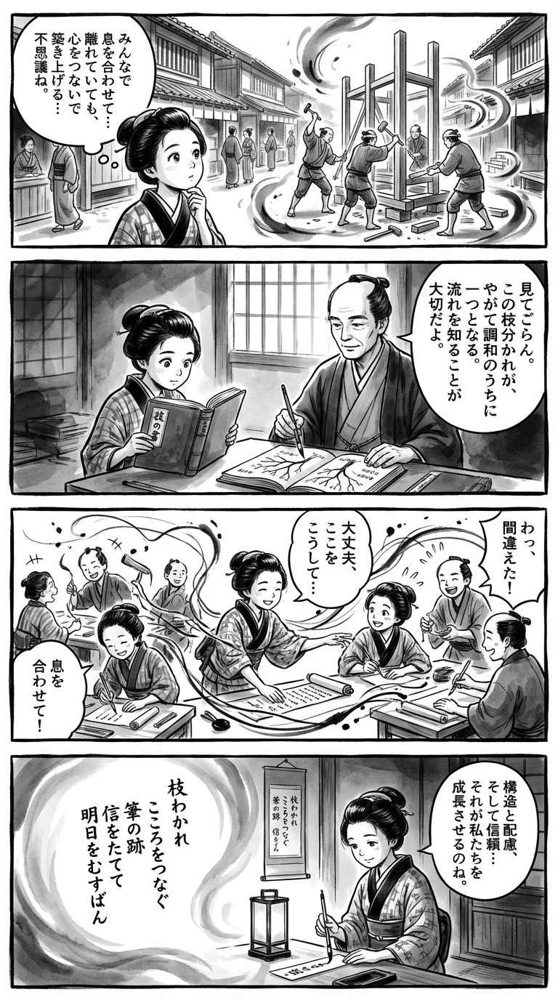

---
---
> **Language**: [日本語](../ja/GitHub実践入門　チーム開発を成功に導くためのブランチ戦略とコードレビュー 技術の泉シリーズ_review.html) | [English](../en/GitHub実践入門　チーム開発を成功に導くためのブランチ戦略とコードレビュー 技術の泉シリーズ_review.html) | [繁體中文](../zh-tw/GitHub実践入門　チーム開発を成功に導くためのブランチ戦略とコードレビュー 技術の泉シリーズ_review.html)
>
> [← Top / トップページ](../../)

## 📖 Book Information
- **Title**: GitHub実践入門　チーム開発を成功に導くためのブランチ戦略とコードレビュー 技術の泉シリーズ  
- **Author**: 大宮 薫  
- **ASIN**: B0GH73DZ2M  
- **URL**: [https://www.amazon.co.jp/dp/B0GH73DZ2M](https://www.amazon.co.jp/dp/B0GH73DZ2M)  

---

## Dialogue

### Panel 1
**Scene**: On a lively Edo street lined with wooden shops, the young townsgirl in a kimono watches a group of carpenters working in rhythm. Each swing of their tools seems to echo one another, and she wonders how people can “build together” even while working apart. The air hums with quiet cooperation, expressed through swirling sumi ink lines.  
**Dialogue**: *“Even when apart, their hands move as one…”*

### Panel 2
**Scene**: Inside a dimly lit temple school, she studies a thick Dutch-bound book titled “The Book of Skill.” Beside her appears the imagined figure of a wise scholar — calm-eyed, hair tied back, dressed in simple robes. He points to a tree-like diagram of branching lines, explaining how each branch flows toward harmony. The scene radiates mentorship and discovery.  
**Dialogue**: *“Each branch finds its way back to the trunk — unity through structure.”*

### Panel 3
**Scene**: In a bustling communal workshop, the townsgirl leads her friends as they copy and weave scrolls together, each taking a “branch” of the task. Ink splashes and laughter fill the air as she gently corrects a friend’s mistake. The intertwining lines of ink and thread symbolize teamwork and shared creation.  
**Dialogue**: *“Let’s connect our efforts — one brushstroke at a time!”*

### Panel 4
**Scene**: Evening falls. By the soft glow of a lantern, she sits before the completed scroll hanging neatly on the wall. With calm focus, she writes a waka on a slender tanzaku, capturing the spirit of harmony, trust, and growth through shared craft. The atmosphere is serene, the ink gradients fading gently into quiet satisfaction.  
**Dialogue**: *“May our joined hearts shape tomorrow.”*  
**Tanka (translation)**:  
Branches divide, yet hearts remain entwined —  
Traces of the brush  
Build trust anew,  
Binding tomorrow  
Through care and creation.  
**Tanka (original)**:  
枝わかれ　こころをつなぐ　筆の跡  
　信をたてて　明日をむすばん

## 🎯 Core of the Book
This book approaches GitHub not merely as a code-sharing tool, but as a *space for cultivating team development culture*. Aimed at readers transitioning from solo to team development, it systematically explains practical methods that support collaboration—branch strategies, code reviews, CI/CD automation, and more.  

Author Kaoru Omiya goes beyond technical know-how, delving into topics such as psychological safety and communication quality within teams. Through principles of GitHub Flow and real examples of managing Organizations, the book conveys the philosophy that “rules are not constraints, but signposts that guide teams forward.”  

As a result, this is not just a “how-to manual” for GitHub operations, but a *blueprint for designing a team culture that balances trust and efficiency*. Readers will come away not only knowing how to use the tool, but also understanding how to think and act as a productive team.  

---

## 💡 Key Insights
- **Code is a team asset, and reviews are part of the culture**  
  The book frames code reviews not as “quality control,” but as a “growth engine” for the team. By expressing feedback as suggestions or questions, it fosters constructive dialogue while maintaining psychological safety.  

- **A good commit message is a gift to the future**  
  Commit messages are described as an act of kindness toward your future self and teammates. When revisiting history, those words become the foundation for shared knowledge and trust.  

- **Maintaining a clean repository is an act of consideration**  
  Using the metaphor “you wouldn’t invite guests into a messy room,” the author emphasizes that technical tidiness reflects human thoughtfulness. A well-organized environment enhances both trust and efficiency.  

- **Security resides in the history, too**  
  The book warns against including sensitive information in past commits and highlights the importance of managing repository history carefully. It advocates leveraging GitHub’s security features to build protection at the historical level.  

- **Automation protects the team’s focus**  
  By using GitHub Actions to automate testing and deployment, teams can focus their energy on creative work. Automation is presented not only as a means of efficiency, but as a foundation for reliability.  

---

## 🔍 Connection to the Modern Context
Since 2024, many Japanese IT companies have embraced the trend of publishing “recruitment pitch decks,” openly sharing their development environments and team cultures. Increasingly, companies disclose their use of GitHub and CI/CD tools, making development transparency a key factor in recruitment competitiveness.  

This trend underscores the importance of what the book advocates—well-structured repositories, clear branch strategies, and healthy review cultures. In an era where the quality of team development directly reflects a company’s credibility and appeal, the practices in this book form the foundation of organizational branding.  

Moreover, as remote and distributed teams become the norm, a “visible development culture” centered on GitHub has become essential for maintaining team cohesion. This book meets that need, serving as a practical guide that supports both the cultural and technical aspects of modern teamwork.  

---

## 🚀 Practical Recommendations
Before welcoming a new team member, tidy up your repository and refine your README and `.gitignore` files. This is not just preparation—it’s a gesture of respect toward your team.  

Next, adopt an issue-driven branching workflow and prohibit direct commits to the main branch. This naturally builds traceability and quality assurance into your process.  

In code reviews, focus on offering “suggestions” and “questions,” engaging in dialogue that respects the other person’s intent. This approach fosters psychological safety and unlocks the team’s collective creativity.  

Finally, use GitHub Actions to automate testing, deployment, and security scans. Reducing manual checks allows your team to concentrate on high-value development work—putting the spirit of this book into practice.  

---

## ⭐ Overall Evaluation
*GitHub実践入門* is more than a technical manual—it’s a *textbook on team culture*. It not only teaches how to use GitHub, but also how to build trust and maintain quality as a team.  

The sections on review culture and psychological safety are particularly valuable for leaders seeking to elevate their engineering organizations. Warm, practical, and insightful, this book is an excellent companion for individual developers aspiring to grow into effective team contributors.

---

&copy; shioki | [CC BY-NC-SA 4.0](https://creativecommons.org/licenses/by-nc-sa/4.0/)
