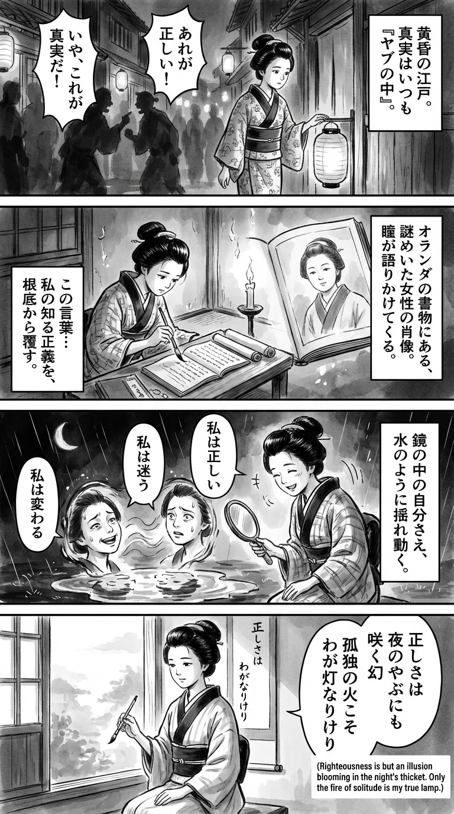

> **Language**: [日本語](../ja/YABUNONAKAーヤブノナカー_review.html) | [English](../en/YABUNONAKAーヤブノナカー_review.html) | [繁體中文](../zh-tw/YABUNONAKAーヤブノナカー_review.html)
>
> [← Top / トップページ](../../)

## 📖 Book Information
- **Title**: YABUNONAKAーヤブノナカー  
- **Author**: 金原 ひとみ  
- **ASIN**: B0F3J33DHL  
- **URL**: [https://www.amazon.co.jp/dp/B0F3J33DHL](https://www.amazon.co.jp/dp/B0F3J33DHL)  

---

<picture>
  <source srcset="../../images/reviews/YABUNONAKAーヤブノナカー_4panel.webp" type="image/webp">
  
</picture>

## Dialogue

### Panel 1
**Scene**: The townsgirl walks through an Edo backstreet at dusk, pausing beside a paper-lantern-lit alley, her expression thoughtful as she observes shadows of people arguing about what is “right.” In the background, merchants whisper conflicting rumors, symbolizing the confusion of “truth in the thicket.”
**Dialogue**: None

### Panel 2
**Scene**: In her small study, illuminated by candlelight, the townsgirl studies a Dutch text and a strange new manuscript. A portrait within the book shows a calm woman with a soft round face and serene eyes, resembling the imagined likeness of author Hitomi Kanehara. The portrait seems to gaze back at her, its expression both cold and tender.
**Dialogue**: None

### Panel 3
**Scene**: The townsgirl steps outside into the night rain, holding a mirror up to her reflection in a puddle. The reflection splits into several faces, each whispering different “truths.” She laughs gently, realizing that her own sense of justice shifts like water.
**Dialogue**: None

### Panel 4
**Scene**: At dawn, the townsgirl sits by her window with a brush in hand, composing a waka on a hanging scroll. The soft morning light illuminates her calm face as she writes.
**Dialogue**: None
**Tanka (translation)**: Justice blooms even in the thicket of night; the fire of solitude is my guiding light.
**Tanka (original)**: 正しさは  
夜のやぶにも  
咲く幻  
孤独の火こそ  
わが灯なりけり

## 🎯 The Core of This Book
『YABUNONAKAーヤブノナカー』 is a multi-perspective narrative that depicts the distortions of contemporary society, such as aging, sexuality, power, capitalism, and gender. Hitomi Kanbara scrutinizes the uncertainty of "being alive" through the physical decline and sexual exploitation of the characters, as well as the wavering of ethics.

At the heart of this work lies the awareness of how social ideals like "correctness" and "solidarity" are, in reality, fragile and at times violent. The cold gaze that perceives humans as beings who wish to connect with others yet ultimately burn out in solitude runs throughout the entire narrative.

---

## 💡 Key Insights
- **Aging is not an "end," but a continuous loss**  
  Aging is portrayed not as a linear path to death, but as a gradual process of diminishing self. The awareness of death while still alive resonates deeply with the modern sense of ennui and nihilism, evoking profound empathy in readers.

- **Sex is the language of domination**  
  Sexual acts are presented not as pleasure but as exposure of power structures. By depicting the reality of sex functioning as a means of violence and control, the book visualizes the structural violence lurking within society.

- **"Correctness" changes with the times**  
  There are no absolute ethics or justice; rather, the flexibility to adapt to the "correct answers" of each era is shown to be a survival strategy. This insight strikes at the extreme of relativism in contemporary society.

- **Solidarity is an illusion, and can only burn in solitude**  
  The difficulty of living with others is confronted, illustrating how humans can only maintain their selves in isolation. Recognizing the limits of empathy is suggested as a more honest way of living.

- **Liberation from "should" is true freedom**  
  Being bound by societal norms and moral "shoulds" undermines individual existence. Living without imposing one's choices on others is presented as the only form of freedom.

---

## 🔍 Relevance to Contemporary Context
The themes of this book resonate deeply with the #MeToo movement and the divisions within social media society. In a modern context where anonymous accusations and battles over "correctness" continue on social media, Kanbara uses the metaphor of "in the thicket" to depict a reality where truths become multiple, and anyone can be both a perpetrator and a victim.

Moreover, the network of empathy expanded by social media simultaneously creates structures of misunderstanding and disconnection. Kanbara's writing, while upholding the ideal of solidarity, exposes its impracticality, marking a literary achievement in the post-#MeToo era.

---

## 🚀 Practical Suggestions
1. **Have the courage to question "correctness"**  
   It is important to distance oneself from the impulse to condemn others, based on the premise that ethical standards change over time. A flexible perspective can prevent rigid thinking.

2. **Live by "choice," not "should"**  
   Choosing actions based on one's beliefs rather than conforming to societal expectations brings about mental freedom.

3. **Receive others' pain through "imagination"**  
   Acknowledging the reality where empathy does not reach, and thinking from the perspective of others with imagination is the first step toward building a mature society.

4. **Observe aging and loss**  
   Rather than fearing aging, adopting a perspective that accepts it as change can help reclaim the reality of life.

5. **Use solitude as a source of creativity**  
   Rather than viewing solitude as a defect, positively embracing it as a starting point for reflection and creation can deepen self-understanding.

---

## ⭐ Overall Evaluation
『YABUNONAKAーヤブノナカー』 is a work that coldly and poetically depicts issues of ethics, sexuality, capital, and loneliness in contemporary society. Hitomi Kanbara exposes the violence lurking behind the "correctness" and "solidarity" of the times, challenging readers with the fundamental question of "what it means to be alive."

This work resonates particularly with readers fatigued by the chaos of the social media era. In a modern world where everyone is "in the thicket," it serves as a sharp and sincere piece of literature that encourages reflection on one's position and the pain of others.

---

&copy; shioki | [CC BY-NC-SA 4.0](https://creativecommons.org/licenses/by-nc-sa/4.0/)
