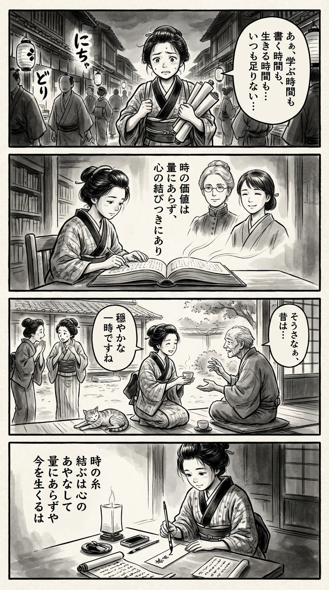

---
---
> **Language**: [日本語](../ja/「人生が充実する」時間のつかい方 UCLAのMBA教授が教える“いつも時間に追われる自分”をやめるメソッド_review.html) | [English](../en/「人生が充実する」時間のつかい方 UCLAのMBA教授が教える“いつも時間に追われる自分”をやめるメソッド_review.html) | [繁體中文](../zh-tw/「人生が充実する」時間のつかい方 UCLAのMBA教授が教える“いつも時間に追われる自分”をやめるメソッド_review.html)
>
> [← Top / トップページ](../../)

## 📖 Book Information
- **Title**: 「人生が充実する」時間のつかい方 UCLAのMBA教授が教える“いつも時間に追われる自分”をやめるメソッド  
- **Authors**: キャシー・ホームズ and 松丸 さとみ  
- **ASIN**: B0CF2CM3QX  
- **URL**: [https://www.amazon.co.jp/dp/B0CF2CM3QX](https://www.amazon.co.jp/dp/B0CF2CM3QX)  

---

## Dialogue

### Panel 1
**Scene**: On a lively Edo street at dusk, the young townsgirl hurries along clutching her study scrolls. The glow of lanterns flickers across her face, revealing her worry about the fleeting hours. She feels torn between her love for learning, writing, and simply living.  
**Dialogue**: “There’s never enough time… to study, to write, to live.”

### Panel 2
**Scene**: In the quiet of a temple library, she opens a newly imported book on “the art of spending time meaningfully.” From the pages, two gentle spirits seem to emerge — a calm foreign scholar with round spectacles and a serene Japanese woman with tied-back hair. They speak as if from the text itself, teaching that the worth of time lies not in its quantity, but in its meaning and connection.  
**Dialogue**: “Time’s value is not in how much you have, but in how deeply you live it.”

### Panel 3
**Scene**: Closing the book, she steps outside into the afternoon light. When invited to idle chatter, she politely declines and instead joins an elderly neighbor for tea. Listening to his stories, she smiles softly as a cat stretches nearby. The world seems to slow — a quiet moment of shared warmth.  
**Dialogue**: “Tell me more about the old days… I’d like to hear.”

### Panel 4
**Scene**: That evening, beneath the soft glow of a paper lamp, she writes a waka poem on a slender tanzaku strip. Her brush moves with calm grace, capturing the day’s reflection on time and heart.  
**Dialogue**: (none)  
**Tanka (translation)**:  
“The threads of time are woven by the heart’s own pattern —  
Not by measure, but by how we live this moment.”  
**Tanka (original)**:  
「時の糸　結ぶは心の　あやなして  
　量にあらずや　今を生くるは」

## 🎯 Core Message
This book tackles the fundamental anxiety of modern people who feel they “never have enough time,” drawing on insights from psychology and behavioral science. Author キャシー・ホームズ argues that it’s not the *quantity* of time but its *quality* that determines happiness, and she offers a framework for redesigning how we use our time.  

Rather than a simple guide to time management, the book takes a philosophical approach—encouraging readers to “invest their time in alignment with their values.” It provides a scientific yet practical answer to the question of how to live meaningfully within the limited time we have.  

---

## 💡 Key Insights
- **More time doesn’t guarantee happiness**  
  Having too little or too much free time both reduce happiness. What matters is how much of our time is spent on “personally meaningful activities.” Quality, not quantity, is what determines well-being.  

- **Happiness is built through intentional action**  
  Happiness is not accidental—it’s created through daily choices and behaviors. Reducing social media use, being kind to others, and incorporating exercise can all change how we experience time and increase our sense of happiness.  

- **Focusing on the present is the key to happiness**  
  Happiness depends less on *what* we’re doing and more on *how present* we are while doing it. Practices like mindfulness and meditation help train our attention to return to the present moment, enriching our sense of time.  

- **Relationships are the best investment of time**  
  The strongest predictor of a happy life isn’t wealth or status but meaningful relationships. Spending time with loved ones yields the highest “return on time investment.”  

- **Awareness of life’s finiteness creates fulfillment**  
  Recognizing that time is limited clarifies what truly deserves our attention. Awareness of mortality can deepen our appreciation of the present moment.  

---

## 🔍 Relevance in Today’s Context
In today’s world, technology has made it possible to work anytime, anywhere—yet many feel more pressed for time than ever. Professor ホームズ’s finding that “two to five hours of free time per day maximizes happiness” offers crucial guidance for those struggling with overwork and work-life balance.  

As remote work and side jobs blur the boundaries between personal and professional life, *how we use our time* increasingly defines *how we live our lives*. This book goes beyond efficiency—it proposes time management as a form of life design, making it deeply relevant to our era.  

---

## 🚀 Practical Applications
1. **Visualize your current time use with a “time-tracking exercise”**  
   Record how you spend your time and how each activity makes you feel. This helps reveal unconscious time drains and serves as the first step toward reallocating your time more intentionally.  

2. **Design your ideal week through “time crafting”**  
   Consciously balance work, joy, and downtime so that your schedule becomes an expression of your values. The focus should be on meaning, not mere efficiency.  

3. **Use a “purpose and happiness filter” to say no**  
   Ask yourself, “Would I still agree to this if it were happening today?” This question helps eliminate unnecessary tasks and allows you to focus on what truly matters.  

4. **Turn daily routines into rituals to prevent hedonic adaptation**  
   Give names or special meaning to everyday moments—like meals or walks—to make them feel special and sustain your sense of happiness.  

---

## ⭐ Overall Evaluation
『「人生が充実する」時間のつかい方』 is a compelling invitation for busy modern readers to *redefine their relationship with time*. Blending scientific evidence with practical methods, it transcends the boundaries of typical self-help books.  

Its central message—that enhancing the *quality* of time is the key to happiness—will particularly resonate with professionals focused on productivity and achievement. Reading it not only helps reclaim your time but also prompts a deeper reflection on the fundamental question: *How do I truly want to live my life?*

---

&copy; shioki | [CC BY-NC-SA 4.0](https://creativecommons.org/licenses/by-nc-sa/4.0/)
