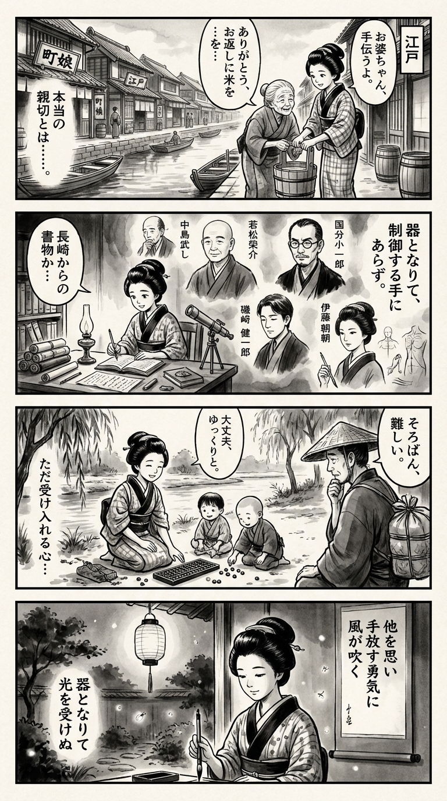

> **Language**: [日本語](../ja/「利他」とは何か_review.html) | [English](../en/「利他」とは何か_review.html) | [繁體中文](../zh-tw/「利他」とは何か_review.html)
>
> [← Top / トップページ](../../)

## 📖 Book Information
- **Title**: 「利他」とは何か  
- **Authors**: 中島岳志, 若松英輔, 國分功一郎, 磯崎憲一郎, and 伊藤亜紗  
- **ASIN**: B08ZXRWM36  
- **URL**: [https://www.amazon.co.jp/dp/B08ZXRWM36](https://www.amazon.co.jp/dp/B08ZXRWM36)  

---

<picture>
  <source srcset="../../images/reviews/「利他」とは何か_4panel.webp" type="image/webp">
  
</picture>

## Dialogue

### Panel 1
**Scene**: In the lively streets of Edo, the townsgirl assists an elderly neighbor in carrying a heavy bucket of water. The neighbor offers to repay her with rice, but she hesitates, contemplating whether true kindness should come without expectations. The background features traditional wooden houses, merchant signs, and a serene canal reflecting the sky.
**Dialogue**: "Is kindness truly kind if it expects something in return?"

### Panel 2
**Scene**: In her cozy study illuminated by lamplight, the townsgirl reads a newly arrived manuscript from Nagasaki. The manuscript depicts a discussion among five scholars, each represented by wise portraits: a thoughtful man (Nakajima Takeshi), a gentle monk (Wakamatsu Eisuke), a sharp-eyed philosopher (Kokubun Koichiro), a quiet literary figure (Isozaki Kenichiro), and a radiant woman (Ito Asa). Their imagined dialogue conveys the idea of being a vessel rather than the controlling hand.
**Dialogue**: "To be a vessel, not the hand that controls."

### Panel 3
**Scene**: The following morning, the townsgirl sits by a riverside, teaching children how to use an abacus. When one child spills the beads, she smiles and allows them to roll into the sunlight. A nearby merchant observes her calm demeanor and appears quietly moved. The composition features flowing diagonals, with the scattered beads sparkling like ripples of thought.
**Dialogue**: "It's okay, let them roll."

### Panel 4
**Scene**: In the evening, the townsgirl writes a waka on a hanging scroll while fireflies dance through the garden. Her face radiates gentle understanding as she expresses the essence of true altruism—born from openness rather than control.
**Dialogue**: "True altruism is a vessel, open to light."
**Tanka (translation)**: Thinking of others,  
the courage to let go,  
the wind begins to blow—  
becoming a vessel,  
receiving the light.  
**Tanka (original)**: 他を思い  
手放す勇気に  
風が吹く  
うつわとなりて  
光を受けぬ

## 🎯 The Core of This Book
『「利他」とは何か』 goes beyond the simple definition of altruism as "doing something for others" and reconstructs the concept of altruism as "events arising in the space between self and others." The authors traverse philosophy, religion, literature, and art to depict altruism not as an "intentional act" but as a "generative phenomenon born from relationships."

The uniqueness of this book lies in its exploration of how altruism emerges beyond human will and agency through concepts such as empathy, reason, gift-giving, and other-power. In particular, the metaphor of "becoming a vessel" presents a new ethical perspective that true altruism lies in the attitude of accepting others without domination.

---

## 💡 Key Insights
- **Altruism is "imagination that does not dominate."**  
  The book argues that letting go of the will to control the outcomes of actions leads to true altruism. Altruism is not about the intention to change others, but rather an exercise of imagination that embraces change.

- **The limits of empathy and the complement of reason.**  
  Emotional empathy often leads to exclusion, while rational altruism encompasses a broader range of others. Being aware of the tension between empathy and reason is key to sustainable altruistic practice.

- **The paradox that giving creates debt.**  
  While giving may seem like a purely altruistic act, it can create feelings of indebtedness or subordination in the recipient. This reveals the danger of altruism containing structures of domination.

- **The ethics of "becoming a vessel."**  
  Altruism resides not in active deeds but in being a "vessel" that embraces the possibilities of others. This is deeply connected to the ethics of care and trust, serving as a key to overcoming the divisions in contemporary society.

- **Beauty and the unintentional altruism.**  
  Similar to Yanagi Soetsu's philosophy of folk crafts, altruism comes to life through being "utilized." Aesthetic experiences and "unintentional service" in craftsmanship quietly embody the essence of altruism.

---

## 🔍 Connection to Contemporary Context
In the post-COVID society, issues such as "compassion fatigue" and "forced altruism" have emerged, making the redefinition of altruism urgent. The decline in volunteerism and the "hypocrisy criticism" on social media reflect the pathology of goodwill entangled with systems and evaluations in modern times.

The ideas of "altruism that does not control outcomes" and "the self as a vessel" presented in this book offer a critical perspective on "pseudo-altruism" in the AI era and corporate CSR-related altruism. Especially as "algorithmic altruism" such as AI counseling and digital fundraising spreads, rethinking altruism as "the generation of relationships" beyond intention and efficiency becomes significant.

Additionally, regarding "altruism burnout" seen in disaster relief and caregiving, this book provides practical hints for "relationships with margins." Understanding altruism as events arising at the boundaries of self and others directly contributes to building a sustainable cohabitation society.

---

## 🚀 Suggestions for Practice
1. **Have the courage to let go of outcomes.**  
   Be conscious of accepting changes in others and situations without trying to control the results of actions. This helps prevent altruism from turning into domination or imposition.

2. **Intentionally create "margins."**  
   Leaving space for others to enter makes relationships more flexible and creative. In care and dialogue, it is important to maintain silence and pauses without fear.

3. **Cultivate motivations that cannot be quantified.**  
   Be aware of intrinsic altruism that does not depend on evaluations or rewards. This connects to "selfless service" and "rebuilding trust" in work and organizational culture.

4. **Accept others as a "vessel."**  
   Listen to the unspoken parts of others and refrain from imposing your values. An accepting attitude supports the essence of altruism.

5. **Embodiment of altruism through aesthetic and creative acts.**  
   Cultivate a sensibility of serving others and the world through craftsmanship, art, and small daily acts of service. Within the beauty of unintentionality lies the quiet power of altruism.

---

## ⭐ Overall Evaluation
『「利他」とは何か』 is a groundbreaking philosophical work that redefines altruism as the generation of relationships with others, transcending conventional views of goodwill and empathy. The multilayered discussions that traverse philosophy, religion, and art challenge readers with fundamental questions about "what actions are" and "who others are."

For readers fatigued by "efficient altruism" and "hypocritical empathy" in modern society, this book serves as an opportunity to rediscover altruism as a "way of life." It leaves a deep resonance that encourages quiet change within the reader.

---

&copy; shioki | [CC BY-NC-SA 4.0](https://creativecommons.org/licenses/by-nc-sa/4.0/)
