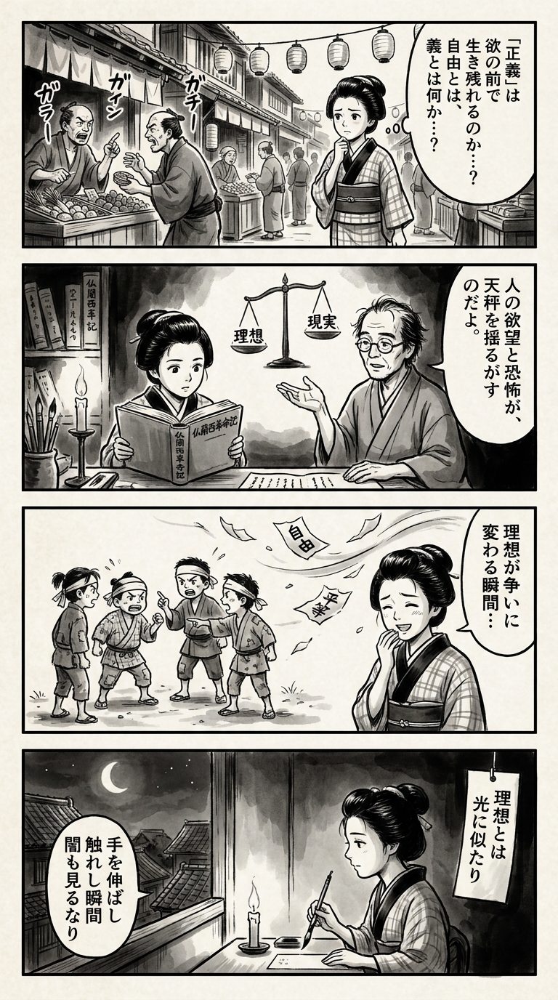

> **Language**: [日本語](../ja/【合本版】小説フランス革命（全18巻）_review.html) | [English](../en/【合本版】小説フランス革命（全18巻）_review.html) | [繁體中文](../zh-tw/【合本版】小説フランス革命（全18巻）_review.html)
>
> [← Top / トップページ](../../)

## 📖 Book Information
- **Title**: 【合本版】小説フランス革命（全18巻）  
- **Author**: 佐藤賢一  
- **ASIN**: B07H2TMXXP  
- **URL**: [https://www.amazon.co.jp/dp/B07H2TMXXP](https://www.amazon.co.jp/dp/B07H2TMXXP)  

---

<picture>
  <source srcset="../../images/reviews/【合本版】小説フランス革命（全18巻）_4panel.webp" type="image/webp">
  
</picture>

## Dialogue

### Panel 1
**Scene**: The townsgirl strolls through a lively Edo street market, listening to merchants debating over fairness and profit. She pauses with a thoughtful frown, contemplating whether "justice" can exist amidst greed. The background features wooden stalls and lanterns, filled with bustling townspeople. Her inner thoughts explore the concepts of "freedom" and "righteousness."

### Panel 2
**Scene**: In a dimly lit study, the townsgirl studies a thick Western-style book translated into kanbun, titled 「仏蘭西革命記」. Beside her sits a scholar resembling her imagined mentor, Sato Kenichi: a middle-aged man with calm yet intense eyes, a thoughtful expression, slightly unkempt hair, dressed in a simple kimono and reading glasses. He gestures towards a diagram depicting scales balancing between "理想" (ideal) and "現実" (reality), sharing profound insights about human desire and fear.

### Panel 3
**Scene**: The townsgirl observes a group of neighborhood children engaged in a "revolution" game, arguing over leadership and accusing one another. She chuckles softly but feels uneasy, recognizing how ideals can devolve into disputes. A sudden gust of wind scatters their paper slogans, symbolizing the transience of ideals.

### Panel 4
**Scene**: In the evening, the townsgirl sits at her small desk illuminated by candlelight, writing a waka on a hanging tanzaku while gazing out at the moonlit rooftops. The poem encapsulates the essence of her reflections — the struggle between ideals and human frailty. The short poem written vertically reads:

「  
理想とは  
光に似たり  
手を伸ばし  
触れし瞬間  
闇も見るなり  
」

## 🎯 The Core of This Book
『小説フランス革命』 is a monumental work of historical literature that depicts how the ideals of liberty, equality, and fraternity can transform into violence and terror through meticulous character portrayals. Sato Kenichi reconstructs the revolution not merely as a political event but as a psychological drama where human desires, fears, and self-justifications intertwine.

The legitimacy of power sways between the king, the parliament, and the populace, revealing the dissonance between ideals and reality, as well as the clash between individual emotions and politics. The "self-destructive nature" of the revolution emerges layered within these themes. The paradox that violence increases as ideals become purer offers sharp insights relevant to contemporary politics and social movements.

---

## 💡 Key Insights
- **Self-interest drives people more than ideals**  
  The populace acts not for freedom or justice, but for their own benefit. A cold perspective is presented, suggesting that individual calculations move history behind the intoxication of revolutionary ideals.

- **Fear supports order but inevitably corrupts**  
  Robespierre's logic of "fear for virtue" symbolizes violence disguised as justice. A political system reliant on fear is warned to eventually self-destruct.

- **The boundaries between enemies and allies constantly shift**  
  In the revolution, the "right" is overthrown by the "left," which then becomes the new enemy. The fluidity of power indicates the absence of absolute justice.

- **The precariousness of idealism**  
  Pursuing ideals while ignoring reality often leads to ruin. It is not merely about raising ideals but how they are applied to reality that is questioned.

- **The silence and irresponsibility of the crowd**  
  The crowd is depicted as capable of becoming either a mob or a bystander. By dispersing responsibility, a structure emerges where no one takes the blame, thus fostering violence.

---

## 🔍 Relevance to Contemporary Context
In modern society, there is a demand for the reconstruction of democracy. With the rise of exclusionary and nationalist sentiments, the "voice of the people" is often swayed more by emotions and self-interest than by ideals. The portrayal of the populace by Sato Kenichi seems to foresee this contemporary crisis.

Moreover, the political exploitation of fear and anxiety can also be seen in social media and media spaces. 『小説フランス革命』 reminds us that democracy is "an ongoing endeavor" and calls for a calm perspective that acknowledges reality while holding onto ideals.

---

## 🚀 Suggestions for Practice
1. **Examine reality before raising ideals**  
   The gap between ideals and reality can lead to tragedy. When discussing ideals, it is crucial to consider the constraints of reality and human weaknesses.

2. **Maintain self-reflection to avoid groupthink**  
   Crowd psychology can easily spiral out of control. It is necessary to constantly check whether one's judgments depend on the opinions and emotions of others.

3. **Be aware of the temporality of power**  
   Just as "the left becomes the right," positions are always changing. When in a position of advantage, one must not forget ethics and humility.

4. **Train to separate emotions from judgment**  
   Love and friendship often cloud judgment. It is important to maintain a calm distance in decision-making without denying emotions.

5. **Question extreme notions of justice**  
   "Violence for justice" can always be replicated. We should hone our thinking to transcend simple good-and-evil dichotomies and embrace the complexities of reality.

---

## ⭐ Overall Evaluation
『小説フランス革命』 transcends the boundaries of historical fiction to become a "discourse on human nature." Through the tensions between ideals and reality, justice and violence, the individual and the crowd, readers are confronted with the fundamental question of "What does it mean to be human?"

This work offers profound insights not only for readers interested in politics and society but also for those seeking to understand conflicts in organizations and human relationships. It brings pain and awakening to its readers, making it a literary work that deserves to be revisited in contemporary times.

---

&copy; shioki | [CC BY-NC-SA 4.0](https://creativecommons.org/licenses/by-nc-sa/4.0/)
