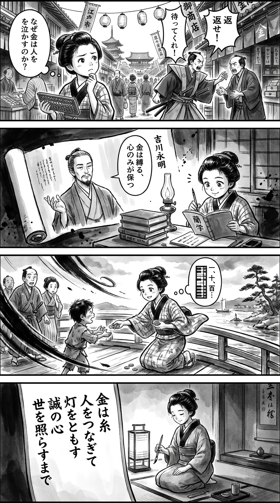

> **Language**: [日本語](../ja/ぜにざむらい_review.html) | [English](../en/ぜにざむらい_review.html) | [繁體中文](../zh-tw/ぜにざむらい_review.html)
>
> [← Top / トップページ](../../)

## 📖 Book Information
- **Title**: ぜにざむらい  
- **Author**: 吉川　永青  
- **ASIN**: B08VNL34VC  
- **URL**: [https://www.amazon.co.jp/dp/B08VNL34VC](https://www.amazon.co.jp/dp/B08VNL34VC)  

---

<picture>
  <source srcset="../../images/reviews/ぜにざむらい_4panel.webp" type="image/webp">
  
</picture>

## Dialogue

### Panel 1
**Scene**: In the bustling Edo market street, the townsgirl stands before a moneylender’s shop, observing a samurai arguing over a debt. She tilts her head thoughtfully, holding her abacus.
**Dialogue**: “Why does gold make men weep?”

### Panel 2
**Scene**: In her dimly lit study, she reads a historical scroll about a man named “Yoshikawa Nagaaki,” depicted as a calm and scholarly figure. He gestures as if to say, “Money binds, but only hearts can hold.”
**Dialogue**: [No dialogue]

### Panel 3
**Scene**: At the riverside, the townsgirl hands a few coins to a hungry child while calculating in her mind. Other townsfolk look on in surprise as a gust of wind lifts her kimono sleeve.
**Dialogue**: [No dialogue]

### Panel 4
**Scene**: In the evening, the girl sits by lantern light, writing a waka on a hanging scroll with a peaceful yet strong expression.
**Dialogue**: [No dialogue]
**Tanka (translation)**: "Money is a thread that connects people, lighting the way with sincerity until it illuminates the world."
**Tanka (original)**: 「金は糸　人をつなぎて　灯をともす  
　誠の心　世を照らすまで」

## 🎯 Core of the Book
『ぜにざむらい』 is a historical novel that depicts the ethics surrounding money and human integrity. The protagonist, 岡左内, realizes during the tumultuous Sengoku period that "money is power," yet he strives to use that power not to make others weep, but to connect people and lead them to happiness.

The book intricately portrays the common principles of commerce and warfare, the relationship between loyalty and trust, and the connection between honesty and happiness. It questions human values and ways of living through the lens of money. The central issue of this book is not about accumulating wealth, but about the happiness that arises from using it.

---

## 💡 Key Insights
- **Money is "the power to connect people"**  
  Money is depicted not merely as wealth, but as a force to help and connect lives. 左内's actions embody the ideal of "ethical economics" that transcends mere economic rationality.

- **Integrity is the greatest strategy**  
  By living honestly and without deceit, 左内 earns trust. His commitment to integrity, unafraid of short-term losses, ultimately becomes his greatest strength.

- **Repay loyalty through action, not just ideals**  
  Carrying the last wishes of his lord, 蒲生氏郷, 左内 dedicates his life to that cause. His attitude of "continuing" rather than merely "repaying" loyalty demonstrates a human integrity that transcends the ethics of a samurai.

- **Happiness gains meaning when shared**  
  左内 perceives his happiness as inseparable from the happiness of others. The narrative illustrates a way of life that finds value in the smiles of others rather than in profit and loss.

- **The ethics of power determine human value**  
  It is not the possession of power itself, but how it is used that determines human value. The book argues that both money and power should serve as "protective talismans" against injustice.

---

## 🔍 Relevance to Contemporary Context
The "ethics of money" presented in this book resonates with the context of modern societal disparities and critiques of capitalism. In an era where economic success does not guarantee personal happiness, 左内's belief that "money is the power to connect people" prompts a reevaluation of the meaning of money.

Moreover, while set in the Sengoku period, the book reflects contemporary issues of labor, inequality, and ethics by depicting the relationship between power and economics, as well as the contradictions between individual integrity and societal structures. 吉川永青's portrayal of a "man out of sync with the times" symbolizes the individual resisting modern absurdities.

---

## 🚀 Suggestions for Practice
1. **Reevaluate how you use money**  
   Shift your perspective from saving to using money to support others. Treat money as a "protective talisman" to safeguard both yourself and others.

2. **Make integrity your strategy**  
   Prioritize building trust over short-term profits. Integrity ultimately becomes your greatest asset.

3. **Choose actions that continue loyalty**  
   Pass on the loyalty you have received as a living action to future generations and others. Embodying loyalty enriches your own life.

4. **Use power to protect**  
   Avoid using power or assets as tools for domination over others; instead, use them as armor against injustice. Be conscious of ethical ways to wield power.

5. **Share happiness**  
   Aim for happiness that includes the well-being of others, not just personal satisfaction. Sharing laughter brings true richness.

---

## ⭐ Overall Evaluation
『ぜにざむらい』 is a story that questions the essence of human integrity and happiness through the most tangible subject of money. Despite its setting of a merchant samurai during the Sengoku period, its ideas possess a universality that connects to contemporary discussions on ethical economics and theories of happiness.

For modern individuals caught between economic success and human integrity, this book serves as a mirror to reconstruct the "philosophy of money." How one uses money determines their way of life—this truth is quietly yet powerfully depicted in this compelling work.

---

&copy; shioki | [CC BY-NC-SA 4.0](https://creativecommons.org/licenses/by-nc-sa/4.0/)
