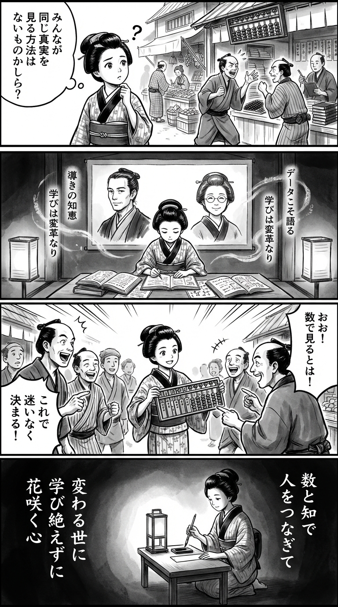

> **Language**: [日本語](../ja/なぜ九州のホームセンターが国内有数のDX企業になれたか_review.html) | [English](../en/なぜ九州のホームセンターが国内有数のDX企業になれたか_review.html) | [繁體中文](../zh-tw/なぜ九州のホームセンターが国内有数のDX企業になれたか_review.html)
>
> [← Top / トップページ](../../)

## 📖 Book Information
- **Title**: なぜ九州のホームセンターが国内有数のDX企業になれたか  
- **Authors**: 柳瀬 隆志 and 酒井 真弓  
- **ASIN**: B0B2NJ27WS  
- **URL**: [https://www.amazon.co.jp/dp/B0B2NJ27WS](https://www.amazon.co.jp/dp/B0B2NJ27WS)  

---

<picture>
  <source srcset="../../images/reviews/なぜ九州のホームセンターが国内有数のDX企業になれたか_4panel.webp" type="image/webp">
  
</picture>

## Dialogue

### Panel 1
**Scene**: The townsgirl stands in front of a lively Edo market, looking confused as merchants argue about decisions based on "intuition" instead of facts. She wonders aloud if there is no way for everyone to see the same truth. The background features a shop using an abacus and ink ledgers, with her eyes shining with curiosity.
**Dialogue**: “Is there no way for all to see the same truth?”

### Panel 2
**Scene**: In a dimly lit study within a temple, the townsgirl is deeply engaged with Dutch and wasan texts about counting and observation. A scroll portrait of two imagined scholars hangs on the wall—one resembling a calm, intellectual man with tied-back hair, and the other a serene woman with gentle features and round spectacles. They serve as her “rangaku mentors,” sharing insights about leadership, data, and learning as transformation.
**Dialogue**: [No dialogue]

### Panel 3
**Scene**: The townsgirl gathers her neighbors, using wooden tablets and beads to visualize their shared harvest data. Her creative “data abacus” impresses the townsfolk, allowing them to make decisions based on numbers rather than guesses. The scene is filled with dynamic brushwork as she presents with confident energy, surrounded by laughter and surprise.
**Dialogue**: [No dialogue]

### Panel 4
**Scene**: As night falls, the townsgirl kneels by the light of a lamp, brush in hand, writing a waka on a small tanzaku. Her expression is calm, embodying both wisdom and hope. The short poem is written vertically beside her.
**Tanka (translation)**: Connecting people through numbers and knowledge, in a changing world, learning never ceases, and hearts blossom.
**Tanka (original)**:  
数と知で  
人をつなぎて  
変わる世に  
学び絶えずに  
花咲く心

## 🎯 Core of the Book

This book illustrates how the home improvement store "Gooday" in Kyushu transformed into one of Japan's leading DX companies, depicting the process through the integration of management, human resources, and culture. The authors position DX not merely as the implementation of systems but as a "transformation of management and human resource development," emphasizing the importance of business leaders understanding IT and building organizations where employees can utilize data.  

In particular, it concretely demonstrates how the concept of "data democratization" connects the field and management through data as a common language, leading to swift and rational decision-making across the company. Furthermore, it focuses on the aspect of "cultural DX," addressing how to transform an organization resistant to change into a learning collective.  

---

## 💡 Key Insights

- **The awareness reform of business leaders is the starting point of DX**  
  DX is not solely the domain of the IT department; it is a business strategy that leaders must tackle as their own challenge. The top management's understanding of IT and their proactive stance in promoting change drive the transformation of the entire organization.

- **Data is the common language that connects the organization**  
  By sharing data, the field and management can communicate using the same metrics, improving the quality of decision-making. The shift from management based on intuition and experience to data-driven management progresses.

- **Cloud breaks the "sanctuary" of IT**  
  The introduction of cloud tools serves as a means to reclaim IT from a specialized department to all employees. This enhances the autonomy of the field and raises the overall digital literacy of the organization.

- **A culture of continuous learning sustains DX**  
  Systems like the Gooday Data Academy, where employees voluntarily learn from each other, support the establishment of DX. When learning is linked to enjoyment and results, a resilient organization capable of adapting to change is formed.

- **DX is not an end goal but a means of corporate transformation**  
  It is crucial not to make digitalization itself the objective but to aim for enhancing customer value and sustainable growth. DX is merely a means to reconstruct corporate culture and management philosophy.

---

## 🔍 Relevance to Contemporary Context

The promotion of DX in local companies is gaining attention as a strategy for regional economic revitalization that goes beyond mere operational efficiency. In Kyushu, where talent outflow is a challenge, more companies like Gooday are utilizing digital tools to enhance the "attractiveness of work."  

Moreover, the entire home improvement industry is advancing in cloud migration, BI tool implementation, and the digitalization of customer experiences, with Gooday's case being a pioneer. As a successful example of DX originating from local enterprises, this book offers practical guidance for "local companies to transform their own culture and gain national competitiveness."  

---

## 🚀 Practical Suggestions

1. **Start DX in areas where results are easily achievable**  
   It is important to accumulate success experiences through immediate measures, such as refreshing PC environments or groupware. Small successes generate trust and momentum throughout the organization.

2. **Establish an internal data academy**  
   Create a permanent space for employees to voluntarily learn data analysis together, aiming to raise skill levels. A continuous learning system supports the sustained promotion of DX.

3. **Visualize operations with cloud and visualization tools**  
   Utilize tools like Google Workspace and Tableau to expedite information sharing and decision-making. This allows real-time feedback from the field to management.

4. **Connect the organization using data as a common language**  
   By having management, field staff, and IT departments discuss based on the same data, organizations can move away from subjective judgments and achieve objective management.

5. **Position DX as a means of corporate transformation, not an end goal**  
   DX is a process to achieve customer value and sustainable growth, not a destination. It is essential to maintain a mindset of continuously questioning "what is the purpose of DX" without confusing objectives and means.

---

## ⭐ Overall Evaluation

This book serves as a practical guide for local companies to transform their culture and management, gaining new competitiveness through digital means. It goes beyond merely presenting success stories and delves into the essence of DX pursued through the integration of management, field operations, and education.  

In particular, the emphasis on the importance of data democratization and a culture of continuous learning is compelling, offering insights not found in other DX-related literature. It is a valuable read filled with real hints for business leaders, managers, and field leaders aiming for organizational transformation.

---

&copy; shioki | [CC BY-NC-SA 4.0](https://creativecommons.org/licenses/by-nc-sa/4.0/)
