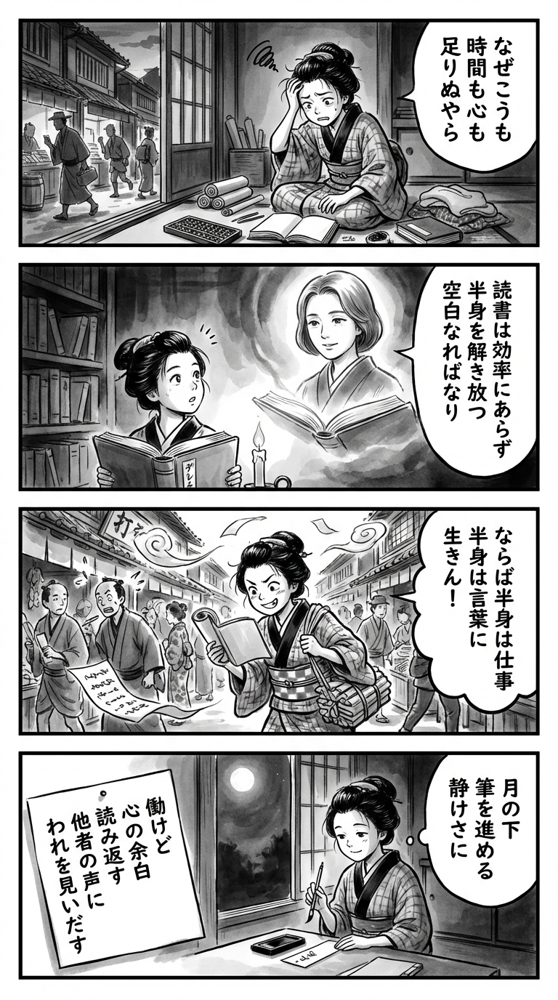

> **Language**: [日本語](../ja/なぜ働いていると本が読めなくなるのか_review.html) | [English](../en/なぜ働いていると本が読めなくなるのか_review.html) | [繁體中文](../zh-tw/なぜ働いていると本が読めなくなるのか_review.html)
>
> [← Top / トップページ](../../)

## 📖 Book Information
- **Title**: なぜ働いていると本が読めなくなるのか  
- **Author**: 三宅香帆  
- **ASIN**: B0CWYZ7PFB  
- **URL**: [https://www.amazon.co.jp/dp/B0CWYZ7PFB](https://www.amazon.co.jp/dp/B0CWYZ7PFB)  

---

<picture>
  <source srcset="../../images/reviews/なぜ働いていると本が読めなくなるのか_4panel.webp" type="image/webp">
  
</picture>
## Dialogue

### Panel 1
**Scene**: The townsgirl is sitting in her small Edo-period room at dusk, surrounded by scrolls and an abacus, looking frustrated as she gazes at an unopened book next to her sewing work. Outside, merchants hurry through the narrow street.
**Dialogue**: She murmurs, "Why can't I find the time or spirit to read anymore?"

### Panel 2
**Scene**: In a candle-lit temple library, the townsgirl opens a Dutch book on work and leisure. A portrait of a wise woman appears from the page, inspired by Miyake Kaho, with neat mid-length hair and calm, intelligent eyes.
**Dialogue**: The woman explains, "Reading is not a tool for efficiency, but a space for your half-self to breathe."

### Panel 3
**Scene**: The townsgirl walks through the bustling market, half carrying goods and half reading a scroll, ignoring the surprised onlookers. She smiles mischievously, embodying the idea of living "half in work, half in words."
**Dialogue**: None.

### Panel 4
**Scene**: At night, she sits by the window, writing with brush and ink as moonlight gently falls on her face. A small tanzaku beside her holds a waka that captures the book’s essence.
**Dialogue**: None.
**Tanka (translation)**: "Though I work, in the margins of my heart, I read again,  
Finding myself in the voices of others."  
**Tanka (original)**: 「働けど　心の余白　読み返す  
　他者の声に　われを見いだす」

## 🎯 The Core of This Book
This book attempts to explore the reasons why "working" and "reading books" have become difficult to balance in modern society, from the intersection of labor history and reading history. The author meticulously traces the transformation of reading from a socially valued activity of "cultivation" and "refinement" to one aimed at efficiency and self-improvement.

In today's labor society, a "full-body society" dominates, where people dedicate all their time and mental energy to work, losing the opportunity to engage with the contexts of others. The author criticizes this structure and proposes "working with half a body"—that is, consciously incorporating contexts outside of work. The essence of this book lies in redefining reading not as a "noise" to be eliminated, but as an act to reclaim our humanity.

---

## 💡 Key Insights
- **Reading is "the noise of working"**  
  In a society that prioritizes efficiency and results, reading is often seen as "wasteful." However, the author argues that this "noise" is what makes us human and is a source of imagination towards others and society.

- **Structural similarities between self-improvement and the internet**  
  Both aim to "eliminate noise and optimize actions." The author points out that this structure excludes the diverse contexts of humanity and impoverishes social imagination.

- **"Full-body commitment" as a modern pathology**  
  Working with full dedication may seem virtuous, but it actually promotes self-exploitation and leads to burnout. The author proposes an ethics of "living with half a body," emphasizing the importance of having space in our lives.

- **Reading as an encounter with "unknown desires"**  
  Reading is not about efficient information gathering, but about engaging with unknown others and contexts. The author asserts that encountering the world of others before understanding one's own desires is the essence of culture.

- **"Half-body society" as a new ideal**  
  A society where one can read while working is not merely a matter of time allocation, but a structural issue of coexistence between culture and care. The author presents "half-body society" as this ideal form.

---

## 🔍 Relevance to Contemporary Context
The issues raised in this book are deeply connected to Japan's modern culture of long working hours. Many people feel "too tired to read," which stems from a work-centric life structure. In an age where social media and smartphones rob us of leisure, "reading deprivation" should be understood not as mere individual laziness, but as a social structural problem, as suggested by the author.

Furthermore, the self-improvement boom and the trend towards "efficient cultivation" since the 1990s have once again subordinated culture to labor. In contrast to this trend, the book reevaluates the value of "reading = inefficiency." In today's world of side jobs and remote work, the idea of "working with half a body" serves as an important guideline for exploring a new relationship between work and culture.

---

## 🚀 Practical Suggestions
1. **Cultivate a "half-body" work consciousness**  
   Do not dedicate your entire self to work; consciously leave space. Use the remaining half for reading, hobbies, and rest to maintain sensitivity to others' contexts.

2. **Embrace "noise" in reading**  
   Instead of efficient information gathering, intentionally read books unrelated to your immediate concerns to regain serendipitous encounters and imagination.

3. **Incorporate non-work contexts into your life**  
   Allocating time to areas unrelated to work, such as culture, arts, and relationships, forms the foundation of a healthy society.

4. **Question the "full-body" culture**  
   Reassess the trend that glorifies excessive enthusiasm and hard work, and affirm the importance of resting and pausing.

5. **Engage in reading for "understanding others"**  
   Redefine reading not as a means of self-management or skill enhancement, but as an act of understanding others and society.

---

## ⭐ Overall Evaluation
『なぜ働いていると本が読めなくなるのか』 is a socially philosophical work that fundamentally questions the relationship between labor and culture. It goes beyond merely discussing reading, criticizing the structure of "full-body commitment" in modern society and proposing a new ethics of "living with half a body."

For all working individuals who have lost the leisure to read, this book serves as "a reading to reclaim reading." It is valuable as a philosophical guide for reconnecting with others and the world beyond efficiency and results.

---

&copy; shioki | [CC BY-NC-SA 4.0](https://creativecommons.org/licenses/by-nc-sa/4.0/)
