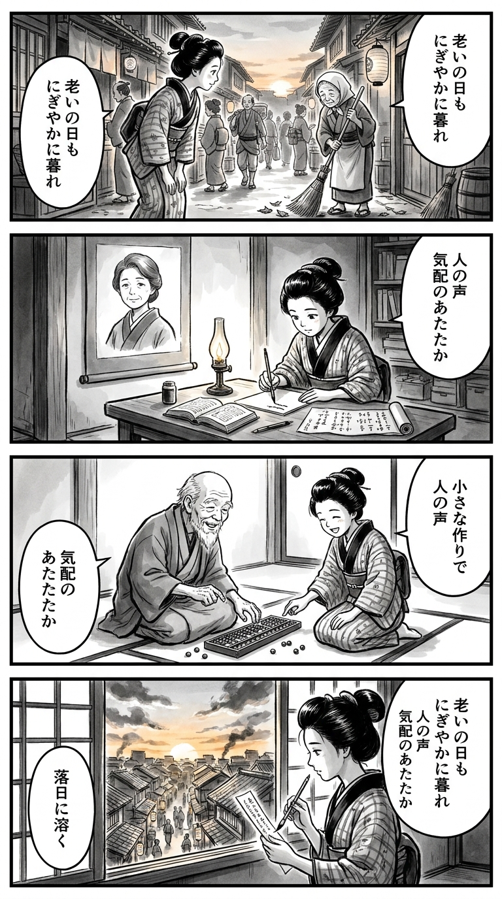

> **Language**: [日本語](../ja/にぎやかな落日_review.html) | [English](../en/にぎやかな落日_review.html) | [繁體中文](../zh-tw/にぎやかな落日_review.html)
>
> [← Top / トップページ](../../)

## 📖 Book Information
- **Title**: にぎやかな落日  
- **Author**: 朝倉 かすみ  
- **ASIN**: B0CM37CC72  
- **URL**: [https://www.amazon.co.jp/dp/B0CM37CC72](https://www.amazon.co.jp/dp/B0CM37CC72)  

---

<picture>
  <source srcset="../../images/reviews/にぎやかな落日_4panel.webp" type="image/webp">
  
</picture>

## Dialogue

### Panel 1
**Scene**: In the tranquil evening of Edo, the townsgirl strolls through a narrow alley as the sun sets behind the tiled roofs. She stops to observe an elderly woman gently sweeping fallen leaves, reflecting on the passage of time. 
**Dialogue**: “Even the setting sun seems lively today.”

### Panel 2
**Scene**: In her small study illuminated by an oil lamp, the townsgirl opens a Dutch medical book and a scroll of wasan. A portrait of her mentor, a calm middle-aged woman with thoughtful eyes, hangs on the wall. The townsgirl eagerly takes notes, contemplating the nature of aging.
**Dialogue**: “Aging is not decline, but continuation.”

### Panel 3
**Scene**: The next morning, the townsgirl assists a local elder with his abacus practice. They share laughter over small mistakes, and she notices the old man's trembling hands but shining eyes. The abacus beads scatter like falling leaves, symbolizing their shared presence.
**Dialogue**: [No dialogue]

### Panel 4
**Scene**: That evening, the townsgirl sits by the window with a brush in hand, composing a tanka on a narrow strip of paper. Outside, the sun sets, creating a “noisy sunset” over Edo’s rooftops. Her silhouette against the glowing sky evokes a serene mood.
**Dialogue**: [No dialogue]
**Tanka (translation)**: Even on aging days,  
The sunset is lively,  
Voices of people,  
Warmth in their presence,  
Melting into the sunset.  
**Tanka (original)**: 老いの日も  
にぎやかに暮れ  
人の声  
気配のあたたか  
落日に溶く

## 🎯 Core of the Book
『にぎやかな落日』 is the story of a woman named Omoti, who strives to live her life while grappling with aging, loss, and loneliness. Through her perspective, as she navigates her days in a nursing home after losing her long-time husband, the realities of aging and the small joys hidden within are delicately portrayed.

The uniqueness of this work lies in its quiet acceptance of aging not as a tragedy but as an extension of daily life. By depicting the fluctuations of memory and the decline of the body with calm humor, readers are invited to touch upon the "dignity of living" and the "courage to accept the end."

---

## 💡 Key Insights
- **Aging Sneaks into Daily Life**  
  Aging is not a sudden event but rather blends into daily life as a "slight effort." The perspective presented encourages us not to fear aging but to affirm our small daily efforts.

- **Loneliness Eases with the Presence of Others**  
  The loneliness felt by Omoti is alleviated through connections with others. It is not grand love or dramatic encounters, but the mere existence of "someone being there" that provides emotional support.

- **Caregiving Swings Between Love and Exhaustion**  
  The reality of caregiving comes with frustrations and guilt that cannot be solely supported by love. Through Omoti's actions, the complexity of caregivers' emotions and the enduring human bonds are depicted.

- **Memory is Both a Support and a Fear of Living**  
  Remembering the past can warm the heart, yet it also evokes fear of lost time. Accepting the ambiguity of memory is presented as wisdom for living with aging.

- **The "End" is Accepted as Part of Nature**  
  The final "grand sunset" is depicted not as a fear of death but as a beautiful natural phenomenon. The gaze that quietly contemplates the end of life leaves a profound aftertaste after reading.

---

## 🔍 Connection to Contemporary Context
The themes of this book encompass universally relevant issues in contemporary Japan, where super-aging is progressing. As social challenges like caregiving and solitary deaths become more pressing, the approach of depicting aging not as "management" but as "dignity" poses an important question to modern society.

Furthermore, in an era where digitalization and efficiency often overshadow the "presence" and "subtle connections" between people, this work reaffirms the significance of the act of "sharing a meal together." Without flashy events or miracles, this story embodies a quiet humanism that illustrates the preciousness of simply living.

---

## 🚀 Practical Suggestions
1. **Acknowledge Small Daily Efforts**  
   By being aware of the "slight effort," one can affirm daily life without self-blame. Continuing without forcing oneself is the first step toward gently accepting aging.

2. **Recall Someone's Presence When Feeling Lonely**  
   Even if you can't meet directly, find ways to feel connected through voices, letters, or messages. Loneliness may never fully disappear, but just the presence of someone can warm the heart.

3. **Cultivate a Habit of Recording**  
   Writing in a diary or taking notes allows you to check your time and connect memories. Like Omoti, rediscovering daily life through "writing" can lead to emotional stability.

4. **Be Mindful of Dignity in Caregiving and Support**  
   Helping is different from controlling. Respecting the other person's freedom and not taking away what they can do fosters true support.

5. **Accept the "End" as Part of Nature**  
   Look at death not as a fear but as a part of life's flow. Just as one appreciates the beauty of a sunset, remember that the end of life can also be a rich time.

---

## ⭐ Overall Evaluation
『にぎやかな落日』 portrays aging and loss without becoming dark or heavy. Rather, within its quiet prose, the strength and kindness of humanity come alive. Omoti's figure offers a chance to reconsider "aging," which everyone will eventually face, not as fear but as acceptance.

While there are no flashy developments, this book gently lights a flame in the reader's heart. It is a story that should be shared with those living with aging, those who care for them, and anyone who wishes to ponder "what it means to live."

---

&copy; shioki | [CC BY-NC-SA 4.0](https://creativecommons.org/licenses/by-nc-sa/4.0/)
