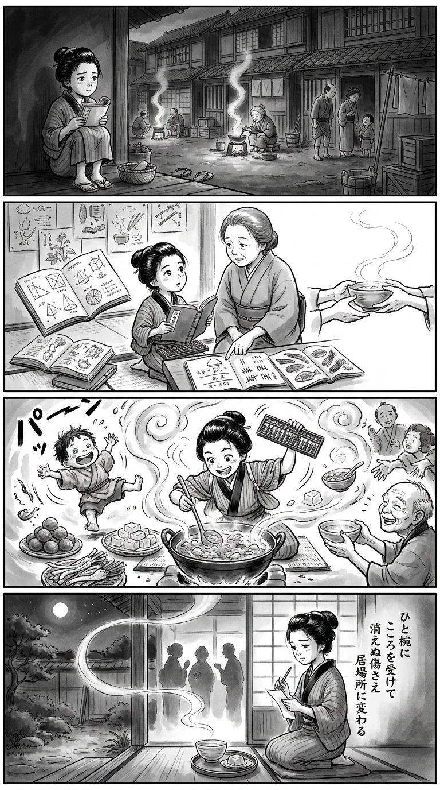

> **Language**: [日本語](../ja/はじまりのスープ、夏ゼリー_review.html) | [English](../en/はじまりのスープ、夏ゼリー_review.html) | [繁體中文](../zh-tw/はじまりのスープ、夏ゼリー_review.html)
>
> [← Top / トップページ](../../)

# 📖 Book Information
- **Title**: はじまりのスープ、夏ゼリー
- **Author**: 瀬尾まいこ
- **ASIN**: B0H2KZS6R6
- **URL**: [https://www.amazon.co.jp/dp/B0H2KZS6R6](https://www.amazon.co.jp/dp/B0H2KZS6R6)

---

<picture>
  <source srcset="../../images/reviews/はじまりのスープ、夏ゼリー_4panel.webp" type="image/webp">
  
</picture>
## 🎯 The Core of This Book

At the heart of this book is the journey of a protagonist who carries the wounds of being unchosen by their parents and has been escaping from relationships. Through cooking, they reconnect with others. Soup and jelly serve not merely as food but as mediums that carry unspoken memories and care.

Someone's "delicious" affirms the labor and existence of the creator, and the presence of those who wait provides the strength to continue working. Even if past wounds do not disappear, the book presents a quiet yet certain perspective of regeneration, suggesting that one can choose people and places anew by their own will.

---

## 💡 Key Insights

- **A life without pain is also distant from joy**  
  The protagonist has chosen an easy way of working, avoiding friction with others. However, they realize that a life without hassle or suffering also lacks the joy of being needed and the exhilarating moments. This insight highlights that safety and fulfillment are not synonymous.

- **"Delicious" is a word that acknowledges existence**  
  Cooking involves unseen labor such as planning, shopping, cooking, and cleaning. The short phrases "delicious" and "thank you for the meal" serve as responses that do not take the creator's time and feelings for granted, extending beyond mere taste evaluation.

- **What one is good at gains meaning through relationships with others**  
  For the protagonist, cooking was not an unconditional hobby from the start. However, through repeated experiences of brightening someone's expression with their cooking, the skills they acquired transform into joy and a sense of belonging.

- **Even shared family pasts carry different pains**  
  The elder sister bears the wound of not being chosen by their mother, while the younger sister carries the burden of being chosen. By listening to each other's perspectives, the sisters begin to free their past from a simplistic dichotomy of happiness and unhappiness, choosing a new adult relationship.

---

## 🔍 Connection to Contemporary Context

In a modern context where the increase of single-person households and issues of loneliness and isolation are prevalent, this book reinterprets meals not merely as nutritional intake but as acts of building relationships. The perspective that even small exchanges—cooking, waiting, and giving feedback—carry a sense of community is significant.

On the other hand, the book does not unconditionally sanctify homemade food. It embraces ready-made and freeze-dried options, prioritizing sustainability over perfection in cooking. This resonates well with the current awareness of household burdens and pressures for "proper meals." While depicting regeneration through everyday food, it maintains a sense of realism that does not exhaust the creator.

---

## 🚀 Suggestions for Practice

1. **Provide specific feedback to the person who cooked for you**  
   Instead of just saying "delicious," express your favorite flavors, aromas, or what you'd like to eat again. Even brief feedback serves as a testament to the effort and care put into the cooking.

2. **Prioritize reproducibility over perfection in household tasks**  
   Use ready-made foods, frozen products, and pre-cut vegetables without hesitation. Establishing a system that is less burdensome and can be sustained consistently is more supportive of daily life than creating something impressive each time.

3. **Before distancing yourself from relationships, organize what you gain from them**  
   Write down the people who wait for you, your role, and the enjoyable moments. This helps distinguish between necessary distancing and reflexive escape due to fear, allowing for conscious decision-making.

4. **Revisit family history from the perspective of others**  
   Ask about feelings during the same events, such as "How did you feel at that time?" Loosening unilateral understanding can serve as an opportunity to reinterpret the meaning of unchangeable pasts from the present.

5. **Turn "next time" into specific actions**  
   For those you want to meet, specify dates or future meals. Avoid letting "next time" end as mere social niceties; instead, execute it as a commitment to continue the relationship, creating a new future.

---

## ⭐ Overall Evaluation

This book does not present a simplistic narrative where all wounds are healed through cooking. It acknowledges the unerasable resentment and loneliness while depicting a story of regeneration, where one can gather around a table with others and choose their roles and futures anew.

It will resonate particularly deeply with those who harbor complex feelings toward family, those who wish to escape from relationships, and those who feel their contributions in household and work contexts are taken for granted. This quietly practical book leaves readers with both the challenges and values of engaging with others, wrapped in a warm afterglow.

---

&copy; shioki | [CC BY-NC-SA 4.0](https://creativecommons.org/licenses/by-nc-sa/4.0/)
