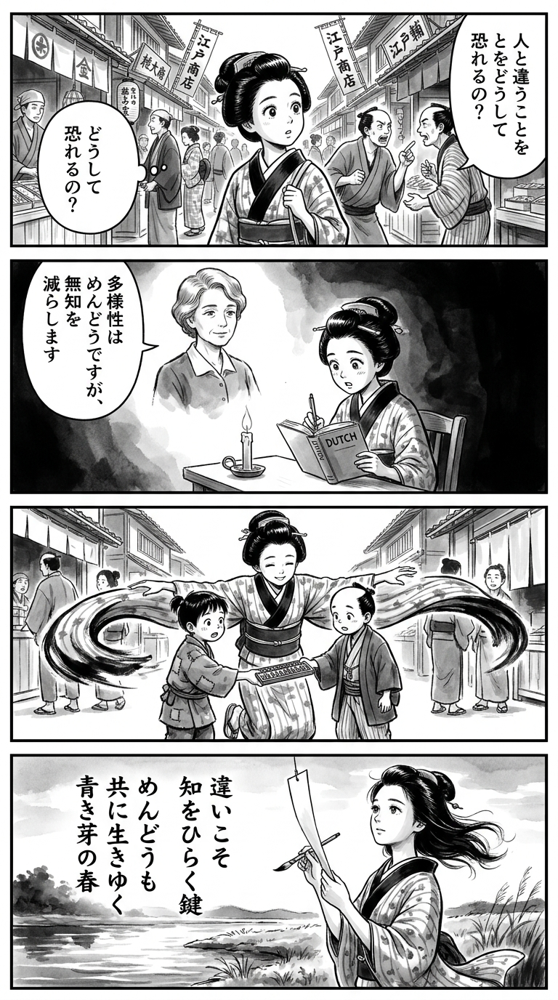

> **Language**: [日本語](../ja/ぼくはイエローでホワイトで、ちょっとブルー（新潮文庫）_review.html) | [English](../en/ぼくはイエローでホワイトで、ちょっとブルー（新潮文庫）_review.html) | [繁體中文](../zh-tw/ぼくはイエローでホワイトで、ちょっとブルー（新潮文庫）_review.html)
>
> [← Top / トップページ](../../)

## 📖 Book Information
- **Title**: ぼくはイエローでホワイトで、ちょっとブルー（新潮文庫）  
- **Author**: ブレイディみかこ  
- **ASIN**: B096ZSKMRS  
- **URL**: [https://www.amazon.co.jp/dp/B096ZSKMRS](https://www.amazon.co.jp/dp/B096ZSKMRS)  

---

<picture>
  <source srcset="../../images/reviews/ぼくはイエローでホワイトで、ちょっとブルー（新潮文庫）_4panel.webp" type="image/webp">
  
</picture>

## Dialogue

### Panel 1
**Scene**: The townsgirl walks through a lively Edo marketplace filled with various merchants. She overhears two townsmen arguing about superiority, and her eyes widen with curiosity as she wonders, “Why do people fear what’s different?”
**Dialogue**: “Why do people fear what’s different?”

### Panel 2
**Scene**: In her candlelit study, the townsgirl opens a Dutch book on human nature and empathy. Above her desk, a vision of a calm, middle-aged woman resembling the author Mikako Brady appears, dressed in simple Western clothing. She gently conveys a message about diversity.
**Dialogue**: “Diversity is troublesome, yet it lessens ignorance.”

### Panel 3
**Scene**: The townsgirl mediates between two neighborhood children, one from a poor family and the other from a merchant's household, helping them share a toy abacus. Her outstretched hands create a bridge, and her kimono sleeves flow gracefully.
**Dialogue**: [No dialogue]

### Panel 4
**Scene**: At twilight by the riverbank, the townsgirl writes a waka on a hanging strip of paper, embodying the essence of the book. She appears serene and thoughtful as the wind plays with her hair.
**Dialogue**: [No dialogue]
**Tanka (translation)**: Differences are the key to knowledge; though troublesome, we live together like the blue buds of spring.
**Tanka (original)**:  
違いこそ  
知をひらく鍵  
めんどうも  
共に生きゆく  
青き芽の春

## 🎯 Core of the Book
This book is an essay that explores fundamental societal themes such as diversity, class, education, and empathy through the perspectives of a Japanese mother living in the UK and her son. The author states, "Diversity is troublesome, but it has the power to reduce ignorance," presenting coexistence not as an ideal but as a reality.

It delves into the issues of race, poverty, and culture that intersect in educational settings and homes with a warm yet sharp writing style. Through the dialogues between mother and son, the quiet power of "empathy" emerges as a means to transcend division.

This work not only denounces social inequality and division but also depicts the hope and goodwill that lie within. Readers will come to appreciate the value of striving to understand others in the context of everyday life.

---

## 💡 Key Insights
- **Diversity is "reality," not "ideal"**  
  Diversity comes with conflicts and frictions, but that very aspect can reduce ignorance and mature society. The author conveys that "it's troublesome, but it's a good thing," presenting a realistic approach to coexistence.

- **Division arises from the desire to be "above others"**  
  The root of social conflict is depicted as a psychological desire for superiority. This sharp insight resonates with the structures of conflict and exclusion prevalent on social media in modern society.

- **Education is a space for nurturing "empathy" and "citizenship"**  
  In the UK educational landscape, understanding others is prioritized over mere knowledge. The author illustrates the importance of education that fosters sensitivity to support democracy through the growth of her son.

- **Affirming family diversity as "real"**  
  The book portrays various family forms, such as multicultural and same-sex families, as natural. The son’s remark, "Our family is real too," symbolizes a new "normal" in changing times.

- **"Blue" is the color of fluctuation and growth**  
  The "little blue" in the title symbolizes not sadness, but contemplation and growth. By positively depicting the fluctuations of identity, the author offers readers hope for maturity.

---

## 🔍 Connection to Contemporary Context
The themes of "diversity," "empathy," and "educational disparity" depicted in this book resonate deeply with contemporary issues in Japanese society. Particularly, structural problems such as gender role division and labor disparity persist strongly in Japan, similar to the UK. ブレイディみかこ’s perspective sheds light on the common social distortions that transcend borders.

Furthermore, this book has gained attention in educational settings, being adopted as a reading material for university lectures and entrance exam assignments. This serves as evidence that it is valued not just as an essay but as a text that contributes to social and educational practice.

The idea of "standing in someone else's shoes" as a form of empathy can serve as an ethical foundation for overcoming political and social media conflicts in an increasingly divided world. This book quietly presents the potential for social regeneration centered on empathy.

---

## 🚀 Suggestions for Practice
1. **Cultivate the habit of "walking in someone else's shoes"**  
   Incorporate daily practices that encourage imagining the perspectives of those who are different from oneself, reducing prejudice and fostering empathy.

2. **Integrate "diversity" into education and parenting**  
   Consciously create opportunities for children to encounter different cultures and values, nurturing their social skills and flexibility.

3. **Accumulate small acts of kindness**  
   Rather than waiting for systems or politics to change, everyday acts of thoughtfulness and mutual support can help ease divisions.

4. **Connect community and education**  
   Create systems that ensure schools are not isolated, with community support being a conscious effort. Participation in volunteer work and local activities is a first step.

5. **Adopt a perspective that affirms "immaturity"**  
   By not denying failures or uncertainties and instead viewing them as opportunities for learning and growth, a more tolerant society can be built.

---

## ⭐ Overall Evaluation
『ぼくはイエローでホワイトで、ちょっとブルー』 is a work that helps rediscover the power of empathy and goodwill in an era rife with division and prejudice. Through the dialogues between mother and son, it simultaneously portrays the complexities of society and the potential of humanity in a way that is quiet yet deeply resonant.

This book offers a chance for educators, parents, and individuals in society to reflect on themselves. It challenges readers to consider the meaning of "living together without fearing differences."

---

&copy; shioki | [CC BY-NC-SA 4.0](https://creativecommons.org/licenses/by-nc-sa/4.0/)
