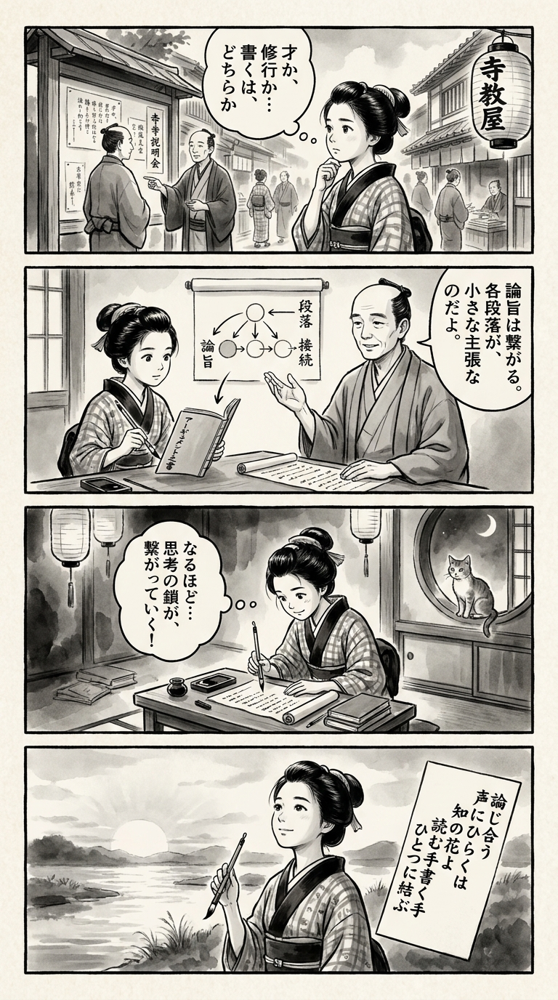

> **Language**: [日本語](../ja/まったく新しいアカデミック・ライティングの教科書_review.html) | [English](../en/まったく新しいアカデミック・ライティングの教科書_review.html) | [繁體中文](../zh-tw/まったく新しいアカデミック・ライティングの教科書_review.html)
>
> [← Top / トップページ](../../)

## 📖 Book Information
- **Title**: まったく新しいアカデミック・ライティングの教科書  
- **Author**: 阿部 幸大  
- **ASIN**: B0D97HJRT1  
- **URL**: [https://www.amazon.co.jp/dp/B0D97HJRT1](https://www.amazon.co.jp/dp/B0D97HJRT1)  

---

<picture>
  <source srcset="../../images/reviews/まったく新しいアカデミック・ライティングの教科書_4panel.webp" type="image/webp">
  
</picture>

## Dialogue

### Panel 1
**Scene**: In a lively Edo street filled with merchants and students, the townsgirl stops by a temple bulletin board where scholars are engaged in a debate about what constitutes a truly “academic” essay. She tilts her head, contemplating whether writing is an innate talent or a skill that can be developed. The background features a paper lantern and the gentle activity of a terakoya school.
**Dialogue**: None

### Panel 2
**Scene**: Inside the terakoya, the townsgirl examines a newly arrived Dutch manuscript titled "The Book of Arguments." A calm and thoughtful scholar, resembling the author Abe Kōdai, sits beside her. He is depicted as a serene, intellectual man in his thirties with neatly tied hair, dressed in a simple kimono, and possessing gentle features that suggest insight and patience. He gestures toward a scroll diagram illustrating connected arguments, showing how each paragraph serves as a small thesis. The girl listens intently, her brush poised.
**Dialogue**: None

### Panel 3
**Scene**: In the evening, under the glow of paper lanterns, the townsgirl applies her newfound knowledge as she writes at her wooden desk, structuring her essay-like notes about a local festival. She pauses, smiling as she rearranges her sentences with logical precision, realizing that her thoughts now form a coherent chain of reasoning. A curious cat watches from the window.
**Dialogue**: None

### Panel 4
**Scene**: At dawn, she gazes toward the river, holding her brush upright. On a hanging short poem card (tanzaku), she writes a waka that encapsulates the essence of the book, her expression serene and radiant.
**Dialogue**: None  
**Tanka (translation)**: In the voices that debate, the flower of knowledge blooms, as reading hands and writing hands unite as one.  
**Tanka (original)**:  
論じ合う  
声にひらくは  
知の花よ  
読む手書く手  
ひとつに結ぶ

## 🎯 Core of the Book
This book attempts to redefine academic writing as a skill that can be acquired through training rather than a mere talent. The author, 阿部幸大, clearly positions a thesis as "a piece of writing that presents a claim and argues for it," finding the essence of academic writing in "arguments (claims that require justification)."

Building on this, the book presents methods such as transitive verb construction models and paragraph writing to logically refine abstract claims. Furthermore, under the principle that "reading is a prerequisite for writing," it outlines a systematic process for developing writing skills through the practice of academic reading.

Ultimately, it sets forth a grand goal of revitalizing the humanities in Japan through such training, aiming to regenerate a culture of critical thinking and dialogue.

---

## 💡 Key Insights
- **The possibility of rebuttal is a condition for a thesis**  
  It argues that claims allowing for rebuttal, rather than self-evident assertions, hold academic value. This perspective redefines a thesis as a "forum for dialogue," forming the foundation of intellectual integrity.

- **Criticism is an expression of respect**  
  By viewing critical citations as acts of creation rather than destruction, it reconciles respect for others' research with the formation of one's own stance. This idea promotes the development of a mature culture of criticism within the academic community.

- **Paragraphs are small theses**  
  Designing each paragraph as a unit that argues a "paragraph thesis" automatically strengthens the overall logical structure of the writing. The insight that the quality of paragraphs influences the persuasiveness of the entire thesis is practical.

- **Reading strengthens writing**  
  Analyzing model papers and grasping their structure and word count through "academic reading" serves as a training method for reading comprehension that supports writing skills. The book's characteristic is its refusal to separate reading from writing.

- **Academic writing can be achieved through training**  
  The stance that anyone can reach a certain level through systematic training, rather than relying on special talent, provides an ideological foundation for the democratization of academia.

---

## 🔍 Relevance to Contemporary Context
In an era of information overload due to AI and social media, the culture of critical thinking and argumentation is being socially reevaluated. In an environment where fake news and misinformation proliferate, the ability to "construct rebuttable claims and provide evidence" has become essential not only in academia but also as a civic literacy.

This book responds to such contemporary demands by presenting training methods for logical thinking and writing construction. The author's concepts of "critical citation" and "argument-centeredness" function as intellectual techniques for discerning truth in an information society.

The goal of revitalizing the humanities signifies not just academic reform but also the reconstruction of a cultural foundation that supports the reliability of information and public dialogue.

---

## 🚀 Practical Suggestions
1. **Start with "This paper shows that..." to clarify your claim**  
   By explicitly stating the claim that requires justification, the focus of the entire paper becomes clearer, making it easier for readers to grasp the logical direction.

2. **Set a "paragraph thesis" for each paragraph**  
   By establishing small claims for each paragraph and supporting them with facts and logic, the coherence and persuasiveness of the entire text increase.

3. **Analyze model papers and calculate the average word count per paragraph**  
   By comparing your writing to model papers, you can quantitatively grasp the density of logical development and structural weaknesses.

4. **Classify sentences by levels of abstraction**  
   Visualizing the balance of data, analysis, and theory layers can help improve the writing in a way that enhances the depth of logic.

5. **Engage in academic "conversation" through critical citations**  
   Rather than merely referencing existing research, engaging critically and respectfully allows you to add academic value to your own claims.

---

## ⭐ Overall Evaluation
『まったく新しいアカデミック・ライティングの教科書』 is a book that reconstructs not only the way academic papers are written but also the very method of thinking. The author organically connects argumentation, criticism, and reading, presenting academic writing as a "practice of knowledge."

It is beneficial not only for university students and researchers but also for professionals who wish to refine their logical writing skills. Through this book, readers will gain an experience that returns them to the fundamentals of academia, asking not just "how to write well," but "why to write" and "how to engage in dialogue."

---

&copy; shioki | [CC BY-NC-SA 4.0](https://creativecommons.org/licenses/by-nc-sa/4.0/)
