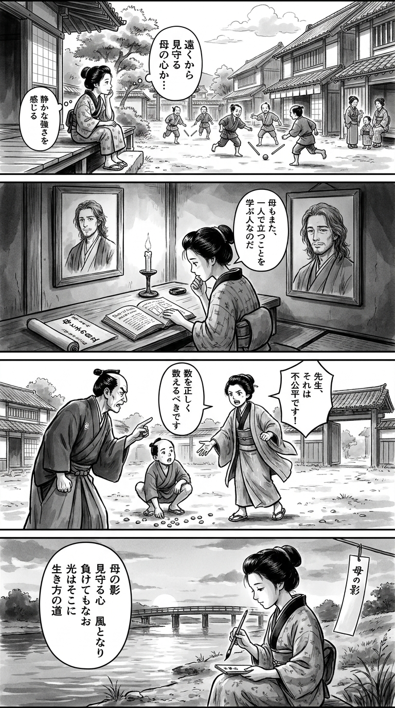

> **Language**: [日本語](../ja/アルプス席の母_review.html) | [English](../en/アルプス席の母_review.html) | [繁體中文](../zh-tw/アルプス席の母_review.html)
>
> [← Top / トップページ](../../)

## 📖 Book Information
- **Title**: アルプス席の母  
- **Author**: 早見和真  
- **ASIN**: B0CXPMC671  
- **URL**: [https://www.amazon.co.jp/dp/B0CXPMC671](https://www.amazon.co.jp/dp/B0CXPMC671)  

---

<picture>
  <source srcset="../../images/reviews/アルプス席の母_4panel.webp" type="image/webp">
  
</picture>

## Dialogue

### Panel 1
**Scene**: The townsgirl sits on the wooden steps of a temple school, observing boys playing baseball-like stick games in the street. She tilts her head, murmuring about “mothers watching from afar,” sensing their quiet strength. The background features Edo townhouses and cheering children, creating a warm yet distant atmosphere.  
**Dialogue**: "Mothers watching from afar..."

### Panel 2
**Scene**: Inside her small room at night, the townsgirl studies a Dutch book and a scroll depicting “母と子の自立” (mother and child’s independence). A portrait of her mentor, a man with long wavy hair and gentle facial hair, hangs on the wall. His thoughtful yet humble expression reflects a balance between duty and freedom. Candlelight flickers as she whispers.  
**Dialogue**: "Even a mother is also just a person learning to stand."

### Panel 3
**Scene**: At dawn, the townsgirl assists a neighborhood boy who is struggling with arithmetic, helping him count pebbles fairly after losing a game. When the local instructor unjustly scolds him, she speaks up firmly yet kindly, challenging the unfair rule and showing courage against rigid hierarchies. Her kimono sleeves flutter as she stands resolutely.  
**Dialogue**: "That's not fair!"

### Panel 4
**Scene**: The townsgirl sits by the riverbank at sunset, brush in hand, writing a waka on a hanging tanzaku. Her expression is calm, illuminated by her reflection in the water. The short poem she writes reflects her thoughts on life and motherhood.  
**Tanka (translation)**:  
The shadow of a mother  
Her heart watching over, like the wind  
Even in defeat  
Light remains right there  
The path of living  

**Tanka (original)**:  
母の影  
見守る心　風となり  
負けてもなお  
光はそこに  
生き方の道

## 🎯 The Core of This Book
『アルプス席の母』 is a story about a mother and son achieving their respective "independence" and "rebirth" through the uniquely Japanese setting of high school baseball. The protagonist, Nanako, reflects on herself both as a "mother" and as an "individual" while watching her son, Koutarou, grow.

The narrative depicts the pressure imposed on the role of a mother and the liberation from it, while also carefully tracing the inner growth of her son, who is in the position of a "substitute." Rather than focusing on wins and losses or status, it delves into the questions of "how to live" and "how to relate" from the perspectives of both mother and son.

Additionally, the book weaves in critiques of the unreasonable and closed culture of sports, questioning the meaning of protecting individual dignity and freedom. It transcends the mother-son relationship, embodying a universal story of "people reclaiming themselves."

---

## 💡 Key Insights
- **Transition from "Self-Sacrifice" to "Self-Acceptance" for Mothers**  
  Nanako feels "sorry for being an unreliable mother," but by accepting her imperfections, she redefines her image as a mother. It is the "acceptance of imperfection," rather than perfection, that marks the starting point of maturity as a parent.

- **Courage to Resist Unreasonable Sports Culture**  
  The act of voicing dissent to the coach is portrayed as a challenge to the closed hierarchical relationships. This small act of rebellion shows the potential for changing children's consciousness and opening up social structures.

- **Affirmation of Being a "Substitute"**  
  Koutarou's realization that "being a substitute suits him better" is a story of self-affirmation that transcends the values of hierarchy and success. His attitude of finding value in "how to engage" rather than results serves as a quiet antithesis to the competitive nature of modern society.

- **Mother-Son Relationship Evolving from "Dependence" to "Respect"**  
  Through the process of separation, both learn to respect each other as individuals. This relationship depicts a "mature parent-child dynamic" where love and pain coexist.

- **There is No "End" to the Story**  
  The perspective that loss and setbacks are not "endings" but "transitional points" is presented. Accepting life as a "continuum" rather than a "conclusion" offers readers a quiet sense of hope.

---

## 🔍 Connection to Contemporary Context
In modern Japan, family structures are diversifying, and the image of mothers is changing. Issues such as the isolation faced by stay-at-home mothers and single mothers, along with the weakening of community ties, resonate with Nanako's life. Her quest to find "her place" echoes the story of "individual rebirth" in contemporary society.

Moreover, the issues of sports culture and hierarchical relationships are structural challenges that extend to corporate society and educational settings. Nanako's actions in raising her voice against the unreasonable serve as a symbolic small resistance to the gender and authoritarianism challenges in modern society.

This book illuminates the macro theme of "reconstructing connections in modern society" through the micro contexts of family and community.

---

## 🚀 Practical Suggestions
1. **Accept Your Imperfections Instead of Striving for "Perfect Parenting"**  
   Recognizing your current self without fear of failure is the first step to deepening trust with your child.

2. **Have the Courage to Speak Up Against Unreasonable Customs**  
   Addressing small discomforts and promoting change through dialogue can be a catalyst for transforming closed cultures.

3. **Prioritize the "Process" Over the "Results"**  
   Finding value in effort and engagement rather than outcomes can enhance life satisfaction.

4. **Choose Your Own Place**  
   Have the courage to select a place where you feel comfortable, without being swayed by others' expectations or environments, leading to a more mature way of living.

5. **Set Aside Time to "Not Ignore Yourself"**  
   Ensuring time to listen to your own voice in daily life builds the foundation for self-understanding and happiness.

---

## ⭐ Overall Evaluation
『アルプス席の母』 is a narrative that depicts the growth of a mother and child while simultaneously posing the universal question of "how to live one's life." Borrowing the setting of baseball, it quietly explores family, society, and individual dignity.

This book resonates not only with those struggling with parenting and family relationships but also with all readers standing at a turning point in their lives. After reading, one will likely want to reflect once more on the meaning of "living" and "engaging."

---

&copy; shioki | [CC BY-NC-SA 4.0](https://creativecommons.org/licenses/by-nc-sa/4.0/)
