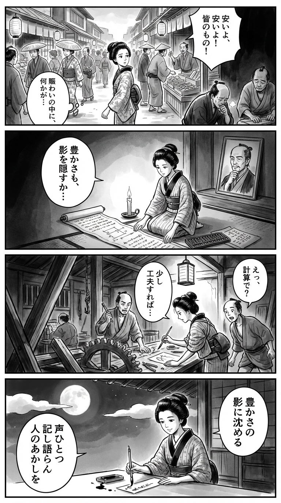

> **Language**: [日本語](../ja/アンダークラス_review.html) | [English](../en/アンダークラス_review.html) | [繁體中文](../zh-tw/アンダークラス_review.html)
>
> [← Top / トップページ](../../)

## 📖 Book Information
- **Title**: アンダークラス  
- **Author**: 相場英雄  
- **ASIN**: B08MTW5N4Q  
- **URL**: [https://www.amazon.co.jp/dp/B08MTW5N4Q](https://www.amazon.co.jp/dp/B08MTW5N4Q)  

---

<picture>
  <source srcset="../../images/reviews/アンダークラス_4panel.webp" type="image/webp">
  
</picture>

## Dialogue

### Panel 1
**Scene**: The townsgirl strolls through the lively Edo marketplace, where merchants boast about their “cheap goods for everyone.” She pauses, sensing an underlying unease amidst the cheerful noise — a servant coughing in the shadows and a craftsman with weary eyes. The background features wooden stalls, lanterns, and crowded alleyways, creating a curious yet pensive atmosphere.
**Dialogue**: None

### Panel 2
**Scene**: In her small study illuminated by candlelight, the townsgirl unrolls a Dutch text alongside a scroll filled with economic calculations. Behind her on the shelf, a portrait of a wise scholar resembling the author appears — he is middle-aged with thoughtful eyes, tied-back hair, a neatly trimmed beard, and a calm presence. His expression seems to oversee her inquiry.
**Dialogue**: She murmurs, “Even abundance can hide sorrow…”

### Panel 3
**Scene**: The townsgirl explores a riverside workshop, investigating the process of making goods. She finds apprentices working late into the night and helps one of them mend a broken tool while deep in thought. A subtle humor emerges as she applies her arithmetic knowledge to fix the gear more efficiently, surprising the foreman. The composition uses angled lighting and strong brushstrokes to convey motion and moral tension.
**Dialogue**: None

### Panel 4
**Scene**: That night, under the moonlight, the townsgirl writes a waka poem on a tanzaku. Her expression is serene yet resolute, with ink flowing like her thoughts.
**Dialogue**: None  
**Tanka (translation)**: Even in abundance, a single voice sinks into shadows, marking the truth of humanity.  
**Tanka (original)**: 豊かさの  
影に沈める  
声ひとつ  
記し語らん  
人のあかしを

## 🎯 Core of the Book
『アンダークラス』 is a socially conscious novel that exposes the "invisible class society" of contemporary Japan. It portrays fragmented social phenomena such as non-regular employment, the foreign technical intern system, and the lonely deaths of the elderly as a structural problem through the perspective of a detective.

相場英雄 presents economic disparity and the collapse of corporate ethics not merely as social issues but as "structural violence" that robs individuals of their dignity. Readers are forced to confront the sacrifices hidden behind convenience and affluence.

At the heart of the story lies the belief that "to record and to tell" is the only resistance that can break the silence. The cold yet empathetic depiction of the distortions in society resonates with the lives of the people living within it.

---

## 💡 Key Insights
- **"Technical Internships" are a mere facade for slavery**  
  Through the tragedy of Vietnamese interns, the deceit and structural exploitation of the system are laid bare. The labor exploitation disguised as learning suggests a continuation of colonial structures.

- **Japan's "kindness" is supported by structural violence**  
  The everyday convenience and low-cost services are built on the sacrifices of unseen individuals. The author visualizes the imbalances lurking behind "ordinary life" and challenges readers with ethical questions.

- **The collapse of corporate ethics and the devaluation of human life**  
  The narrative depicts a structure where large corporations sacrifice individuals to protect their face and profits. This is not merely a critique of corporations but a microcosm of a society that discards humanity in the name of "efficiency."

- **The "lower class" is no longer a minority**  
  The phrase "90% of Japan is lower class" symbolizes the entrenchment of disparity and the loss of mobility. The collapse of the middle-class fantasy reveals a society where anyone can fall.

- **Empathy and recording protect human dignity**  
  The detective, 田川, is portrayed as engaging in the act of "recording" as a means of resisting societal silence. Empathy and observation are shown to be the last means of resistance left to powerless individuals.

---

## 🔍 Relevance to Contemporary Context
In the mid-2020s, Japan's relative poverty rate has reached a record high, with non-regular employment accounting for about 40% of workers. The number of foreign workers has exceeded 2.5 million, and human rights violations in the technical intern system have drawn international criticism. The social structure depicted in 『アンダークラス』 is no longer fiction but a reflection of reality.

Additionally, terms like "poverty anecdotes" and "immigrant neighborhoods" have become trends on social media, indicating a phenomenon where issues of disparity and exclusion are being turned into entertainment. 相場英雄's writing serves as a warning against a "society of forgetfulness."

This book transcends the context of policy discussions and academic research, illuminating the imbalances lurking in readers' own lives. It functions as a literary device to encourage consideration of societal divisions as not merely someone else's problem.

---

## 🚀 Practical Suggestions
1. **Examine the realities behind consumption**  
   Be aware of the labor structures behind cheap products and services. Ethical consumption is the first step to breaking the chain of unconscious exploitation.

2. **Listen to the voices of foreign workers**  
   Recognize their existence as "neighbors" rather than just "labor," and engage in dialogue within communities and workplaces to contribute to social well-being.

3. **Maintain a vigilant eye on corporate ethics**  
   Do not remain silent in the face of wrongdoing or concealment; support reporting and whistleblowing. A commitment to transparency is essential for maintaining societal trust.

4. **Consider "lower class" issues as your own**  
   Do not view the issues of disparity and non-regular employment as someone else's problems; connect them to your own life and future. A sense of social solidarity is crucial.

5. **Record and pass on**  
   Do not overlook injustices and absurdities; document and share personal experiences. The act of breaking the silence can serve as a foundation for societal regeneration.

---

## ⭐ Overall Evaluation
『アンダークラス』 is a profound social novel that captures the voices of those at the bottom of society and illuminates the structural violence of contemporary Japan. 相場英雄 transcends the framework of criminal investigation to depict the collapse of economy, ethics, and humanity in a multi-layered manner.

Readers will confront the sacrifices hidden behind convenience and will be prompted to reevaluate their own positions. This book allows readers to experience social issues as a "story," encouraging thought to change reality.

---

&copy; shioki | [CC BY-NC-SA 4.0](https://creativecommons.org/licenses/by-nc-sa/4.0/)
