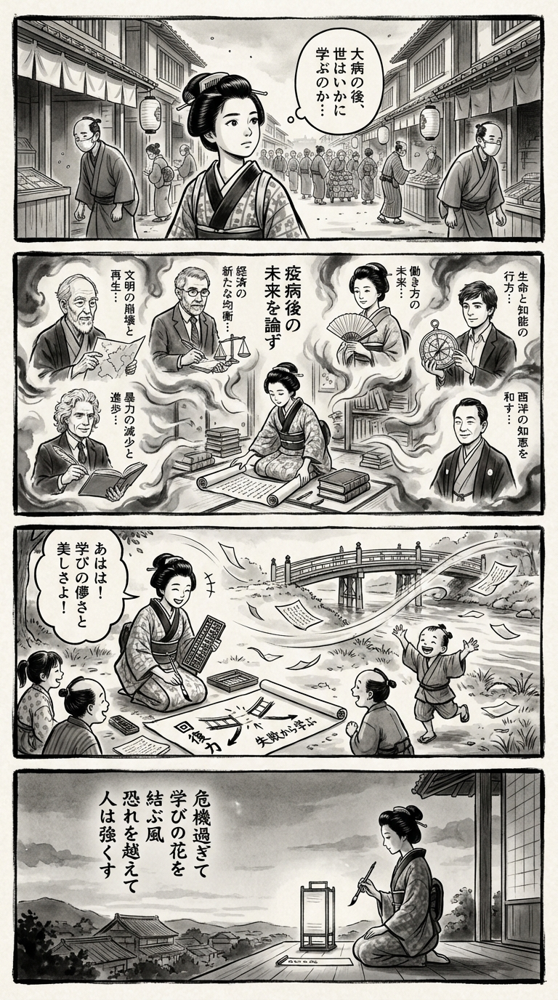

> **Language**: [日本語](../ja/コロナ後の世界_review.html) | [English](../en/コロナ後の世界_review.html) | [繁體中文](../zh-tw/コロナ後の世界_review.html)
>
> [← Top / トップページ](../../)

## 📖 Book Information
- **Title**: コロナ後の世界  
- **Authors**: ジャレド・ダイアモンド, ポール・クルーグマン, リンダ・グラットン, マックス・テグマーク, スティーブン・ピンカー, スコット・ギャロウェイ, and 大野 和基  
- **ASIN**: B08D3GVLHB  
- **URL**: [https://www.amazon.co.jp/dp/B08D3GVLHB](https://www.amazon.co.jp/dp/B08D3GVLHB)  

---

<picture>
  <source srcset="../../images/reviews/コロナ後の世界_4panel.webp" type="image/webp">
  
</picture>

## Dialogue

### Panel 1
**Scene**: The townsgirl strolls through a quiet Edo street, observing the return of daily life after a small epidemic, yet sensing the lingering anxiety among the townsfolk. The market is bustling with wooden stalls and paper lanterns, while people wear cloth masks.
**Dialogue**: She murmurs, “How does the world learn after a great sickness?”

### Panel 2
**Scene**: Inside a cozy study room, the townsgirl unrolls a Dutch manuscript and an imported book adorned with portraits of seven imagined scholars on hanging scrolls. Each scholar embodies a distinct personality, discussing “the future after the plague” in a dreamlike, ink-filled atmosphere.
**Dialogue**: [No dialogue]

### Panel 3
**Scene**: By the riverside, the townsgirl teaches children with her abacus and brush, illustrating a chart of “resilience” that shows how learning from failure can strengthen their resolve. A gust of wind suddenly scatters her scrolls, prompting her to laugh at the beauty and fragility of learning.
**Dialogue**: [No dialogue]

### Panel 4
**Scene**: As dusk settles, the townsgirl kneels beside a glowing paper lantern, writing a waka poem on a tanzaku, her silhouette framed by the fading light.
**Dialogue**: [No dialogue]
**Tanka (translation)**: After the crisis, the winds weave flowers of knowledge; beyond fear, humanity grows strong.
**Tanka (original)**: 危機過ぎて　学びの花を　結ぶ風  
　恐れを越えて　人は強くす

## 🎯 The Core of This Book
『コロナ後の世界』 is an intellectual dialogue collection that multifacetedly depicts the structural challenges humanity faces and the possibilities for regeneration through the unprecedented crisis of the pandemic. Leading experts from various fields such as science, economics, society, and ethics analyze the COVID-19 crisis as a "stress test for civilization."  

At the heart of this book lies a trust in humanity to choose understanding over fear, cooperation over division, and learning over stagnation. Wisdom for enhancing societal resilience through crises and building a more flexible and sustainable future is presented in each chapter.  

---

## 💡 Key Insights
- **Human resilience lies in the ability to "learn from failure."**  
  The pandemic has exposed the vulnerabilities of civilization, but it also presents an opportunity for learning and adaptation. Rather than fearing crises, the attitude of extracting lessons from them will be key to shaping the next society.  

- **Population decline is not a tragedy but an opportunity for redesign.**  
  Viewing Japan's declining population as an "advantage" encourages a rethinking of society from the perspective of sustainability. It can be seen as a turning point that emphasizes qualitative maturity over quantitative growth.  

- **The "race for wisdom" in AI and ethics.**  
  The advancement of technology holds the potential to surpass human intelligence, but ethical governance to control it is essential. How to maintain a human-centered approach to technology will be a critical juncture for future society.  

- **The participation of women and the elderly is key to economic regeneration.**  
  Solutions to labor shortages are not merely policy-driven but lie in the redesign of social structures. Promoting gender equality and diverse working styles represents a reform that combines economic rationality with ethical legitimacy.  

- **Reason and data support democracy.**  
  In an age of information overload, judgment based on data rather than emotion is essential for societal health. Sharing scientific thinking is the only way to transcend divisions.  

---

## 🔍 Relevance to Contemporary Context
As of 2026, the post-COVID society is on a continuum of the challenges identified in this book, including the establishment of hybrid work, a mental health crisis, and the widening gap in AI. The rise of remote migration and the permeation of well-being culture indicate a growing value placed on resilience and flexibility.  

Moreover, the rapid evolution of AI and the lag in ethical governance have made the warnings from Tegmark and others a reality. The deepening of disparities and social divisions resonates with the discussions of Krugman and Galloway, pressing for a redesign of economic structures.  

Thus, this book serves not merely as an "analysis of the post-COVID world," but as a philosophical compass that anticipates the social changes of the late 2020s, offering striking insights even today.  

---

## 🚀 Suggestions for Practice
1. **Cultivate a culture of learning without fear of failure.**  
   To transform crises into opportunities, both individuals and organizations need to institutionalize the attitude of "learning from failure." A culture that values trial and error will enhance societal flexibility.  

2. **Incorporate lifelong learning into daily habits.**  
   In a rapidly changing era, the ability to continue learning itself is the greatest asset. Focusing on the capacity to learn rather than specific skills will lead to long-term happiness and stability.  

3. **Promote institutional reforms that support diverse working styles.**  
   Creating an environment where women and the elderly can work comfortably is essential not only for securing the workforce but also for enhancing social inclusivity. Expanding childcare support and flexible working systems is crucial.  

4. **Read information critically and listen to differing opinions.**  
   Overcoming the divisions of the social media age requires an effort to understand opinions from different perspectives. Embracing information diversity will form the foundation of a rational society.  

5. **Maintain an ethical perspective in technology use.**  
   Avoid being swept away by the convenience of AI and data utilization, and always be aware of ethical risks. Questioning the "how" of technology use is vital for safeguarding a human-centered future.  

---

## ⭐ Overall Evaluation
『コロナ後の世界』 is an intellectual adventure that seeks to interpret the challenges humanity faces, revealed through the pandemic, with intelligence rather than fear. The dialogues among multiple experts are not merely future predictions but a philosophical attempt to reconstruct hope.  

This book serves as a "vaccine for thought" for all readers who are anxious in this era of change. It offers deep insights and practical suggestions for policymakers considering social redesign, as well as for individuals reflecting on their own lives.

---

&copy; shioki | [CC BY-NC-SA 4.0](https://creativecommons.org/licenses/by-nc-sa/4.0/)
