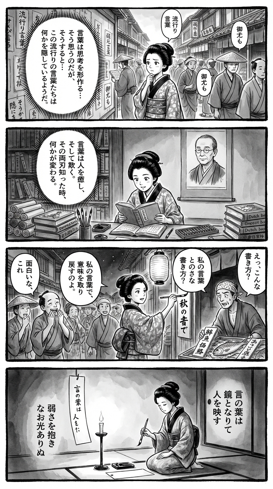

> **Language**: [日本語](../ja/ザ、コラム_review.html) | [English](../en/ザ、コラム_review.html) | [繁體中文](../zh-tw/ザ、コラム_review.html)
>
> [← Top / トップページ](../../)

## 📖 Book Information
- **Title**: ザ、コラム  
- **Author**: 小田嶋隆  
- **ASIN**: B0B77GW4GJ  
- **URL**: [https://www.amazon.co.jp/dp/B0B77GW4GJ](https://www.amazon.co.jp/dp/B0B77GW4GJ)  

---

<picture>
  <source srcset="../../images/reviews/ザ、コラム_4panel.webp" type="image/webp">
  
</picture>

## Dialogue

### Panel 1
**Scene**: In a lively Edo street filled with wooden bookshops, the townsgirl stops in front of a paper wall covered with slogans and catchphrases. She has a slight frown, sensing that these "popular words" hide more than they reveal. Her inner thoughts ponder how words can shape our thinking. Background: signboards and townspeople mindlessly repeating slogans.
**Dialogue**: [No dialogue]

### Panel 2
**Scene**: Inside a dim study, the townsgirl is deeply engrossed in a pile of scrolls and imported Dutch books. A monochrome portrait of a middle-aged man with a calm demeanor hangs on the wall — an imagined likeness of author Takashi Odajima, with a round face, gentle expression, and small spectacles, exuding a mentor-like presence. She feels inspired, realizing that words can both heal and deceive. Ink brushes and an abacus are scattered around her.
**Dialogue**: [No dialogue]

### Panel 3
**Scene**: Under the warm glow of a lantern, she applies her newfound insight by rewriting shop signs and notices in her own precise language. The townspeople react with surprise, laughing yet intrigued. A dramatic angle captures her standing confidently, brush in hand, as if reclaiming the true meaning of words. Humor arises as a fishmonger looks puzzled at her “revised” poetic price tag.
**Dialogue**: [No dialogue]

### Panel 4
**Scene**: In her quiet room, she kneels by candlelight, holding her brush with a serene determination. On a hanging scroll or tanzaku, she writes a tanka that encapsulates the essence of her thoughts — the dignity of thinking, the dual nature of culture, and empathy for human frailty. The atmosphere is calm and reflective.
**Dialogue**: [No dialogue]  
**Tanka (translation)**: Words become a mirror, reflecting humanity's essence, embracing our weaknesses, yet still shining with light.  
**Tanka (original)**: 言の葉は  
鏡となりて  
人を映す  
弱さを抱き  
なお光ありぬ

## 🎯 The Core of This Book
『ザ、コラム』 is a comprehensive collection of columns by 小田嶋隆 that depicts the intellectual regression and cultural decay lurking in the fractures of our times with a cold yet humorous touch. His writing exposes the "thought paralysis" that permeates various realms of modern society, including politics, media, language, generations, and addiction.  

小田嶋 surveys the gap between the baby boomer generation and today's youth, illustrating the generational divide and intellectual void while sharply criticizing the self-destruction of media and the degradation of language. His critiques are not mere satire; they are supported by a sincere gaze that confronts "human weakness."  

This book serves as proof that even ephemeral current affairs columns can possess universal insights, empowering readers to reclaim the "dignity of thinking."  

---

## 💡 Key Insights
- **Language Shapes Social Thought**  
  小田嶋 points out the dangers of terms like "Abenomics" and "awareness," which obscure reality and guide thought. His insight that the choice of words influences societal intelligence is particularly thought-provoking in today's information-saturated environment.  

- **Addiction is a Structural Issue, Not Just a Matter of Will**  
  His portrayal of alcohol addiction as a "disease" critiques a society that morally judges individual weakness. He emphasizes the importance of understanding human fragility and establishing supportive structures.  

- **Culture Comes with Side Effects**  
  As encapsulated in the phrase, "Anything that doesn't bring side effects is not culture," the essence of culture lies in its power to transform humanity. Accepting the duality of pleasure and ruin is a hallmark of mature cultural understanding.  

- **Bookstores are Pathways for Thought**  
  小田嶋's depiction of bookstores as "places for contemplation and serendipitous encounters" is a call to reclaim the "serendipity of knowledge" that is increasingly lost in the digital age.  

- **Even Ephemeral Columns Have Lasting Value**  
  Even timely pieces can transcend time if they contain insights into human nature. 小田嶋's writing elevates beyond mere contemporary critique to achieve a universal understanding of humanity.  

---

## 🔍 Relevance to Contemporary Context
In the late 2020s, Japan is witnessing intensified debates over cancel culture and freedom of expression, questioning whether one can separate a speaker's "character" from their "work." 小田嶋's critiques touch the heart of this issue, presenting a model for "sincere words" that do not succumb to social sanctions or peer pressure.  

Moreover, in the simplistic discourse environment of the social media era, 小田嶋's writing offers a moment to reassess the "slowness of thought" and the "weight of words." In a time when freedom of expression is often undervalued, his critical spirit paradoxically feels fresh and worthy of re-examination.  

---

## 🚀 Practical Suggestions
1. **Be Conscious of Word Choice**  
   Cultivate the habit of thinking and speaking in your own words, rather than relying on buzzwords or slogans. Language is the vessel of thought, and its precision determines the depth of societal understanding.  

2. **Maintain a Skeptical Attitude Towards Information**  
   Avoid taking media reports or snippets from social media at face value; develop the habit of verifying primary information. Critical reading skills are foundational to democracy.  

3. **Accept Weakness**  
   Understand addiction and setbacks not as "weakness of will," but as structural issues. Acknowledging human fragility is the first step toward empathy and support for others.  

4. **Do Not Fear the Side Effects of Culture**  
   New expressions and technologies come with risks. Embrace change with courage rather than seeking safe "mediocrity," as this fosters creativity.  

5. **Engage in Real-Life Reflection**  
   Visit bookstores and libraries to enjoy serendipitous encounters. The intellectual stimulation gained from real-world experiences broadens the scope of thought.  

---

## ⭐ Overall Evaluation
『ザ、コラム』 is a landmark of critique that sharply captures the intellectual landscape of contemporary Japan. 小田嶋隆's writing, while acerbic, is filled with deep understanding and compassion for humanity.  

While laughing off the foolishness of the times, his perspective also gazes at the pain and hope underlying it, reminding readers of the "pleasure of thinking." This book is essential for modern individuals weary of media and language.

---

&copy; shioki | [CC BY-NC-SA 4.0](https://creativecommons.org/licenses/by-nc-sa/4.0/)
