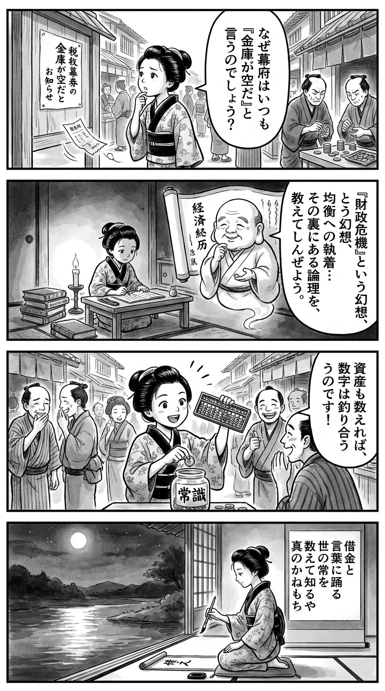

> **Language**: [日本語](../ja/ザイム真理教_review.html) | [English](../en/ザイム真理教_review.html) | [繁體中文](../zh-tw/ザイム真理教_review.html)
>
> [← Top / トップページ](../../)

## 📖 Book Information
- **Title**: ザイム真理教  
- **Author**: 森永 卓郎  
- **ASIN**: B0C4PJG9R8  
- **URL**: [https://www.amazon.co.jp/dp/B0C4PJG9R8](https://www.amazon.co.jp/dp/B0C4PJG9R8)  

---

<picture>
  <source srcset="../../images/reviews/ザイム真理教_4panel.webp" type="image/webp">
  
</picture>

## Dialogue

### Panel 1
**Scene**: In the lively streets of Edo, the townsgirl stands in front of a notice board filled with tax announcements, looking confused as she wonders why the shogunate claims to be financially strained. The background features merchants counting coins and customers with frowns, while a gentle breeze carries a torn receipt across her wooden sandals.
**Dialogue**: "Why does the shogunate always say the coffers are empty?"

### Panel 2
**Scene**: In her dimly lit room, illuminated by candlelight, the townsgirl studies a Dutch ledger alongside a mysterious economic scroll. The scroll depicts a scholarly man with round cheeks and gentle eyes, resembling a rotund sage in simple robes, who seems to explain the concept of "fiscal crisis" and the obsession with balance, teaching her the hidden logic of taxes.
**Dialogue**: "The illusions of fiscal crisis... it's all about understanding the balance."

### Panel 3
**Scene**: Energized by her newfound knowledge, the townsgirl gathers the townsfolk in the marketplace. Using an abacus, she illustrates how the numbers balance when assets are counted, entertaining the crowd as she drops a coin into a jar labeled "common sense." The atmosphere is lively, filled with laughter and disbelief, resembling a small rebellion through education.
**Dialogue**: "See? When we count properly, everything adds up!"

### Panel 4
**Scene**: Later that night, on her veranda overlooking a tranquil river, the townsgirl writes a waka on a hanging scroll. Her brush glides smoothly, reflecting her calm yet determined demeanor as she composes her poem.
**Tanka (translation)**: "In debts and words, the world's norms dance;  
Counting reveals the true wealthy ones."
**Tanka (original)**: 「借金と　言葉に踊る　世の常を  
　数えて知るや　真のかねもち」

## 🎯 The Core of This Book
『ザイム真理教』 is a critique that likens the ideology and behavior of Japan's Ministry of Finance, which has dominated the Japanese economy for many years, to religious fanaticism. The author, 森永卓郎, refers to the Ministry as the "Zaimu Truth Cult" and asserts that its doctrines, including fiscal balance and the consumption tax hike, have led to Japan's deflation and stagnant wages.

This book is not merely a conspiracy theory; it explains the mechanisms of finance and fiscal policy in an accessible manner, logically dismantling the myth of a "crisis" in national finance. Furthermore, it exposes the intertwined power structure of bureaucrats, media, and the wealthy, revealing how ordinary people's lives are systematically oppressed.

In the final chapter, it proposes a "脱・ザイム真理教" lifestyle that distances oneself from the state's doctrines, encouraging readers toward economic and spiritual independence.

---

## 💡 Key Insights
- **The Myth of "Fiscal Crisis"**  
  The author criticizes the Ministry of Finance's narrative that labels Japan as a "debt-ridden nation" by only focusing on the total debt. He points out that when assets are deducted, the actual debt is only 102% of GDP, comparable to other developed countries. He exposes the structure that exaggerates the crisis to justify tax increases.

- **The Deflationary Structure Caused by Consumption Tax Hikes**  
  The analysis shows that raising the consumption tax rate leads to a decline in real wages and a decrease in consumption, worsening the economic cycle. Policies that strip ordinary people of purchasing power are said to entrench economic stagnation.

- **The Religious Organizational Culture of the Ministry of Finance**  
  Within the Ministry, fiscal balance is shared as a "faith," and there exists a pressure to conform that does not allow dissent. This structure leads to policy rigidity, even ensnaring politicians.

- **Favoring the Wealthy at the Expense of the Common People**  
  The book highlights the phenomenon where the effective tax burden on high-income earners is lower than that on low-income earners, denouncing the unfairness of the tax system. It clearly presents the mechanisms of institutional inequality reproduction.

- **Loss of Media Independence**  
  It points out that media outlets are subservient to the Ministry of Finance due to land sales and reduced tax rates. The insight that the freedom of the press has become part of a structure that stifles criticism of economic policy is sharp.

---

## 🔍 Relevance to Contemporary Context
The issues raised in this book are directly connected to the recent policy debates over "fiscal soundness" versus "household support." Amid rising prices and stagnant real wages, the backlash against tax increases and austerity measures is growing, and 森永's arguments are being reevaluated as a reflection of social discontent.

Additionally, the term "Zaimu Truth Cult" has spread online, becoming a symbolic slang for criticizing the Ministry of Finance. This reflects a distrust of bureaucratic politics and frustration over the lack of democratic control. The conflict with those who emphasize fiscal discipline will continue, but this book serves as a starting point for that discussion.

---

## 🚀 Practical Suggestions
1. **Examine the "Debt-ridden Nation" Narrative from the Ministry of Finance**  
   It is crucial to verify both the assets and liabilities of the government and not be swayed by manipulated numerical impressions. Developing a habit of reading primary sources will enhance information literacy.

2. **Raise Awareness for Consumption Tax Reduction**  
   Since the consumption tax directly impacts the lives of ordinary people, reducing it is key to economic recovery. It is necessary to engage politically and express opinions through elections and petitions.

3. **Focus on the Unfair Structure of the Tax System**  
   Understanding the mechanisms that favor the wealthy and sharing the need for tax reform is the first step toward social justice.

4. **Read Media Information Critically**  
   Be aware of the interests behind news reporting and adopt a stance of comparing multiple information sources. This can serve as an opportunity to reconsider the "common sense" surrounding fiscal issues.

5. **Explore the Possibility of Local and Self-sufficient Living**  
   Seek ways to live that reduce the high burden of urban life and lower living costs. This is presented as a practical option for regaining economic freedom.

---

## ⭐ Overall Evaluation
『ザイム真理教』 is a unique economic book that exposes the ideological domination of the Ministry of Finance and makes visible the "faith" underlying economic policies. 森永卓郎's writing is provocative but backed by data and institutional analysis, making it more than mere agitation.

For readers who wish to critically analyze the relationships between politics, economics, and media, this book serves as an excellent introduction. It is worth reading as an intellectual weapon to reclaim one's life and judgment rather than following state doctrines.

---

&copy; shioki | [CC BY-NC-SA 4.0](https://creativecommons.org/licenses/by-nc-sa/4.0/)
