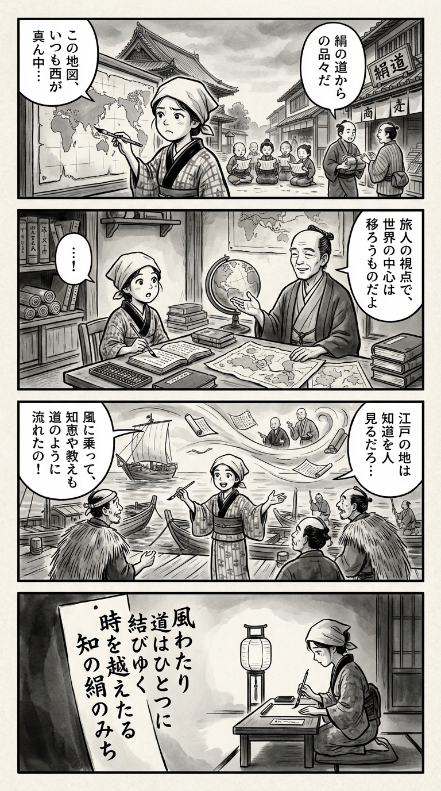

> **Language**: [日本語](../ja/シルクロード世界史_review.html) | [English](../en/シルクロード世界史_review.html) | [繁體中文](../zh-tw/シルクロード世界史_review.html)
>
> [← Top / トップページ](../../)

## 📖 Book Information
- **Title**: シルクロード世界史  
- **Author**: 森安孝夫  
- **ASIN**: B08H232LTW  
- **URL**: [https://www.amazon.co.jp/dp/B08H232LTW](https://www.amazon.co.jp/dp/B08H232LTW)  

---

<picture>
  <source srcset="../../images/reviews/シルクロード世界史_4panel.webp" type="image/webp">
  
</picture>

## Dialogue

### Panel 1
**Scene**: In an Edo street filled with merchant houses and travelers, the townsgirl gazes at a world map displayed at a temple school, slightly frowning as she notes how all maps seem to center the West. In the background, children recite lessons while merchants discuss exotic goods from the “Silk Road.”  
**Dialogue**: "Why does it always seem like the West is in the center?"

### Panel 2
**Scene**: Inside her small study room, the townsgirl studies scrolls and imported texts. A serene scholar resembling Moriyasu Takao appears as a wise teacher, dressed in scholarly robes, gesturing toward a globe and ancient trade routes. She listens with wide eyes, brush and abacus resting beside her.  
**Dialogue**: "The center of civilization shifts with the traveler’s gaze."

### Panel 3
**Scene**: The townsgirl stands at the bustling Edo harbor, sketching lines in the air while explaining to curious fishermen how ideas and religions flowed like trade winds along unseen roads. A gust of wind lifts her scrolls, connecting ships, monks, and merchants in her imagination.  
**Dialogue**: "Just like trade winds, ideas traveled along hidden paths!"

### Panel 4
**Scene**: In the evening, she kneels by lantern light, brush in hand, reflecting deeply. On a hanging tanzaku, she writes a waka that encapsulates the unity of civilizations and the timeless flow of knowledge.  
**Dialogue**: *[No dialogue in this panel]*  
**Tanka (translation)**: "Through the winds, paths unite, transcending time, the silk road of knowledge."  
**Tanka (original)**: 「風わたり  
　道はひとつに  
　結びゆく  
　時を越えたる  
　知の絹のみち」

## 🎯 Core of the Book
『シルクロード世界史』 is an ambitious work that presents a new vision of world history centered on Central Eurasia. The author, 森安孝夫, reevaluates regions that have been considered "marginal" as centers of civilizational exchange, depicting the Silk Road as a multifaceted junction of Eastern and Western civilizations.  

The book's distinctive feature lies in its approach to trade and the spread of religions, viewing them not merely as historical events but as structural dynamics of civilization. By overturning the stereotype of nomads as "barbarians" and positioning them as mediators of culture and economy, it attempts to reconstruct world history.  

Furthermore, the author finds the mission of history to be "de-ideologization" and "the revival of culture," questioning the significance of history in contemporary society. He presents history not just as a record of the past, but as an intellectual foundation for envisioning the future.  

---

## 💡 Key Insights
- **World history is a matter of perspective**  
  森安 asserts that "a truly meaningful world history does not yet exist." By moving beyond Western-centric or Sinocentric views and placing Central Eurasia at the center, he seeks to correct historical biases and present a more pluralistic vision of the world.

- **Nomads are mediators of civilization**  
  Reevaluating nomadic states not as raiders but as bearers of trade and cultural exchange. The perspective that their movements and networks facilitated the spread of religions, technologies, and ideas leads to a redefinition of civilizational history.

- **The Silk Road is a "path of religion and knowledge"**  
  Beyond the trade of silk and spices, the Silk Road is depicted as a spiritual network where Buddhism, Manichaeism, Christianity, and Islam intersect. Understanding it as a place where economics and faith intersect resonates with today's global society.

- **Reevaluation of Manichaeism will change religious history**  
  The provocative assertion that "without Manichaeism, there is no Christianity" challenges existing narratives and compels a reconstruction of religious history. Through the existence of Manichaean paintings that arrived in Japan, it reveals how deeply intertwined Eastern and Western religious cultures were.

- **History is a way of thinking in terms of time**  
  The core of historical study is described as "knowledge that deals with time," asserting its uniqueness compared to other social sciences. Understanding the continuity of time that connects the past and present is presented as the key to deciphering contemporary issues.  

---

## 🔍 Relevance to Contemporary Context
Today, the Silk Road is reemerging not as a "past trade route" but as a concept symbolizing the reconfiguration of geopolitics, economy, and culture. China's Belt and Road Initiative is a prime example of this, attempting to recreate ancient spheres of exchange in a modern context.  

Simultaneously, digital reconstructions of archaeological sites and AI-driven archaeological research in Central Asia are bringing renewed attention to the once-celebrated "path of religion and knowledge." 森安's perspective of "dialogue between civilizations" can also be interpreted as a new guideline for the protection of cultural heritage and international cooperation.  

Moreover, as globalization progresses, the "commodification" and "homogenization" of culture are advancing in modern society. The book's perspective of "pluralistic world history" holds value as an intellectual tool for preserving cultural diversity.  

---

## 🚀 Suggestions for Practice
1. **Approach history from multiple perspectives**  
   Rethink world history from the viewpoint of Central Eurasia, transcending the binary opposition of West and East. This will allow for a deeper understanding of the underlying structures of international relations and cultural exchanges.  

2. **Integrate the study of religion, economy, and culture**  
   By viewing the Silk Road not merely as a trade route but as a network of ideas and technologies, one can gain a more comprehensive understanding of the development of civilizations.  

3. **Utilize history as a form of cultural literacy in society**  
   Adopt an attitude of applying historical knowledge to policy-making and international understanding. Transform history from a "record of the past" into "knowledge that guides the future."  

4. **Emphasize source-based and de-ideologized practices**  
   Prioritize empirical thinking based on historical sources and eliminate political and ethnic biases. This is the first step toward true historical understanding.  

5. **Reposition Japanese culture within world history**  
   By tracing the roots of Buddhism, writing, and art back to the Silk Road, reexamine Japanese culture in a global context to deepen self-understanding and international empathy.  

---

## ⭐ Overall Evaluation
『シルクロード世界史』 is an intellectual challenge that shakes the foundations of fixed worldviews. 森安孝夫 integrates diverse elements such as nomads, religion, trade, and writing to depict the "dynamic connections" of civilizations.  

This book presents history not merely as a record of the past but as a methodology for understanding contemporary society. It is a must-read for those interested in international relations and cultural exchange, or for anyone considering "relearning world history."

---

&copy; shioki | [CC BY-NC-SA 4.0](https://creativecommons.org/licenses/by-nc-sa/4.0/)
