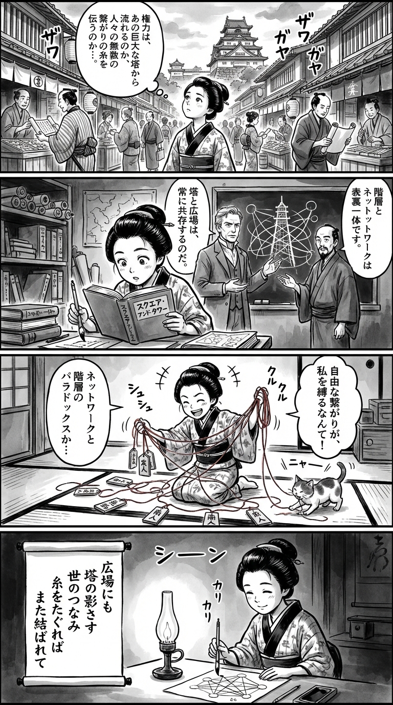

> **Language**: [日本語](../ja/スクエア・アンド・タワー　【合本版】_review.html) | [English](../en/スクエア・アンド・タワー　【合本版】_review.html) | [繁體中文](../zh-tw/スクエア・アンド・タワー　【合本版】_review.html)
>
> [← Top / トップページ](../../)

## 📖 Book Information
- **Title**: スクエア・アンド・タワー　【合本版】  
- **Author**: ニーアル ファーガソン and 柴田 裕之  
- **ASIN**: B081PVDCHF  
- **URL**: [https://www.amazon.co.jp/dp/B081PVDCHF](https://www.amazon.co.jp/dp/B081PVDCHF)  

---

## Dialogue

### Panel 1
**Scene**: The townsgirl strolls through a lively Edo market, observing merchants and officials communicating through couriers and gossip. She stops to gaze at the distant Edo Castle, pondering the true nature of "power"—whether it resides in the grand tower or in the intricate web of human connections. Background features wooden stalls, paper lanterns, and the silhouette of the castle tower in the distance.
**Dialogue**: "How does power truly flow?"

### Panel 2
**Scene**: In a dim study filled with scrolls and Dutch books, the townsgirl reads a thick foreign book titled “Square and Tower.” A wise foreign scholar resembling Niall Ferguson appears beside her, along with a calm Japanese interpreter, Hiroyuki Shibata. They point to a chalkboard diagram illustrating a "tower" and a "web" intertwined. The girl's eyes light up with understanding as she traces the lines with her brush.
**Dialogue**: "So this is how they connect..."

### Panel 3
**Scene**: The townsgirl is on a giant tatami mat, mapping out relationships in her neighborhood with red threads connecting friends, teachers, and merchants. The web becomes chaotic, tangling around her feet, illustrating the binding nature of connections. She laughs, realizing the paradox of "network and hierarchy," while a cat playfully swats at the threads.
**Dialogue**: "It's both freeing and binding!"

### Panel 4
**Scene**: At night, the townsgirl sits by a lamp, admiring her completed network diagram. She lifts her brush to write a reflective tanka on a hanging scroll, her face illuminated by gentle light as she smiles with quiet insight.
**Dialogue**: "This is my understanding of connection."
**Tanka (translation)**: In the square, shadows of towers cast, connecting the world.  
When I pull the threads, they bind once more.  
**Tanka (original)**: 広場にも　塔の影さす　世のつなみ  
糸をたぐれば　また結ばれて

## 🎯 The Core of This Book
"スクエア・アンド・タワー" is a grand historical work that reconstructs human history as a struggle between "networks (squares)" and "hierarchies (towers)." The author, Niall Ferguson, illustrates how the forms of power have changed from the Reformation to the digital revolution through the lens of network theory.

The development of communication technologies, such as printing and the internet, disrupts existing orders and creates new structures of domination, sharply questioning the relationship between technology and power. The paradox that the freedom of networks does not necessarily mean democratization, but rather creates new hierarchies, is a core insight of this book.

Ultimately, Ferguson concludes that the world will always maintain a structure that oscillates between "squares" and "towers," presenting an eternal cycle of order and disorder.

---

## 💡 Key Insights
- **Networks are a fundamental human capability**  
  Humans have evolved through their ability to form social networks. The mechanisms of cooperation and information sharing support the development of civilization, and the structure of these networks influences social stability and transformation, as the author argues.

- **The spread of information depends on network structures**  
  The dissemination of ideas and thoughts is influenced more by the form of connections than by the content itself. The book presents a framework for understanding the success or failure of social movements and technological innovations from the perspective of network science.

- **Technological innovations always reorganize power structures**  
  Just as printing technology prompted the Reformation, the internet is shaking up political and economic hierarchies. The evolution of technology signifies not just convenience, but a reallocation of control and freedom.

- **The freedom of networks creates new inequalities**  
  Giant companies like Facebook and Google, while advocating for decentralization, actually concentrate information and capital. Facing the gap between the ideals and realities of networks is a challenge of modern society.

- **Understanding history requires a network perspective**  
  By interpreting changes in politics, religion, and economics as dynamics of networks challenging hierarchies, our view of history fundamentally shifts. This insight is applicable not only to understanding the past but also to designing future societies.

---

## 🔍 Relevance to Modern Context
The development of modern social media and AI embodies the "revival of networks" and the "emergence of new towers" described in this book. Social media visualizes individual voices while simultaneously strengthening information control through algorithms.

In the society of 2026, information networks generated by AI are influencing decision-making in politics, economics, and culture, manifesting the signs of "orderless networks" that Ferguson warns about. In this era where the democratization and centralization of information occur simultaneously, the historical insights of this book serve as a guide for rethinking the ethical governance of technology.

---

## 🚀 Practical Suggestions
1. **Visualize your network structure**  
   By diagramming your relationships and information pathways, you can understand which nodes hold influence, enabling more strategic communication.

2. **Cultivate "weak ties"**  
   Intentionally increasing loose connections with different fields and cultures, rather than relying solely on homogeneous relationships, can generate new ideas and opportunities.

3. **Read technology as a power structure**  
   Adopt a perspective that observes new services and platforms not merely as convenient tools, but as devices for the reorganization of social control.

4. **Consider the ethical governance of networks**  
   In light of the current situation where information centralization expands inequality, it is crucial to explore systems that prioritize transparency and decentralization.

5. **Reevaluate history from a network perspective**  
   By reinterpreting past social transformations through the lens of network formation and collapse, we can gain a deeper understanding of contemporary changes.

---

## ⭐ Overall Evaluation
"スクエア・アンド・タワー" is an intellectual adventure that traverses history, society, and technology. Ferguson presents network theory not merely as a metaphor but as a structural principle of history, depicting the evolution of humanity and the shifts in power from a consistent viewpoint.

In today's information society, this book is essential for considering how to control the power of networks and how to ethically utilize them. It will provide deep insights and a long-term perspective to readers standing at the intersection of social science, management, and technology.

---

&copy; shioki | [CC BY-NC-SA 4.0](https://creativecommons.org/licenses/by-nc-sa/4.0/)
