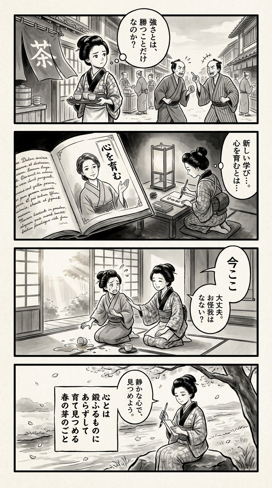

> **Language**: [日本語](../ja/スポーツ精神科医が教える日常で活かせるスポーツメンタル_review.html) | [English](../en/スポーツ精神科医が教える日常で活かせるスポーツメンタル_review.html) | [繁體中文](../zh-tw/スポーツ精神科医が教える日常で活かせるスポーツメンタル_review.html)
>
> [← Top / トップページ](../../)

## 📖 Book Information
- **Title**: スポーツ精神科医が教える日常で活かせるスポーツメンタル  
- **Author**: 木村好珠  
- **ASIN**: B09LCG4749  
- **URL**: [https://www.amazon.co.jp/dp/B09LCG4749](https://www.amazon.co.jp/dp/B09LCG4749)  

---

<picture>
  <source srcset="../../images/reviews/スポーツ精神科医が教える日常で活かせるスポーツメンタル_4panel.webp" type="image/webp">
  
</picture>

## Dialogue

### Panel 1
**Scene**: In a lively Edo street, the townsgirl pauses while assisting at a teahouse, overhearing two merchants arguing about whose efforts deserve more recognition. She frowns slightly, contemplating the nature of strength.
**Dialogue**: “Is strength only about winning?”

### Panel 2
**Scene**: In her dimly lit room at night, illuminated by an andon lamp, the townsgirl unrolls a scroll of Dutch medical texts alongside a new manuscript. It features an illustration of a serene woman resembling Dr. Yoshimi Kimura, who embodies wisdom and compassion. The townsgirl eagerly copies the phrase “心を育む” (to nurture the mind) into her notebook.
**Dialogue**: [None]

### Panel 3
**Scene**: The next morning, when her friend accidentally spills tea, the townsgirl responds with a gentle smile instead of anger. She takes a deep breath, focusing on “今ここ (the here and now),” and offers kind words that turn the mishap into laughter.
**Dialogue**: [None]

### Panel 4
**Scene**: By the riverbank in quiet reflection, the townsgirl writes a waka on a small tanzaku paper, gracefully holding her brush. The serene scene captures the essence of nurturing inner strength, with rippling water and drifting petals surrounding her.
**Dialogue**: [None]  
**Tanka (translation)**: The heart is not something to be forced; it is like the spring buds that we nurture and observe.  
**Tanka (original)**: 心とは　鍛ふるものに　あらずして  
育て見つめる　春の芽のごと

## 🎯 The Core of This Book
This book serves as a practical guide to applying the theories of sports psychology in everyday life, fostering the "power to organize one's mind." The author, 木村好珠, positions mental strength not as something to be "built up," but rather as something to be "nurtured," emphasizing growth through understanding emotions and relationships rather than relying on effort and willpower.

At its core are the concepts of "having a personal axis" and "visualizing and accepting emotions." The book provides concrete explanations of various multi-layered elements that support mental health, such as creating a psychologically safe environment, the use of language, and the establishment of healthy habits. The content is relevant not only for athletes but also for anyone facing stress in work or family life.

---

## 💡 Key Insights
- **The Harmony of "Thought" and "Emotion" Influences Performance**  
  Understanding and organizing emotions, not just rational thought, is key to achieving stable results. Acknowledging emotions rather than ignoring them enhances self-understanding and the quality of actions.

- **Change Your Brain's Focus with a "Gratitude Journal"**  
  By recording small daily successes and joys, you cultivate your brain's circuitry for "finding good things." This practice is based on positive psychology and has the effect of increasing happiness and self-esteem.

- **Reduce Anxiety by Focusing on the "Here and Now"**  
  Anxiety arises from abstract thoughts about the future. By bringing awareness back to the present, you can prevent runaway thoughts and make calm judgments. This practice is also effective as a form of mindfulness.

- **"Anger" is a Reflection of Expectations, and Verbalizing is Key**  
  Instead of suppressing anger, expressing the underlying expectations and frustrations can lead to constructive dialogue. How we handle emotions reflects the maturity of our relationships.

- **"Acting for Evaluation is Not the Goal; Evaluation Comes After Action"**  
  By not getting swept away by results-oriented thinking and focusing on "contribution" and "meaning," you can sustain long-term motivation. This perspective is crucial in today's work culture.

---

## 🔍 Relevance to Modern Context
The book's proposal of "applying sports psychology to daily life" resonates deeply with the contemporary focus on well-being. In a society that emphasizes competition and results, the attitude of "having a personal axis and growing together with others" is gaining attention as a new standard for mental health.

Moreover, against the backdrop of an expanding inclusive society and the divisions of the social media age, there is a growing awareness of psychological safety and boundaries. The practices of "equal relationships" and "verbalizing emotions" presented in this book provide concrete answers to the challenges of our time. It is a book that supports a culture of "mutual recognition and coexistence" that extends from the sports field to society as a whole.

---

## 🚀 Suggestions for Practice
1. **Start a "Gratitude Journal"**  
   Record one positive thing each day. This helps shift your brain's focus to the positive and cultivates gratitude and happiness.

2. **Reduce "D-words"**  
   Avoid negative words like "but" and "because," replacing them with more accepting language. This improves the quality of dialogue and enhances psychological safety.

3. **Practice Bringing Awareness Back to the "Here and Now"**  
   When feeling anxious, concentrate on specific actions you can take right now. This helps curb runaway thoughts and regain calm judgment.

4. **Establish a Rhythm for Eating and Sleeping**  
   Ensure you have breakfast and get enough sleep. Practicing the basics that lead to mental stability is essential.

5. **Act with a Clear Purpose**  
   Being conscious of "why you are doing something" gives meaning to your actions and helps sustain motivation.

---

## ⭐ Overall Evaluation
『スポーツ精神科医が教える日常で活かせるスポーツメンタル』 presents a new perspective that focuses on "nurturing" rather than "training" the mind. Through insights from sports, it offers concrete methods for integrating emotions, thoughts, and lifestyle habits, making it beneficial for business professionals, students, and families alike.

Reading this book deepens self-understanding and fosters flexibility in relationships with others. It teaches what it means to cultivate "mental muscles" in a stress-filled society, providing insights from both theoretical and practical perspectives.

---

&copy; shioki | [CC BY-NC-SA 4.0](https://creativecommons.org/licenses/by-nc-sa/4.0/)
