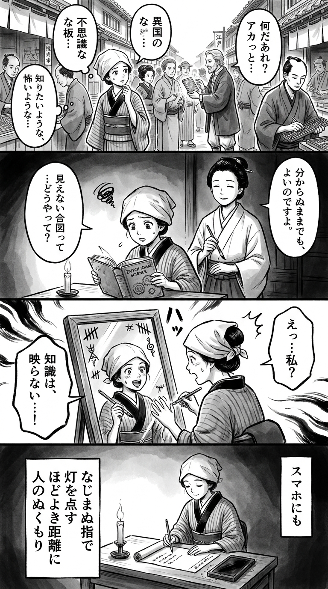

> **Language**: [日本語](../ja/スマホになじんでおりません_review.html) | [English](../en/スマホになじんでおりません_review.html) | [繁體中文](../zh-tw/スマホになじんでおりません_review.html)
>
> [← Top / トップページ](../../)

## 📖 Book Information
- **Title**: スマホになじんでおりません  
- **Author**: 群 ようこ  
- **ASIN**: B0FNLRBYQY  
- **URL**: [https://www.amazon.co.jp/dp/B0FNLRBYQY](https://www.amazon.co.jp/dp/B0FNLRBYQY)  

---

<picture>
  <source srcset="../../images/reviews/スマホになじんでおりません_4panel.webp" type="image/webp">
  
</picture>

## Dialogue

### Panel 1
**Scene**: The townsgirl walks through a lively Edo marketplace, observing merchants using abacuses to tally their accounts. She spots a peculiar “glass tablet” brought by a foreign trader, with people poking at it in confusion. She tilts her head, feeling both intrigued and uneasy, sensing the allure and burden of this mysterious “smart tool.” The street is filled with chatter, and the air buzzes with curiosity and mild frustration.
**Dialogue**: None

### Panel 2
**Scene**: Inside a candle-lit study, the townsgirl studies a Dutch science book, trying to grasp the concept of the “invisible signals” from the glass tablet. Behind her stands a calm, thoughtful woman, inspired by the author Yōko Mure, with a gentle expression and scholarly aura. She wears simple robes, her hair neatly tied, and holds a brush, smiling softly as if to convey, “It’s fine not to master everything.” The atmosphere is humorous and tender, blending wisdom and humility.
**Dialogue**: None

### Panel 3
**Scene**: The townsgirl experiments with her own version of the “smart glass”—a framed mirror adorned with tally marks and charms. She attempts to “summon” knowledge, only to find that it reflects her own face. Startled, she laughs, realizing that the true tool lies within her hands and heart. The composition is dynamic, showcasing reflection and self-recognition.
**Dialogue**: None

### Panel 4
**Scene**: Sitting by lamplight, the townsgirl writes a waka on a scroll, her expression serene. The candle flickers beside her, and the “glass tablet” now rests quietly on the desk, covered in dust but still faintly glowing.  
**Dialogue**: None  
**Tanka (translation)**: Even with fingers unaccustomed to smartphones, I light the flame, finding warmth in the right distance from others.  
**Tanka (original)**: スマホにも  
なじまぬ指で  
灯を点す  
ほどよき距離に  
人のぬくもり

## 🎯 The Core of This Book
群ようこ’s 『スマホになじんでおりません』 is an essay that explores how to engage with the smartphone, a modern symbolic presence, from the perspective of a generation unfamiliar with digital devices. The author humorously recounts the process of gradually adapting to smartphone operations and the confusion of password management, even while feeling overwhelmed by the complexities.

At the same time, the book examines the duality of smartphone convenience and dependency, information overload, and the loss of tangible experience, while seeking a "moderate distance" from technology. Through the experiences of living with an elderly cat and dealing with loss, the author highlights moments where digital devices support human endeavors, showcasing a warm perspective.

---

## 💡 Key Insights
- **The Burden Behind Convenience**  
  While acknowledging the convenience of smartphones, the author candidly depicts the reality of being exhausted by complex operations and a flood of information. The sharp insight that convenience also entails "management hassle" and "time wastage" stands out.

- **Loss of Sensation Due to Digitalization**  
  The author's statement about "losing the sense of money" through cashless payments and stamp purchases symbolizes the "loss of tactile experience" brought about by the digital society. It presents the precariousness of diminishing the reality of life as a cost of convenience.

- **Humor in Aging and Relearning**  
  Self-deprecatingly stating, "The problem is my head," the author continues to challenge new technologies. This attitude, filled with warm humor, portrays aging not as something to be pessimistic about but as an opportunity for relearning.

- **Human Connections Brought by Smartphones**  
  The experience of smartphones being helpful in caring for an elderly cat illustrates how technology can serve as a medium connecting people and lives. The image of smartphones as not just machines but as entities that support emotions and memories emerges.

- **Coexistence Despite Incomplete Understanding**  
  The phrase "I have no idea what's going on, but it worked out" reflects the reality of modern individuals who continue to use technology without fully understanding it. It suggests that flexible coexistence is more relevant to contemporary living than perfect understanding.

---

## 🔍 Relevance to Modern Context
The themes of this book reflect not only the confusion of individuals struggling to master smartphones but also the discomfort with the societal shift towards "smartphone dependency." As smartphone use becomes essential in various aspects of life, such as administrative procedures, payments, and transportation, the issue of "digital exclusion"—where those unable to use smartphones are disadvantaged—becomes a real concern.

On the other hand, there is a growing fatigue with the always-connected society and an increasing interest in "digital detox." 群ようこ’s approach of "keeping a moderate distance" resonates with these countercultural values of the times. The proposal to coexist at one's own pace, neither rejecting smartphones nor becoming dependent on them, illuminates a universal challenge relevant to all modern individuals.

---

## 🚀 Practical Suggestions
1. **Consciously Limit Usage Time**  
   Like the author, setting personal rhythms for smartphone usage, such as "turning it off after five minutes," can help avoid being overwhelmed by information. Digital fasting is an effective means to regain time and focus.

2. **Maintain Flexibility to Use Without Full Understanding**  
   Adopting an attitude of "using what I can" without seeking perfect understanding can reduce stress and allow for continued learning. It is more realistic to "get accustomed to" technology rather than "master" it.

3. **Value Analog Sensibilities**  
   Engaging with physical books and vertical writing culture is an act of preserving the senses often lost in the digital world. Maintaining formats that feel comfortable can contribute to mental stability.

4. **Question Convenience and Be Aware of Risks**  
   Convenient systems like cashless payments and online banking often harbor risks of information leakage and dependency. The author's cautious attitude serves as a reference for literacy in modern society.

5. **Position Smartphones as "Assistants" in Life**  
   Use smartphones only in truly necessary situations, such as caring for an elderly cat or searching for flowers. By treating smartphones as auxiliary tools rather than the center of life, one can build a healthy relationship with technology.

---

## ⭐ Overall Evaluation
『スマホになじんでおりません』 is an essay that transforms the confusion of those unfamiliar with technology into humor while quietly illuminating the "shadows of convenience" in modern society. 群ようこ’s writing is light-hearted yet possesses depth, questioning what it means to be "human" in an increasingly digital world.

For those fatigued by smartphones, feeling discomfort in the digital society, or struggling with generational gaps, this book offers empathy and comfort. It provides an opportunity to reflect on one's relationship with technology while eliciting laughter.

---

&copy; shioki | [CC BY-NC-SA 4.0](https://creativecommons.org/licenses/by-nc-sa/4.0/)
