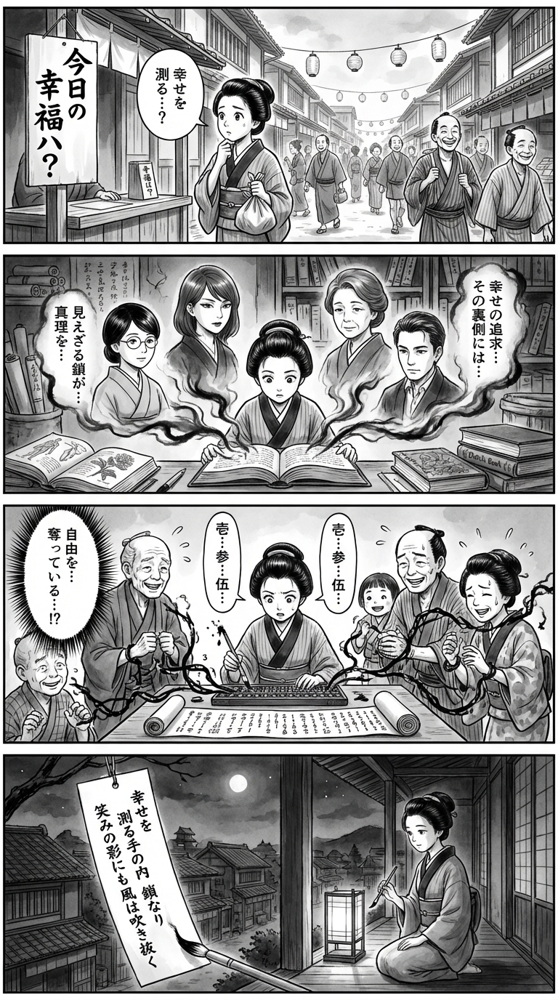

> **Language**: [日本語](../ja/ハッピークラシー――「幸せ」願望に支配される日常_review.html) | [English](../en/ハッピークラシー――「幸せ」願望に支配される日常_review.html) | [繁體中文](../zh-tw/ハッピークラシー――「幸せ」願望に支配される日常_review.html)
>
> [← Top / トップページ](../../)

## 📖 Book Information
- **Title**: ハッピークラシー――「幸せ」願望に支配される日常  
- **Authors**: エドガー・カバナス, エヴァ・イルーズ, 山田陽子, and 高里ひろ  
- **ASIN**: B0BLHXVHHX  
- **URL**: [https://www.amazon.co.jp/dp/B0BLHXVHHX](https://www.amazon.co.jp/dp/B0BLHXVHHX)  

---

<picture>
  <source srcset="../../images/reviews/ハッピークラシー――「幸せ」願望に支配される日常_4panel.webp" type="image/webp">
  
</picture>

## Dialogue

### Panel 1
**Scene**: In a lively Edo street, the townsgirl stands in front of a fortune-teller's stall, contemplating a wooden sign that asks, "How happy are you today?" She tilts her head, confused about the concept of measuring happiness. The background features longhouses, merchants, and townspeople who wear forced smiles, creating an unsettling atmosphere of artificial cheerfulness.
**Dialogue**: None

### Panel 2
**Scene**: Inside a dimly lit study filled with scrolls and Dutch books, the townsgirl is engrossed in reading a foreign treatise. The page depicts four ghostly mentors engaged in conversation: a calm, bespectacled woman, a sharp-eyed woman with a refined demeanor, a gentle middle-aged woman with a scholarly presence, and a serious male scholar. Their expressions are grave, as if they are revealing the hidden truths about the pursuit of happiness.
**Dialogue**: None

### Panel 3
**Scene**: The townsgirl conducts an experiment, setting up an abacus and scroll to "calculate happiness" among her neighbors. As she counts, everyone tries to smile widely, but the numbers twist into chaotic ink lines, forming chains around them. Shocked, she drops her brush, realizing that she is measuring away their freedom.
**Dialogue**: None

### Panel 4
**Scene**: As night falls, the townsgirl sits beside a lantern, gazing at the quiet town. She writes a waka on a hanging strip of paper, her expression calm yet contemplative. The poem reads:  
「幸せを　測る手の内　鎖なり　笑みの影にも　風は吹き抜く」  
**Tanka (translation)**: "To measure joy / is to forge unseen chains— / even in smiles’ shade, / the wind of doubt still passes."  
**Tanka (original)**: 「幸せを　測る手の内　鎖なり　笑みの影にも　風は吹き抜く」

## 🎯 The Core of This Book
『ハッピークラシー』 is a critical sociological work that exposes how the universal value of "happiness" has become a mechanism of control in modern society. The authors point out that positive psychology and happiness economics, while masquerading as "scientific neutrality," are actually political projects that spread neoliberal values.

The quantification of happiness and the proliferation of mindfulness do not enhance individual freedom and autonomy; rather, they create a new form of control that imposes "self-management" and "self-optimization." This book argues for the need to reclaim happiness as a social and political question, exposing the internalized control that progresses in the name of happiness.

---

## 💡 Key Insights
- **The Science of Happiness is Political**  
  Happiness research is not a neutral science but a political endeavor that contains values. By framing happiness as "measurable," there is a risk of shifting the issues of social inequality and disparity onto individual shortcomings.

- **The Individualization of Happiness Hinders Social Change**  
  By confining happiness to the individual’s inner world, the structural causes of social problems become obscured. The more people prioritize "their own happiness," the more the power of solidarity and political action diminishes.

- **Positive Psychology Internalizes Corporate Control**  
  The culture that demands "be positive" in workplaces and educational settings makes employees and students compliant, stifling criticism of the status quo. The pursuit of happiness becomes a means to justify workers' "self-exploitation."

- **The Measurement of Happiness Threatens Democracy**  
  When happiness metrics become the basis for policy decisions, political judgments are transformed into "technical" matters. This book sharply points out the danger of citizens' voices being excluded as "irrational."

- **The Happiness Industry Strengthens a Self-Surveillance Society**  
  Self-tracking apps and well-being products impose the "duty to manage oneself" on individuals. In the name of happiness, we are being transformed into subjects who willingly accept surveillance.

---

## 🔍 Connection to Contemporary Context
In modern Japan, the idea of "being happy" has permeated as a social obligation. In education and workplaces, "positive thinking" and "smiling environments" are encouraged, forcing caregivers and teachers to create "happy environments" even while they are exhausted. This phenomenon is a typical example of a structure that reduces happiness to individual effort.

Moreover, while companies promote themselves as "brands that provide happiness," issues of labor conditions and social justice are often neglected. The current situation where happiness becomes a marketing tool precisely supports the critiques presented in this book. The "gentle control" that progresses in the name of happiness is one of the most invisible forms of power in contemporary society.

---

## 🚀 Practical Suggestions
1. **Adopt a Critical Perspective on "Happiness"**  
   Question whose interests happiness serves as a starting point. It is important to discern the political and economic intentions behind scientific claims about happiness rather than taking them at face value.

2. **Do Not Reduce Structural Problems to Individual Responsibility**  
   Consider the social and institutional contexts behind unhappiness or dissatisfaction instead of treating them as "failures of self-improvement." Sharing problems through solidarity and collaboration is the first step toward true happiness.

3. **Distance Yourself from the Quantification of Happiness and Self-Tracking**  
   Measuring happiness through apps and data leads to self-alienation. It is essential to focus on relationships with others and social connections rather than managing emotions numerically.

4. **Reassess "Positive Enforcement" in Education and Workplaces**  
   A culture that demands "always being bright and positive" robs diversity of thought. Creating an environment that respects critical thinking and emotional breadth will form the foundation of a healthy society.

5. **Redefine Happiness as a Social Concept**  
   It is necessary to reconsider happiness not as an individual inner state but within the context of social values like justice, solidarity, and freedom. Reclaiming happiness as "the power to live together" is the core of the proposals in this book.

---

## ⭐ Overall Evaluation
『ハッピークラシー』 is a sharp critique that cuts through the illusions surrounding happiness in contemporary society. It visualizes the structures of control and self-surveillance that progress in the name of happiness, challenging us to question our "freedom."

For readers who have felt discomfort with positive psychology or the well-being industry, this book will serve as a powerful theoretical backing for those intuitions. Questioning happiness is not pessimism; it is an intellectual resistance for living more authentically.

---

&copy; shioki | [CC BY-NC-SA 4.0](https://creativecommons.org/licenses/by-nc-sa/4.0/)
