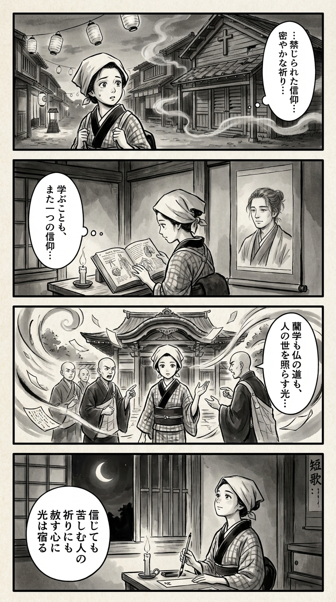

> **Language**: [日本語](../ja/パシヨン_review.html) | [English](../en/パシヨン_review.html) | [繁體中文](../zh-tw/パシヨン_review.html)
>
> [← Top / トップページ](../../)

## 📖 Book Information
- **Title**: パシヨン  
- **Author**: 川越 宗一  
- **ASIN**: B0C9CG8C55  
- **URL**: [https://www.amazon.co.jp/dp/B0C9CG8C55](https://www.amazon.co.jp/dp/B0C9CG8C55)  

---

<picture>
  <source srcset="../../images/reviews/パシヨン_4panel.webp" type="image/webp">
  
</picture>

## Dialogue

### Panel 1
**Scene**: The townsgirl walks through an Edo street at dusk, captivated by a whispered sermon about forbidden faith. She pauses before a closed church, her expression a mix of curiosity and unease, surrounded by the quiet tension of the evening, with incense smoke drifting and paper lanterns swaying gently in the breeze.
**Dialogue**: [No dialogue]

### Panel 2
**Scene**: Inside her small room, the townsgirl studies a Dutch book on philosophy and faith by candlelight. A scroll nearby features a portrait of an imagined scholar inspired by Sōichi Kawagoe, depicted as a calm, thoughtful man with soft features and loosely tied hair. His eyes seem to watch over her as she reflects, “Learning too is a kind of belief…”
**Dialogue**: “Learning too is a kind of belief…”

### Panel 3
**Scene**: The townsgirl visits the local temple, where monks question her about her studies. She responds gently, combining logic and compassion, blending her knowledge of rangaku with empathy. A gust of wind lifts fallen prayer papers into the sky, symbolizing freedom through learning and forgiveness, with her figure centered amid swirling calligraphic strokes.
**Dialogue**: [No dialogue]

### Panel 4
**Scene**: That night, she sits by the window under the moonlight, writing a waka on a small tanzaku strip. The candle flickers softly as she gazes upward, embodying serenity and resolve. Her short poem encapsulates the book's message—faith, freedom, and forgiveness transcending despair.
**Dialogue**: [No dialogue]
**Tanka (translation)**: Even in belief, the prayers of the suffering hold a heart of forgiveness, where light resides.
**Tanka (original)**: 信じても  
苦しむ人の  
祈りにも  
赦す心に  
光は宿る

## 🎯 The Core of This Book
『パシヨン』 is a grand historical narrative set in Japan under religious prohibition, depicting the lives of people caught between faith and power, forgiveness and revenge. 川越宗一 challenges the essence of "believing" and "living" through the extreme circumstances of religious persecution.

At the heart of the story lies the paradox that faith can both save and torment individuals. The characters, while searching for the meanings of faith, loyalty, and freedom, resist or succumb to state power and social order, striving to maintain their dignity.

Ultimately, the narrative moves towards "forgiveness," transcending the cycle of revenge. The portrayal of human beings finding the will to "weave life" even in despair leaves a quiet hope in the hearts of readers.

---

## 💡 Key Insights
- **Faith is both salvation and a source of suffering**  
  Believing can guide people, but it can also lead to persecution and isolation. By depicting the light and shadow of faith, the author poses the universal question of "What does it mean to believe?"

- **Learning is the path to freedom**  
  As the saying goes, "Learning liberates people," knowledge possesses the power to free humans just like faith. The attitude of continuing to learn amidst oppression supports spiritual freedom.

- **Forgiveness is the only way to transcend despair**  
  As symbolized by 彦七's words "I return to forgive," choosing forgiveness over revenge is the path to true salvation. The courage to accept human weakness becomes the key to breaking the cycle.

- **The conflict between the state and the individual is a timeless theme**  
  The oppression under the Tokugawa regime symbolizes a structure that robs individuals of their freedom in the name of order. This conflict resonates with contemporary society, continuing as a struggle between power and conscience.

- **Hope is born in the midst of despair**  
  The will to "weave life" that remains after death and destruction embodies human resilience. The struggle to survive, even while hiding faith and ideals, symbolizes hope for the future.

---

## 🔍 Relevance to Contemporary Context
The "conflict between faith and power" and the "cycle of forgiveness and revenge" depicted in this work are universal issues that resonate in modern society. Divisions caused by differences in religion and ideology, as well as individual oppression by states and institutions, still exist in various forms today.

Moreover, the theme of "gaining freedom through learning" carries even more weight in a contemporary context marked by information overload and division. The ability to think for oneself and understand others through knowledge is the only means to transcend differences in faith and ideology.

『パシヨン』 serves as a mirror reflecting ethical and social challenges of today while being a story from the past. It continually questions the meaning of believing, forgiving, and surviving across time.

---

## 🚀 Suggestions for Practice
1. **Have the courage to choose forgiveness**  
   Choosing forgiveness over revenge in response to others' mistakes is the first step in breaking the cycle of conflict. Forgiveness is not a sign of weakness, but a testament to strength.

2. **Protect freedom by continuing to learn**  
   Maintaining a mindset of continuous learning and engaging with different values is key to preserving spiritual freedom. Knowledge, like faith, should liberate rather than bind.

3. **Weave hope even in despair**  
   It is crucial to never lose the will to "weave life" regardless of the situation. Accumulating small actions shapes hope for the future.

4. **Question your conscience before obeying power**  
   Resist being swayed by societal or institutional pressures, and maintain a stance of making judgments based on your ethical beliefs, which is the path to true freedom.

5. **Respect others' beliefs**  
   Approaching differences in faith and ideology with a willingness to understand rather than fear is the first step towards coexistence. It is essential to cultivate the strength to live amidst diverse values.

---

## ⭐ Overall Evaluation
『パシヨン』 is a powerful work that portrays fundamental human questions relevant to modern times, set against the backdrop of religious persecution. It deeply explores universal themes such as faith, freedom, and forgiveness with a profound narrative style.

This work, combining the intensity of a historical novel with philosophical depth, is not merely a story of the past. Readers will find themselves confronting their own beliefs through the struggles and choices of the characters.

It quietly teaches the meaning of believing, the difficulty of forgiving, and the preciousness of surviving.

---

&copy; shioki | [CC BY-NC-SA 4.0](https://creativecommons.org/licenses/by-nc-sa/4.0/)
