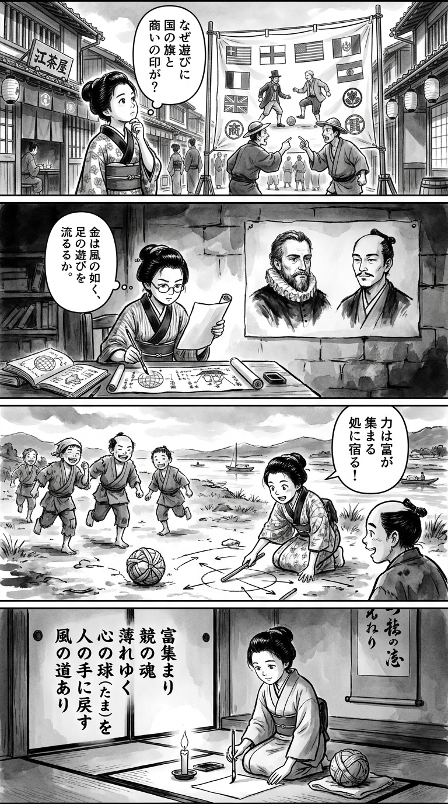

> **Language**: [日本語](../ja/フットボール・マネー_review.html) | [English](../en/フットボール・マネー_review.html) | [繁體中文](../zh-tw/フットボール・マネー_review.html)
>
> [← Top / トップページ](../../)

## 📖 Book Information
- **Title**: フットボール・マネー  
- **Authors**: ミゲル・デラニー and 山中拓磨  
- **ASIN**: B0GXF524MP  
- **URL**: [https://www.amazon.co.jp/dp/B0GXF524MP](https://www.amazon.co.jp/dp/B0GXF524MP)  

---

<picture>
  <source srcset="../../images/reviews/フットボール・マネー_4panel.webp" type="image/webp">
  
</picture>

## Dialogue

### Panel 1
**Scene**: In a lively Edo street, the townsgirl stops to listen to men discussing a banner that displays a football match between foreign nations. She tilts her head in curiosity about the significance of national flags and merchant crests for a simple game. Background features the Edo townscape with paper lanterns and a teahouse.
**Dialogue**: None

### Panel 2
**Scene**: Inside a dim study, the townsgirl examines Dutch and foreign scrolls depicting globes and trade routes. A charcoal portrait of two scholars hangs on the wall—one, a thoughtful foreign man (Miguel Delaney) with a contemplative gaze, and the other, a serene Japanese scholar (Takuma Yamanaka) with a calm demeanor and thin mustache. She softly reflects on how “money flows like wind through the sport of feet.”
**Dialogue**: "Money flows like wind through the sport of feet."

### Panel 3
**Scene**: At a local field by the riverbank, children are playing with a handmade rag ball. The townsgirl observes them and begins to draw circles and lines in the dirt with a stick, excitedly explaining how “power gathers where wealth pools.” The children laugh and chase the ball, and she realizes the joy that exists beyond ownership.
**Dialogue**: "Power gathers where wealth pools."

### Panel 4
**Scene**: In the evening, the townsgirl sits in candlelight with a brush in hand, looking at the ball beside her. She writes a waka poem on a hanging scroll that captures the essence of her reflections.
**Dialogue**: None  
**Tanka (translation)**: "Wealth gathers,  
The spirit of competition fades,  
The heart's ball returns  
To the hands of people,  
A path of wind exists."  
**Tanka (original)**: 「富集まり  
　競の魂　薄れゆく  
　心の球（たま）を  
　人の手に戻す  
　風の道あり」

## 🎯 The Core of This Book
『フットボール・マネー』 is a definitive critique of modern soccer, illustrating how the sport has transformed into a crossroads of national strategy, capital, and politics. Author ミゲル・デラニー thoroughly analyzes the internal structure of European soccer, uncovering the geopolitical intentions and capital flows lurking behind club management.

The book focuses on sportswashing, wealth concentration, and the collapse of governance. It questions how soccer, once intertwined with local communities, has morphed into a "symbol of hyper-capitalism" while depicting the process by which it has become a "national image strategy" and a "device for legitimizing authority."

The writing is accusatory yet simultaneously an attempt to rediscover the essential allure of soccer—its simplicity, communal nature, and storytelling.

---

## 💡 Key Insights
- **Soccer has become part of national strategy**  
  Soccer is no longer just entertainment; it has become a "tool of the state" intertwined with diplomacy, security, and resource policy. The author coldly depicts the reality where the purity of sports is eroded by political intentions.

- **The essence of sportswashing lies in emotional manipulation**  
  The joy of victory and the frenzy over star players "wash away" criticism of human rights violations and authoritarian regimes. This structural emotional manipulation symbolizes the ethical paralysis in modern media society.

- **Wealth concentration is destroying competition**  
  The structure where just 12 clubs monopolize wealth across Europe strips away the allure of soccer's "uncertainty," transforming the narrative into a "capital equation."

- **Lack of governance leads to systemic collapse**  
  Institutions like FFP (Financial Fair Play) have become mere shells, and the dysfunction of regulations accelerates inflation and bankruptcy. The soccer world has lost its ability to self-regulate, carrying structural risks akin to a financial crisis.

- **The essence of soccer lies in community**  
  The universality of enjoying the game with just one ball is the fundamental value of soccer. Now, as commercialization advances, there is a need to reevaluate connections between communities and people.

---

## 🔍 Relevance to Contemporary Context
The issues raised in this book resonate closely with the realities of modern soccer. The rise of oil money from Middle Eastern countries, the political exploitation of the World Cup, and national image strategies through club acquisitions all corroborate the warnings presented in this book.

Moreover, the infiltration of American-style commercialism into soccer, where even "water breaks" during matches are institutionalized for advertising revenue, symbolizes how sports have completely become "commodities." In this context, the book's call to "reclaim soccer" is not merely nostalgic but serves as a contemporary proposal for cultural regeneration.

Furthermore, as financial connections to sports strengthen through gambling markets, cryptocurrency inflows, and concerns over money laundering, the author's analysis becomes increasingly relevant.

---

## 🚀 Practical Suggestions
1. **Read the structures behind the matches**  
   By consciously tracking not just the outcomes and tactics but also the capital structures of clubs and their national backgrounds, one can gain a deeper understanding of soccer.

2. **Pay attention to club ownership structures**  
   The differences in ownership structures—state-owned funds, individual investors, fan ownership models—affect competition and ethics. It's important to consider which model can build a healthy future.

3. **Be aware of emotional manipulation**  
   Recognizing that the euphoria of victory and the frenzy over star players can obscure political and ethical issues is crucial. Spectators must not forget that they are also part of the structure.

4. **Support a sustainable soccer economy**  
   Evaluating and supporting models that prioritize community over profit, such as fan ownership and community-focused clubs, is necessary.

5. **Discuss the need for redistribution and regulation**  
   The future of soccer can only be made healthy through wealth redistribution and transparent regulation. Fans, as citizens, have a responsibility to participate in this discussion.

---

## ⭐ Overall Evaluation
『フットボール・マネー』 confronts soccer lovers with a harsh yet unavoidable reality. It exposes the political, capital, and ethical structures lurking behind the glamorous pitch, illustrating the fundamental crisis facing soccer as a culture.

This book is not merely a sports critique but a key text for understanding the "politics of power and emotion" in contemporary society. It serves as a must-read for those who love soccer and wish to reflect on the transformations in society.

---

&copy; shioki | [CC BY-NC-SA 4.0](https://creativecommons.org/licenses/by-nc-sa/4.0/)
