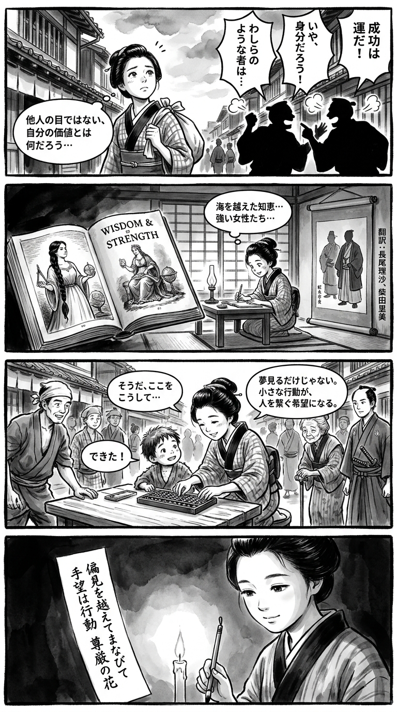

> **Language**: [日本語](../ja/マイ・ストーリー_review.html) | [English](../en/マイ・ストーリー_review.html) | [繁體中文](../zh-tw/マイ・ストーリー_review.html)
>
> [← Top / トップページ](../../)

## 📖 Book Information
- **Title**: マイ・ストーリー  
- **Author**: ミシェル・オバマ, 長尾莉紗, and 柴田さとみ  
- **ASIN**: 4087861171  
- **URL**: [https://www.amazon.co.jp/dp/4087861171](https://www.amazon.co.jp/dp/4087861171)  

---

<picture>
  <source srcset="../../images/reviews/マイ・ストーリー_4panel.webp" type="image/webp">
  
</picture>

## Dialogue

### Panel 1
**Scene**: In a narrow backstreet of Edo, the townsgirl carries a bundle of scrolls from her school, pausing to listen to merchants arguing about who deserves success, their voices filled with pride and bias. She looks up at the sky, pondering how one can find their own worth beyond others' expectations.
**Dialogue**: None

### Panel 2
**Scene**: In her dimly lit study, the girl reads a newly arrived Dutch-printed book featuring a strong, wise woman with long braided black hair, resembling an imagined portrait of Michelle Obama as a Western scholar. A translation scroll signed by “Nagao Risa” and “Shibata Satomi” hangs beside her, depicting gentle scholars in silhouette. The girl is deeply focused, her eyes shining with inspiration.
**Dialogue**: None

### Panel 3
**Scene**: In the town square, the girl assists a struggling child with arithmetic using her abacus. Curious townsfolk of various backgrounds gather around them. She chuckles softly, realizing that hope grows not just from dreams but from small acts that connect people.
**Dialogue**: None

### Panel 4
**Scene**: That night, illuminated by candlelight, she writes a tanka on a narrow strip of paper, her expression calm yet radiant.
**Dialogue**: None  
**Tanka (translation)**: Beyond prejudice, I learn and reach out; hope blossoms through actions, the flower of dignity.  
**Tanka (original)**: 偏見を  
越えてまなびて  
手をのばす  
希望は行動  
尊厳の花

## 🎯 The Core of This Book
『マイ・ストーリー』 is an autobiography in which ミシェル・オバマ describes her journey to find her own voice and values beyond "the expectations of others" and "societal prejudices." Her life is shaped by the support of her family, her passion for education, and her efforts to overcome racial and social constraints.  

At the heart of this book are two axes: "hope" and "dignity." While confronting realities such as loss and discrimination, ミシェル shows how she regenerates from those experiences and cultivates hope through action. Her perspective on "becoming something" emphasizes the value of life as an ongoing process of growth rather than a final destination.  

---

## 💡 Key Insights
- **The Limits of a Life Governed by a "To-Do List"**  
  Realizing the exhaustion of a results-oriented lifestyle, ミシェル transcends the anxiety of "not enough" and seeks essential fulfillment. This serves as a warning against "perfectionism" in modern society.  

- **Hope Grows Through Action**  
  She argues that hope is not an abstract ideal but a force that engages with reality. Not only setting ideals but also realizing them through practice becomes the driving force for social change.  

- **Loss Changes the Direction of Life**  
  Through the death of her father and her miscarriage, she comes to understand that "life is short and should not be wasted." Her ability to transform grief into energy for action serves as a model for regeneration for readers.  

- **Understanding Others Breaks Down Prejudice**  
  The realization that "it's hard to hate someone who is close to you" illustrates that empathy and dialogue are keys to healing divisions. She compellingly conveys the importance of human contact through her own experiences.  

- **"Becoming Something" Means Continual Evolution**  
  The philosophy that growth is not a fixed goal but an act of constant progression is central to this book. This reflects the idea of "lifelong self-formation" that is not bound by social roles or age.  

---

## 🔍 Connection to Contemporary Context
The themes of this book resonate deeply with social trends since the 2020s. The "diversity," "women's empowerment," and "health and education" that ミシェル・オバマ has communicated through platforms like Netflix documentaries extend from her autobiographical narrative. In both written and visual forms, she practices "transformation through storytelling."  

Furthermore, in the wake of the Black Lives Matter movement, discussions around race and identity have regained attention in American society. ミシェル's story advocates that protecting individual dignity is fundamental to democracy through her experiences as a Black woman. Her way of life serves as a symbolic example of "the politics of empathy" in an era of division.  

---

## 🚀 Suggestions for Practice
1. **Have the Courage to Tell Your Story**  
   By putting experiences into words, empathy with others can arise. Speaking out, rather than remaining silent, is the first step to breaking down prejudice.  

2. **Transform Hope into Action**  
   Rather than just setting ideals, shape hope through small daily actions. Action is the only means to actualize hope.  

3. **Let Go of Perfectionism and Support Each Other**  
   Helping one another and not demanding perfection is essential for sustainable growth. This is especially important for working women.  

4. **Choose Words with Ethics**  
   Selecting words that uphold dignity in social media and daily conversations maintains the health of society. Words carry social responsibility, just like actions do.  

5. **Maintain a Forward-Moving Attitude**  
   Continue the endless journey of "becoming something." Choosing evolution over stagnation allows for the coexistence of self-realization and social contribution.  

---

## ⭐ Overall Evaluation
『マイ・ストーリー』 is a rare autobiography that connects personal growth with social responsibility. Through her journey, ミシェル・オバマ presents readers with universal values of "hope," "dignity," and "empathy."  

This book will serve as a powerful compass for those who feel they might lose their voice in society or are facing prejudice and anxiety. After reading, one is left with the conviction that the first step to changing the world begins with "telling your own story."

---

&copy; shioki | [CC BY-NC-SA 4.0](https://creativecommons.org/licenses/by-nc-sa/4.0/)
