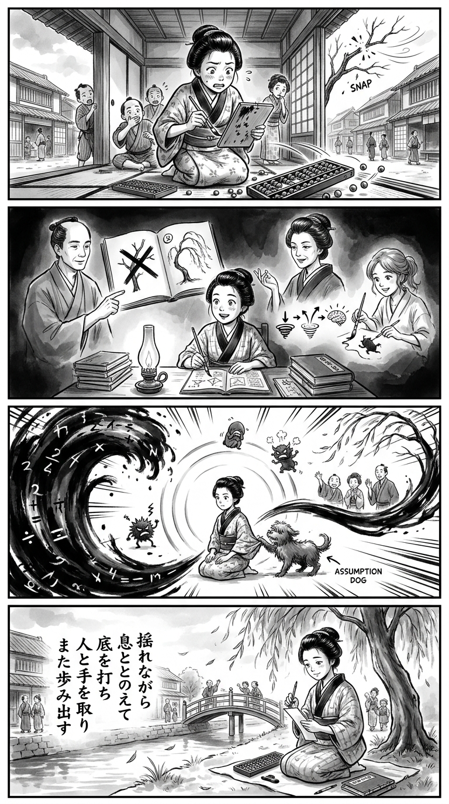

> **Language**: [日本語](../ja/マンガでやさしくわかるレジリエンス_review.html) | [English](../en/マンガでやさしくわかるレジリエンス_review.html) | [繁體中文](../zh-tw/マンガでやさしくわかるレジリエンス_review.html)
>
> [← Top / トップページ](../../)

# 📖 Book Information
- **Title**: マンガでやさしくわかるレジリエンス
- **Author**: 久世浩司, 松尾陽子, and 朝戸ころも
- **ASIN**: B017R70C88
- **URL**: [https://www.amazon.co.jp/dp/B017R70C88](https://www.amazon.co.jp/dp/B017R70C88)

---

<picture>
  <source srcset="../../images/reviews/マンガでやさしくわかるレジリエンス_4panel.webp" type="image/webp">
  
</picture>
## 🎯 Core of the Book
The resilience discussed in this book is not about having a strong mind that remains unshaken in adversity, but rather about having a "flexible mental strength" that can recover even when hurt and shaken. It is portrayed as a psychological resource that can be cultivated through emotional regulation and coping with misconceptions, rather than being an innate trait.

The recovery process is organized into three stages: "hitting rock bottom," which stops the cycle of negative emotions; "bouncing back," which restores psychological state; and "learning from experience," which derives meaning from past events. Furthermore, the book's approach encompasses relationships, self-efficacy, personal strengths, and the meaning of work, aiming to holistically nurture the ability to take on challenges again.

---

## 💡 Key Insights
- **Strength is not about being unshakeable**  
  What this book emphasizes is not the rigidity of suppressing emotions and enduring, but the flexibility to adapt and bounce back from change. This understanding alleviates self-criticism that labels a down self as "weak," allowing one to reframe recovery as a capability.

- **Do not eliminate emotions; label and manage them**  
  Emotions like anger, anxiety, and guilt are necessary responses for survival and danger avoidance, and should not be seen as villains. By labeling feelings as "I am anxious" or "I fear failure," one creates space to observe and regulate emotions without equating them with oneself.

- **Misconceptions are not personality traits but correctable interpretations**  
  The "colored glasses" that influence how events are perceived are not innate personality traits but thought patterns shaped by experiences. The book refers to these as "misconception dogs" and presents multiple coping methods—expulsion, acceptance, and training—to promote realistic self-understanding.

- **Confidence grows from small achievements**  
  Self-efficacy is strengthened not by grand successes but by accumulating experiences of completing small tasks one has set for oneself. Reflecting on not just the outcomes but also the ingenuity, perseverance, and strengths displayed becomes a foundation for facing future challenges.

- **Resilience also stems from connections with others**  
  Resilience is not just the ability to endure loneliness but also includes the capacity to seek help when needed. Relationships with those who provide assistance, information, advice, and intimacy support resilience not only for individuals but also for entire organizations.

---

## 🔍 Relevance to Modern Context
In today's world, where changes in work styles, interpersonal stress, harassment, and future anxieties overlap, resilience is becoming increasingly important. The book's distinction between "perseverance" and "resilience" serves as an effective correction to the tendency to attribute mental distress to a lack of personal grit.

However, if recovery methods are solely placed on individuals, environmental issues such as overwork and unhealthy relationships may become obscured. The book's focus on social support and high-quality connections aligns with recent trends in considering resilience, including consultation systems and workplace design. The use of manga as a medium also serves as an accessible entry point to psychological concepts, making it easy to share in training and educational settings.

---

## 🚀 Practical Suggestions
1. **Take three minutes to breathe right after an emotional upheaval**  
   Before rushing to solve problems, take a moment to adjust your posture and focus on your breathing. This is effective in preventing emotionally driven statements or actions and establishes the first stage of recovery, "hitting rock bottom."

2. **Record emotions in specific words**  
   Instead of ending with "it's tough," break it down into categories like "anger," "anxiety," "shame," and "guilt." By transforming vague pain into observable targets, it becomes easier to choose necessary coping strategies.

3. **Categorize your misconceptions into three types**  
   Look for thoughts behind strong reactions, such as "I must not fail" or "asking for help is a weakness." Then, if they are unhelpful, let them go; if they are realistic, accept them; and adjust only the excessive parts.

4. **List supporters by their roles**  
   Organize people who actually help you, provide information, offer advice, or make you feel secure. By nurturing these relationships in normal times, you can avoid isolation during adversity and connect to necessary support more quickly.

5. **Set small goals achievable within a week**  
   Instead of aiming for big changes, choose tasks like short workouts, completing one pending job, or having one consultation that you can confirm completion of. If you also record the ingenuity involved in achieving these, it builds a foundation for self-efficacy that "I can cope."

---

## ⭐ Overall Evaluation
The significance of this book lies in its ability to separate resilience from mere mental philosophy, presenting it as a trainable strength across multiple aspects: emotions, cognition, behavior, and relationships. The combination of manga and explanations makes it easy for readers unfamiliar with psychology to relate it to their own experiences.

This book is particularly suitable for those who tend to dwell on failures, struggle with workplace stress, or are in positions to support subordinates or colleagues. However, it should be noted that serious distress or harmful environments should not be overcome solely through self-regulation. By combining the practical methods in this book with rest, professional support, and environmental improvements, readers can achieve healthier outcomes.

---

&copy; shioki | [CC BY-NC-SA 4.0](https://creativecommons.org/licenses/by-nc-sa/4.0/)
