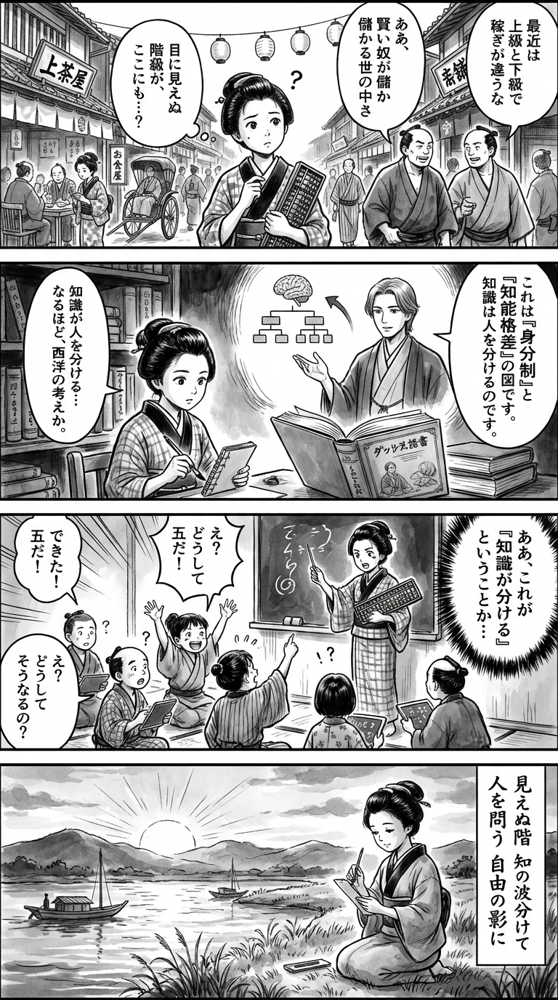

> **Language**: [日本語](../ja/上級国民／下級国民（小学館新書）_review.html) | [English](../en/上級国民／下級国民（小学館新書）_review.html) | [繁體中文](../zh-tw/上級国民／下級国民（小学館新書）_review.html)
>
> [← Top / トップページ](../../)

## 📖 Book Information
- **Title**: 上級国民／下級国民（小学館新書）  
- **Author**: 橘玲  
- **ASIN**: B07VRHJ3VG  
- **URL**: [https://www.amazon.co.jp/dp/B07VRHJ3VG](https://www.amazon.co.jp/dp/B07VRHJ3VG)  

---

<picture>
  <source srcset="../../images/reviews/上級国民／下級国民（小学館新書）_4panel.webp" type="image/webp">
  
</picture>

## Dialogue

### Panel 1
**Scene**: In a lively street of Edo, the townsgirl listens to merchants discussing the distinctions between “upper” and “lower” townsfolk, contemplating the invisible social ranks while holding an abacus and a notebook.
**Dialogue**: None

### Panel 2
**Scene**: In a dim study, the townsgirl opens a newly arrived rangaku book, envisioning a scholarly figure inspired by Tachibana Akira, who explains the concepts of social hierarchy and knowledge disparity.
**Dialogue**: None

### Panel 3
**Scene**: At a local temple school, the townsgirl teaches arithmetic to children, noticing the varying abilities of her pupils and realizing the truth behind the saying “knowledge divides.”
**Dialogue**: None

### Panel 4
**Scene**: At dusk by the riverbank, the townsgirl writes a waka on a tanzaku, her expression a mix of serenity and contemplation as the sun sets.
**Dialogue**: None
**Tanka (translation)**: The unseen ranks, waves of knowledge divide us, questioning humanity; A flower blooms alone, in the shadow of freedom.
**Tanka (original)**: 見えぬ階　知の波分けて　人を問う  
　自由の影に　孤立咲く花

## 🎯 The Core of This Book
橘玲's "上級国民／下級国民" is a social analysis that dissects the division in Japanese society through the lenses of "class system" and "intelligence disparity." The author identifies the root cause of economic stagnation as "low productivity," asserting that Japanese employment practices such as seniority-based pay and lifetime employment actually hinder happiness.

Moreover, the author points out that the "upper/lower" structure permeates private domains such as love and marriage, depicting the inequalities in the sexual market as a mechanism for the reproduction of social classes. There is a paradoxical perspective throughout the book that a liberal society, which advocates freedom and equality, is actually generating a new class domination under the guise of "personal responsibility."

In the final chapter, the author envisions a future where AI and technology surpass human intelligence, predicting the end of the "knowledge society" itself. The book's breadth lies in its ability to position Japan's stagnation and division within a global context and the evolution of technology.

---

## 💡 Key Insights
- **Japan's impoverishment stems from "low productivity"**  
  The author asserts that the decline in wages and living standards is a structural issue of productivity, not merely a cyclical economic phenomenon. To restore prosperity, it is essential to improve productivity at the individual level, in addition to institutional reforms.

- **"Japanese employment" is not a source of happiness but a breeding ground for misfortune**  
  Lifetime employment and seniority-based pay have sacrificed young people, women, and non-regular workers behind a facade of stability. The class system of full-time employees has fixed social stagnation and inequality.

- **Liberal society promotes both freedom and isolation simultaneously**  
  The expansion of freedom has a structure that justifies the "exclusion of those who do not strive." The advancement of individualism leads to the collapse of community, intensifying pressures of isolation and personal responsibility.

- **Disparities in the knowledge society are "intelligence disparities" themselves**  
  In a knowledge society, intelligence determines economic advantage. The evolution of AI and technology is exacerbating these disparities, making social division irreversible.

- **The sexual market is also a class society**  
  The freedom of love and marriage is linked to economic and social success, creating new hierarchies. Inequalities in sexual relationships symbolize another mirror of social division.

---

## 🔍 Relevance to Contemporary Context
The "upper/lower" structure pointed out in this book is directly connected to contemporary social issues in Japan, such as wage disparities, non-regular employment, and gender inequality. Especially now, as AI and automation advance, the tendency for disparities in knowledge and skills to determine economic status is becoming even more pronounced.

Furthermore, with the proliferation of social media and dating apps, love and human relationships are becoming "marketized," giving rise to visible hierarchical structures.橘's analysis can be read as a prescient insight into the divisions of the digital age.

The contradictions of liberal society and the runaway "personal responsibility" ideology also relate to contemporary political divisions. The author's perspective resonates not merely as social criticism but as a wake-up call that questions our own modes of thinking.

---

## 🚀 Practical Suggestions
1. **Do not neglect skill investment to enhance productivity**  
   Even amid structural stagnation, individual skills and knowledge can influence added value. Continuous learning and deepening expertise are the best defenses against a divided society.

2. **Aim to break free from "class consciousness"**  
   It is important to choose environments where one is evaluated based on achievements and abilities, rather than being trapped by rigid hierarchies of regular/non-regular employment, academic background, and gender. A flexible mindset to adapt to societal changes is required.

3. **Understand the structure of liberal society and live strategically**  
   Recognize the pressure of "personal responsibility" behind the ideals of freedom and equality, and develop realistic survival strategies. It is essential to build one's own capital, networks, and skills rather than relying solely on idealistic notions.

4. **Engage in continuous learning to adapt to the knowledge society**  
   As AI and digital technologies evolve, maintaining a learning attitude becomes a condition for survival. The only way to bridge the intelligence gap is through investment in knowledge.

5. **Maintain a perspective that does not reproduce the "upper/lower" structure**  
   Distance yourself from the mindset of ranking others and cultivate empathy for social minorities, as this will be the first step toward overcoming division.

---

## ⭐ Overall Evaluation
"上級国民／下級国民" is a masterpiece of social analysis that starkly depicts the divisions in contemporary Japan. 橘玲 clearly illustrates the "resurgence of class systems" that permeate diverse domains such as economy, employment, love, and intelligence, confronting readers with an uncomfortably sharp awareness of reality.

This book is not merely a discourse on disparity; it is also a philosophical treatise that reexamines the essence of "freedom" and "happiness." I highly recommend it to readers who wish to understand the structure of society and reflect on their own positions in order to navigate the modern world.

---

&copy; shioki | [CC BY-NC-SA 4.0](https://creativecommons.org/licenses/by-nc-sa/4.0/)
