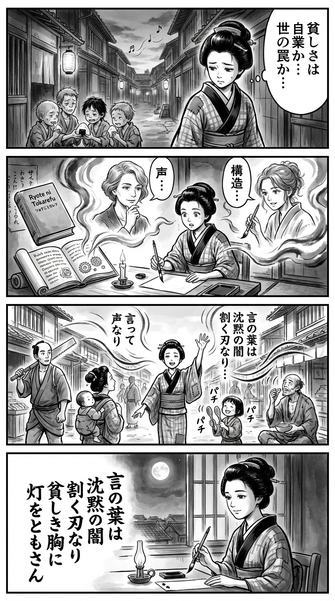

> **Language**: [日本語](../ja/両手にトカレフ_review.html) | [English](../en/両手にトカレフ_review.html) | [繁體中文](../zh-tw/両手にトカレフ_review.html)
>
> [← Top / トップページ](../../)

## 📖 Book Information
- **Title**: 両手にトカレフ  
- **Author**: ブレイディみかこ and オザワミカ  
- **ASIN**: B0B38Y31P6  
- **URL**: [https://www.amazon.co.jp/dp/B0B38Y31P6](https://www.amazon.co.jp/dp/B0B38Y31P6)  

---

<picture>
  <source srcset="../../images/reviews/両手にトカレフ_4panel.webp" type="image/webp">
  
</picture>

## Dialogue

### Panel 1
**Scene**: The young Edo-period townsgirl walks through a narrow alley of wooden houses at dusk, hearing distant shamisen music. She sees a group of poor children sharing a single rice ball, her smile fading as she feels a quiet unease. The flickering lantern light reflects her inner question: “Is poverty one’s fault… or a snare spun by the world?”
**Dialogue**: 

### Panel 2
**Scene**: Inside her small study illuminated by candlelight, she unrolls a Dutch text and a mysterious imported book titled “Ryote ni Tokarefu.” Two figures appear as imagined mentors — one resembling Brady Mikako, a thoughtful woman with short wavy hair and calm eyes, and another as Ozawa Mika, a younger woman with a keen gaze and a brush in hand. They appear as ghostly guides within the pages, whispering ideas about “voice” and “structure.” The townsgirl listens intently, her brush hovering over paper.
**Dialogue**: 

### Panel 3
**Scene**: The townsgirl stands in the bustling marketplace, reciting her freshly written verse aloud. Townsfolk pause — a carpenter, a mother, a beggar — each hearing part of her words. The air seems to ripple, her voice bridging invisible gaps between lives. She smiles unexpectedly as a child claps rhythm to her poem using two wooden spoons, an echo of music born from hardship.
**Dialogue**: 

### Panel 4
**Scene**: Night. The townsgirl sits by the window, gazing at the moon, holding her brush poised over a tanzaku. She writes a waka encapsulating the book’s essence, her expression serene yet resolute. The poem is visible on the tanzaku.
**Dialogue**: 
**Tanka (translation)**: Words are like blades that cut through the silence of darkness, igniting a light in a poor heart.
**Tanka (original)**: 言の葉は  
沈黙の闇  
割く刃なり  
貧しき胸に  
灯をともさん

## 🎯 The Core of This Book
『両手にトカレフ』 is a story about Mia, a girl surrounded by poverty and violence, who reconstructs her world through words and music. The authors depict poverty not as "individual laziness" but as a "structural trap," critically examining how social inequalities are reproduced across generations.

At the same time, this work is also a piece of literature that illustrates the power of "speaking," "listening," and "resonating." Mia's act of writing lyrics is not just a form of expression but a means of survival, where the seeds of solidarity with others reside. The process of finding the courage to say "YES" amidst despair leaves a profound aftertaste for the reader.

---

## 💡 Key Insights
- **Poverty is structural, not a choice**  
  Through the lives of Mia and Zoe, the book clearly illustrates that poverty is a social structure that cannot be escaped through effort alone. Readers gain an opportunity to reassess society from a perspective that transcends the narrative of personal responsibility.

- **Words have the power to change reality**  
  The scenes where Mia expresses her pain through lyrics show that words are not merely records but tools for self-healing and social change. Speaking becomes the first act of resistance against the violence of silence.

- **"Justice" is a privileged concept**  
  The line "Justice is something only the privileged believe in" confronts the depth of social inequality. Yet, at the same time, Mia's determination to change the world through her actions symbolizes a rediscovery of agency.

- **Resonance with others sustains life**  
  The music production with Will symbolizes understanding and healing that transcends words. The presence of others with whom one can resonate brings hope amidst despair.

- **"A world not here" exists within reality**  
  The "other world" that Mia discovers is not an escape, but a revelation of the possibilities hidden within reality. Hope is born not from a distant utopia but from the everyday life that exists here and now.

---

## 🔍 Connection to Contemporary Context
The themes of this book resonate deeply with the issues of poverty, gender, and race that are becoming increasingly visible in the UK and Japan in the 2020s. The "fixation of class society" that Brady Mikako has observed for many years echoes the structures of division and the exclusion of low-income groups following Brexit.

Moreover, in Japan, as the number of foreign workers increases and social exclusion progresses, the voices of the impoverished remain difficult to visualize. The importance of "speaking" and "listening" depicted in this work can be read as an ethical act to break such social silence.

The symbol of the "Tokarev" gun signifies not violence, but a metaphor for reclaiming the power that has been taken away within society. In today's unequal society, this book challenges us to reconsider the meaning of having "words to survive."

---

## 🚀 Suggestions for Practice
1. **Redefine reading as an act that transcends reality**  
   Just as Mia expands her world through books, reading stories from different classes and cultures is one of the most accessible practices to broaden one's thinking.

2. **Have the courage to speak your own reality**  
   Putting your experiences into words, whether through poetry, diaries, or social media, is the first step to creating resonance with others.

3. **Cultivate the attitude of listening to others' voices**  
   Just as Will transformed Mia's words into sound, sincerely listening to someone’s story is an act that transcends social divides.

4. **Be conscious of choosing "YES"**  
   Rather than negativity or resignation, accumulating small affirmations can empower us to change reality.

5. **Pay attention to invisible poverty**  
   Make an effort to understand the realities of those on the margins of society, and by engaging with news and voices from the field, regain a sense of imagination and solidarity.

---

## ⭐ Overall Evaluation
『両手にトカレフ』 is a pinnacle of contemporary literature that vividly portrays poverty, violence, and hope from the perspective of a girl living at the bottom of society. The intersection of Brady Mikako's social observations and Ozawa Mika's sensibility transforms the pain of reality into a poetic rhythm.

This work is not merely a social novel; it is a story that demonstrates the fundamental power of "living by speaking." For readers who are pained by contemporary inequalities and divisions, this book offers a quiet sense of renewal after reading.

---

&copy; shioki | [CC BY-NC-SA 4.0](https://creativecommons.org/licenses/by-nc-sa/4.0/)
