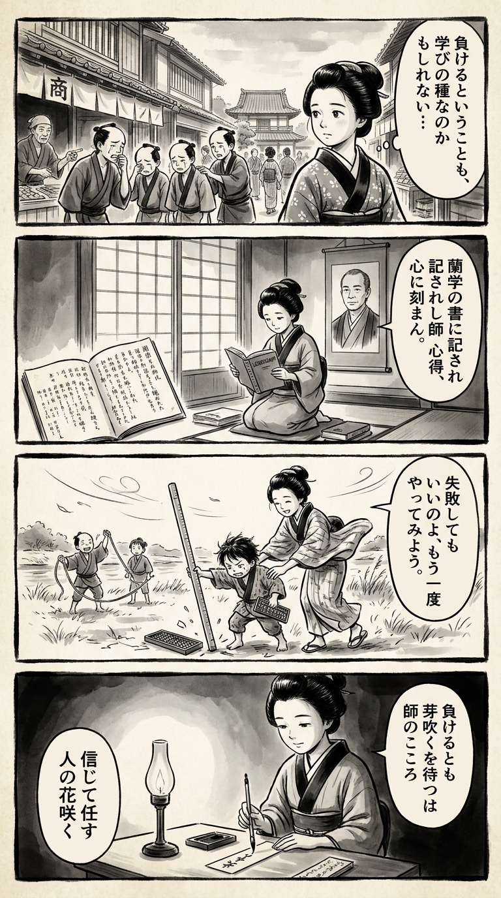

> **Language**: [日本語](../ja/二軍監督の仕事～育てるためなら負けてもいい～_review.html) | [English](../en/二軍監督の仕事～育てるためなら負けてもいい～_review.html) | [繁體中文](../zh-tw/二軍監督の仕事～育てるためなら負けてもいい～_review.html)
>
> [← Top / トップページ](../../)

## 📖 Book Information
- **Title**: 二軍監督の仕事～育てるためなら負けてもいい～  
- **Author**: 高津 臣吾  
- **ASIN**: B07KJ9XR8G  
- **URL**: [https://www.amazon.co.jp/dp/B07KJ9XR8G](https://www.amazon.co.jp/dp/B07KJ9XR8G)  

---

<picture>
  <source srcset="../../images/reviews/二軍監督の仕事～育てるためなら負けてもいい～_4panel.webp" type="image/webp">
  
</picture>

## Dialogue

### Panel 1
**Scene**: The townsgirl strolls through a bustling Edo street, observing a group of young apprentices being reprimanded for their mistakes. She pauses thoughtfully, contemplating that perhaps losing or failing can also be a form of learning. In the background, merchant houses and a small temple school can be seen.
**Dialogue**: "Maybe losing is just another way to learn."

### Panel 2
**Scene**: Inside a serene study illuminated by daylight filtering through shōji screens, the townsgirl is engrossed in a Dutch-translated book about leadership and learning. A hanging scroll features the portrait of an imagined scholar resembling Takatsu Shingo — a calm middle-aged man with short hair and steady eyes, exuding both discipline and empathy. His presence feels like that of a mentor watching over her as she takes notes in her washi notebook.
**Dialogue**: "I wonder what wisdom he would share..."

### Panel 3
**Scene**: At a riverside field, the townsgirl is teaching local children how to measure distance with a rope and abacus. One child miscalculates and accidentally knocks over the measuring pole; instead of scolding him, she laughs softly and encourages him to try again. The moment embodies the book's message that growth is more important than immediate success, with the wind gently rippling her kimono sleeves.
**Dialogue**: "It's okay! Let's try again together!"

### Panel 4
**Scene**: As evening descends, the townsgirl sits by the light of a lamp, peacefully writing a waka poem on a tanzaku slip. Her expression is serene, and the final panel radiates quiet emotion, with soft and fluid brush lines. 
**Tanka (translation)**: "Even if I lose, I wait for the sprout, trusting in the heart of my teacher, letting the flowers of others bloom."
**Tanka (original)**: 「負けるとも  
　芽吹くを待つは  
　師のこころ  
　信じて任す  
　人の花咲く」

## 🎯 The Core of This Book
This book portrays a coaching philosophy that values "developing people" over winning from the perspective of a professional baseball "minor league manager." The author, 高津臣吾, presents a nurturing method that emphasizes trust and autonomy, based on the "thinking baseball" he learned from coaches like 野村克也.  

As symbolized by the phrase "it's okay to lose in order to nurture," the entire text is permeated with the attitude of prioritizing player growth even at the cost of short-term victories. This approach is rooted in the manager's own experiences and the open organizational culture of the Yakult team.  

This book is not just about baseball; it can be read as a universal leadership theory applicable to education, organizational management, and talent development.

---

## 💡 Key Insights
- **A Philosophy of Nurturing "Finished Products"**  
  Positioning the minor league as a "factory for exporting finished products," the book advocates a patient approach to player development. This perspective, which prioritizes long-term growth over short-term results, is applicable across various fields of development.

- **"Not Playing" is the Biggest Risk**  
  The author argues that depriving players of playing opportunities is the primary factor that halts their growth. He emphasizes the importance of creating an environment that encourages learning through experience and challenges players to take risks without fear of failure.

- **Simple Instruction to "Go All Out"**  
  The emphasis on drawing out individuality through practice rather than theory is striking. By prompting action with concise phrases, the book creates moments for players to grasp their own instincts.

- **"Listening Skills" Determine a Leader's Qualities**  
  The ability to discern the essence behind players' words is deemed the most crucial trait for a coach. Building trust through dialogue serves as the foundation for supporting growth.

- **Sharing Development Policies Across the Organization**  
  The book stresses that development cannot succeed without collaboration among the first team, minor league, and front office. It maintains a realistic perspective that organizational support, rather than individual effort, produces results.

---

## 🔍 Relevance to Modern Context
In today's professional baseball world, there is a shift in values from an immediate results-oriented approach to "long-term development." 高津's philosophy symbolizes this change, redefining the minor league as a "learning space that allows for failure."  

This mindset resonates in the fields of education and corporate training as well. In school education, experiential learning that emphasizes "learning from failure" is gaining importance, and companies are increasingly fostering a culture that provides young employees with opportunities to take on challenges. 高津's coaching philosophy echoes these social trends and prompts a reconsideration of the modern leader's role.  

In essence, this book presents a new form of leadership that supports "growth over results," transcending the realm of sports.

---

## 🚀 Suggestions for Practice
1. **Have the Courage to Trust and Delegate**  
   Rather than micromanaging subordinates or juniors, allow them to think and take charge. When trusted, individuals develop a sense of responsibility and begin to act proactively.  

2. **Create a Development Plan that Doesn't Overload**  
   Excessive practice or tasks can diminish motivation. Allowing for some breathing room fosters spontaneous learning and creativity.  

3. **Foster a Culture that Accepts Failure**  
   Establishing an environment where challenges can be undertaken without fear of failure promotes long-term growth. It is crucial to value the process over the results.  

4. **Encourage Action with Simple Words**  
   Short phrases like "go all out" can prompt action more effectively than complex reasoning. Encouraging intuitive understanding hones practical skills.  

5. **Share Development Policies Across the Organization**  
   Relying solely on individual efforts in development has its limits. Achieving sustainable talent growth requires the entire team to align in the same direction.

---

## ⭐ Overall Evaluation
『二軍監督の仕事』 is a book that reexamines "what it means to develop people" beyond the confines of baseball. 高津臣吾's words embody a strength that believes in human potential over victory.  

The content is rich in insights not only for sports coaches but also for educators, corporate managers, and team leaders. In a modern context often driven by short-term results, the courage to assert "it's okay to lose" teaches us that true growth can emerge.

---

&copy; shioki | [CC BY-NC-SA 4.0](https://creativecommons.org/licenses/by-nc-sa/4.0/)
