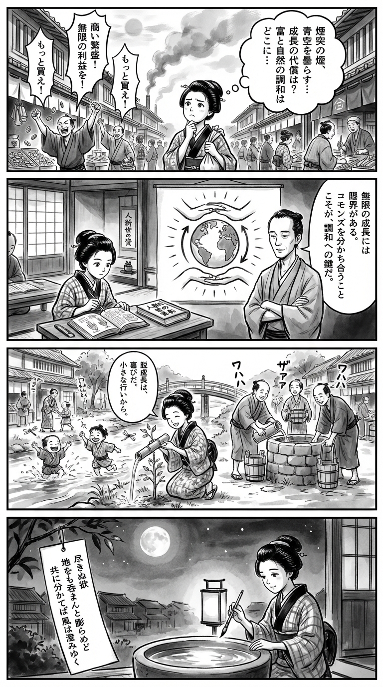

---
---
> **Language**: [日本語](../ja/人新世の「資本論」_review.html) | [English](../en/人新世の「資本論」_review.html) | [繁體中文](../zh-tw/人新世の「資本論」_review.html)
>
> [← Top / トップページ](../../)

## 📖 Book Information
- **Title**: 人新世の「資本論」  
- **Author**: 斎藤幸平  
- **ASIN**: B08L2XMQKX  
- **URL**: [https://www.amazon.co.jp/dp/B08L2XMQKX](https://www.amazon.co.jp/dp/B08L2XMQKX)  

---

<picture>
  <source srcset="../../images/reviews/人新世の「資本論」_4panel.webp" type="image/webp">
  
</picture>
## Dialogue

### Panel 1
**Scene**: In a lively Edo marketplace, the young townsgirl strolls among merchants shouting about trade and profit. She pauses, puzzled, watching chimney smoke blur the blue sky. Coins clink as townsfolk bargain at wooden stalls. In her thoughts, she wonders what “growth” truly costs, and how wealth might coexist with nature.  
**Dialogue**: *“Is endless gain worth the haze that hides the sky?”* (thought)

### Panel 2
**Scene**: Inside a quiet temple school, she opens a Dutch science book beside a scroll titled “Capital in the Anthropocene.” The imagined figure of a calm, scholarly man appears—slender, thoughtful, arms folded as he explains a diagram of the Earth surrounded by human hands. He speaks gently about the limits of infinite growth and the harmony found in sharing the commons.  
**Dialogue**: *“When we share what sustains us, the world breathes easier.”*

### Panel 3
**Scene**: By the riverside, the townsgirl helps neighbors plant trees and draw water from a communal well. She measures the flow with a bamboo tube, smiling as she murmurs that “degrowth” can mean joy, not loss. Children laugh nearby. The scene contrasts the earlier market’s frenzy with this calm cooperation, light and humorous in tone as she realizes that change begins with small acts.  
**Dialogue**: *“Even a trickle of kindness can fill a river.”*

### Panel 4
**Scene**: Evening falls. By lamplight, she sits with brush in hand, gazing at the moon reflected in a basin of water. On a hanging tanzaku, she writes a waka poem that captures her reflection on balance and sharing.  
**Dialogue**: *(softly)* “May the wind clear when hearts learn to share.”  
**Tanka (translation)**:  
Endless desire swells,  
as if to swallow the earth—  
yet when we divide  
what we have among us all,  
the wind grows pure again.  
**Tanka (original)**:  
「尽きぬ欲　地をも呑まんと　膨らめど  
　共に分かてば　風は澄みゆく」

## 🎯 Core of the Book
*人新世の「資本論」* exposes the structural limits of capitalism in the age of climate crisis. Author 斎藤幸平 argues that as long as capitalism is predicated on “infinite economic growth,” the destruction of the Earth’s environment is inevitable. The system that has long “externalized” environmental costs has reached its limit—there is no longer any “outside” left in the Anthropocene. Capitalism, he contends, has entered a stage of self-destruction.  

What sets this book apart is that it goes beyond environmentalism or economic critique, offering a reinterpretation of Marx’s thought to propose a new social vision: “degrowth communism.” By excavating the late Marx’s view of nature and envisioning a society based on the *commons* and association, the author explores the possibility of hope beyond capitalism.  

---

## 💡 Key Insights
- **Critique of SDGs and the “Trap of Good Intentions”**  
  The author calls the SDGs “the modern opium of the masses,” arguing that they function as a life-support system for capitalism. As long as growth remains the premise, the fundamental structure of environmental destruction persists—an irony he incisively reveals.  

- **Rejection of the “Decoupling Myth”**  
  He points out that the supposed decoupling of economic growth from environmental impact has no empirical basis. Warning against blind faith in technological innovation, he insists on the need to question growth itself, thereby clarifying the limits of “green growth” and “climate Keynesianism.”  

- **Degrowth as “Reconstruction,” Not “Stagnation”**  
  Degrowth is not mere economic contraction but a social redesign through redistribution and democratic decision-making. It redefines prosperity and proposes transformation toward improving quality of life.  

- **Rebuilding the *Commons***  
  Reclaiming education, healthcare, and the environment from the market and managing them collectively is key to the future. This forms the foundation for a new social rationality that transcends capitalist ownership relations.  

- **Rediscovering the Late Marx**  
  Reassessing the late Marx’s thought beyond the worship of productive forces, the author reconstructs it as “degrowth communism.” He presents a vision of a society grounded in coexistence with nature, offering theoretical direction amid today’s climate crisis.  

---

## 🔍 Connection to Contemporary Context
As of 2026, global awareness of the climate crisis has intensified, and movements seeking “prosperity without growth” are spreading. The ideas of “degrowth” and the *commons* advocated by 斎藤 are not mere theories but serve as the intellectual backbone for social movements demanding systemic transformation.  

In the cultural sphere, critiques of “capitalist expansion” are also advancing, with discussions emerging around “artificial scarcity” in industries such as VTubers and idols. This cultural self-reflection resonates with the book’s arguments, prompting a reevaluation of capitalist values.  

Moreover, as interest grows in public-interest capitalism and decentralized regional energy systems, *人新世の「資本論」* stands not just as a warning but as a theoretical guide for designing a sustainable society.  

---

## 🚀 Proposals for Practice
- **Embrace a Smaller-Scale Lifestyle**  
  Reducing consumption and redefining quality of life is an ethical responsibility toward the planet. Scaling back to a 1970s-level lifestyle is not mere frugality but a rediscovery of sustainable happiness.  

- **Engage in Activities Supporting the *Commons***  
  Participating in community-based initiatives that share and manage education, healthcare, and energy can help build a new social foundation beyond capitalist ownership.  

- **Cultivate the Imagination for Degrowth**  
  Discussing and envisioning social systems not premised on economic growth—politically and culturally—is the first step toward transformation.  

- **Adopt a Global South Perspective**  
  Recognize how one’s consumption is linked to exploitation and environmental destruction elsewhere, and practice fair trade and ethical consumption. This awareness fosters liberation from the “imperial mode of living.”  

- **Reconsider Faith in Technology**  
  Avoid viewing technological innovation as a panacea; instead, aim for structural social change. Technology should be seen as a means to realize a society of coexistence, not as an end in itself.  

---

## ⭐ Overall Evaluation
*人新世の「資本論」* presents environmental issues not merely as scientific or policy challenges but as philosophical questions about the foundations of civilization. By confronting the limits of capitalism and theorizing a society based on degrowth and coexistence, this book marks a groundbreaking “new reading of Marx” for our time.  

For readers interested in economics, environmental studies, or social thought—and for anyone seeking “sustainable prosperity” in everyday life—this book serves as a compass for rethinking how we live and what it means to be truly rich.

---

&copy; shioki | [CC BY-NC-SA 4.0](https://creativecommons.org/licenses/by-nc-sa/4.0/)
