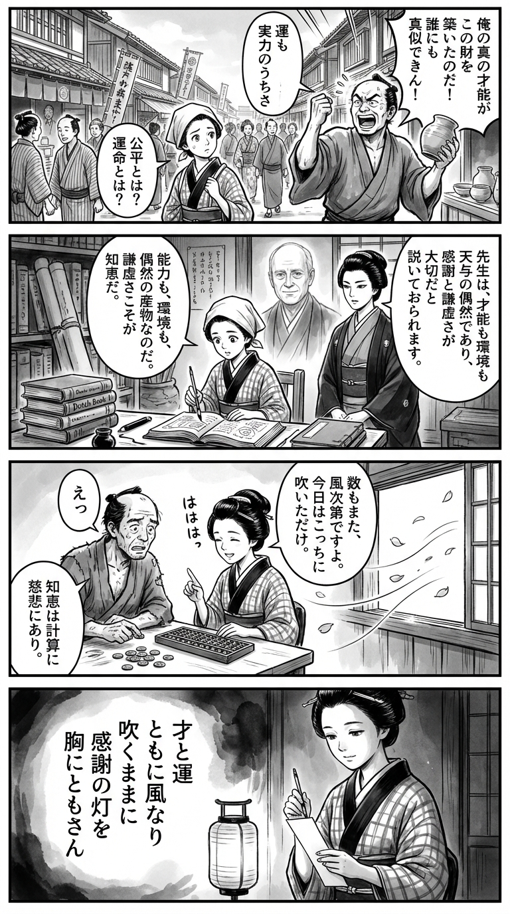

---
---
> **Language**: [日本語](../ja/実力も運のうち　能力主義は正義か？_review.html) | [English](../en/実力も運のうち　能力主義は正義か？_review.html) | [繁體中文](../zh-tw/実力も運のうち　能力主義は正義か？_review.html)
>
> [← Top / トップページ](../../)

## 📖 Book Information
- **Title**: 実力も運のうち　能力主義は正義か？  
- **Author**: マイケル サンデル and 鬼澤 忍  
- **ASIN**: B0922GS8SL  
- **URL**: [https://www.amazon.co.jp/dp/B0922GS8SL](https://www.amazon.co.jp/dp/B0922GS8SL)  

---

## Dialogue

### Panel 1
**Scene**: In the lively streets of Edo, a young townsgirl in a kimono walks past a bustling marketplace. Merchants and craftsmen boast of their skills and profits. She pauses, watching a craftsman proudly claim that his fortune comes purely from his own talent. Amid the chatter and fluttering banners, she looks thoughtful, quietly questioning the fairness of fate and merit.  
**Dialogue**: (Townsgirl, thinking) “Is success truly only one’s own doing…?”

### Panel 2
**Scene**: Inside a dimly lit terakoya lined with scrolls and Dutch books, the townsgirl studies an imported philosophical treatise. From the pages, a ghostly foreign scholar—calm, dignified, and wise—appears, accompanied by a composed Japanese interpreter who translates his words. Together, they discuss the nature of merit, luck, and humility. The girl listens intently, brush in hand, absorbing their ideas.  
**Dialogue**:  
**Scholar (translated)**: “Talent may open the door, but fortune decides who enters.”  
**Townsgirl**: “Then… humility is the truest wisdom.”

### Panel 3
**Scene**: The townsgirl helps a struggling neighbor count his small earnings with her abacus. When he thanks her, she smiles gently and remarks that even numbers depend on chance—the wind could scatter coins differently each day. Her words surprise him, and she laughs softly, realizing that wisdom lies not only in calculation but also in compassion. Cherry petals drift through the open window, carried by the wind.  
**Dialogue**:  
**Townsgirl**: “Even numbers dance with the wind. Today’s sum may not be tomorrow’s.”  
**Neighbor**: “You speak like a poet, miss!”

### Panel 4
**Scene**: That evening, under the warm glow of a paper lantern, the townsgirl writes a waka poem on a slender tanzaku strip. Her expression is serene, her heart filled with gratitude and humility. The ink flows gracefully as she reflects on the balance between talent and fortune.  
**Dialogue**: (Townsgirl, softly) “May I always keep this light of thanks within me.”  
**Tanka (translation)**:  
“Talent and luck—  
both are winds that blow;  
as they will,  
I’ll keep a lamp of gratitude  
burning in my heart.”  
**Tanka (original)**:  
「  
才（さい）と運（うん）  
ともに風（かぜ）なり  
吹くままに  
感謝（かんしゃ）の灯（ひ）を  
胸（むね）にともさん  
」

## 🎯 Core of the Book
In this work, Michael Sandel philosophically dismantles the modern faith in “meritocracy,” which lies at the foundation of contemporary society. He explores the paradox of how an ethic that praises effort and talent can instead breed social division and arrogance—analyzing it from both moral philosophy and political theory.  

Tracing the transformation of the idea of the “chosen” from religious providence to secular success, Sandel exposes how meritocracy has functioned as a mechanism for justifying inequality. He then proposes a reconstruction of public ethics grounded in humility—viewing success as a “gift”—and in the pursuit of the common good.  

This book is not merely a social critique; it is a philosophical challenge to rediscover the democratic ideal of shared dignity.  

---

## 💡 Key Insights
- **Success is not a virtue but often a matter of chance**  
  Sandel argues that even talent and effort are shaped by luck or grace. The moral belief that success is deserved fosters a sense of superiority and erodes empathy for others.  

- **The cult of education divides society**  
  The notion that “academic credentials equal worth” undermines the dignity of those without degrees and weakens the foundation of democracy. We need to rebuild a social language that does not treat education as the sole measure of success.  

- **The danger of “smartness” replacing “rightness”**  
  In modern politics, “smart policies” have replaced “just policies.” When ethical judgment is substituted by technical efficiency, public morality is lost.  

- **The market is not a measure of merit**  
  Sandel criticizes the fallacy of equating market success with moral worth. Market prices merely reflect supply and demand; finding “justice” or “contribution” in them is misguided.  

- **Restoring the ethics of gratitude and the common good**  
  Viewing success as a “gift” and building social solidarity on gratitude toward others is the only way to neutralize the poison of meritocracy.  

---

## 🔍 Relevance to Contemporary Context
Even in Japan in 2026, the “arrogance of meritocracy” that Sandel warned about has become a reality. Since the era of neoliberal reforms, the narrative that “effort will be rewarded” has taken root, while the tendency to ignore the roles of luck and environment has created a pervasive sense of hardship.  

On social media, “intelligence” and “efficiency” are excessively valued, fostering a culture of exclusion. This mirrors Sandel’s warning about the “rule of the smart,” which threatens the ethical foundation of democracy.  

The book’s call for a renewed sense of the “common good” and an “ethic of grace” offers vital philosophical guidance for rebuilding care and solidarity in a society obsessed with intellect and achievement.  

---

## 🚀 Practical Suggestions
- **Accept success as a “gift”**  
  By acknowledging the roles of luck and others’ support rather than attributing success solely to personal responsibility, we can regain humility and gratitude.  

- **Do not use education as a measure of dignity**  
  Fostering a culture that respects diverse occupations and ways of life—beyond academic credentials—is the first step toward healing social division.  

- **Value “rightness” over “smartness” in politics**  
  By prioritizing ethical correctness over technical efficiency, we can restore public morality.  

- **Support institutions grounded in the common good**  
  Backing tax and welfare policies that share the fruits of success across society can institutionally mitigate the harms of meritocracy.  

---

## ⭐ Overall Evaluation
『実力も運のうち　能力主義は正義か？』 is a sharp yet deeply humane work of philosophy that exposes the ethical illusion underlying modern society’s faith in effort. Sandel reexamines the moral imagination surrounding success and failure, offering a new public philosophy grounded in humility and gratitude.  

For those exhausted by inequality and division, this book provides a perspective that transcends the ideology of self-responsibility. It invites everyone involved in politics, education, or business to reconsider what “justice” truly means in our society.

---

&copy; shioki | [CC BY-NC-SA 4.0](https://creativecommons.org/licenses/by-nc-sa/4.0/)
