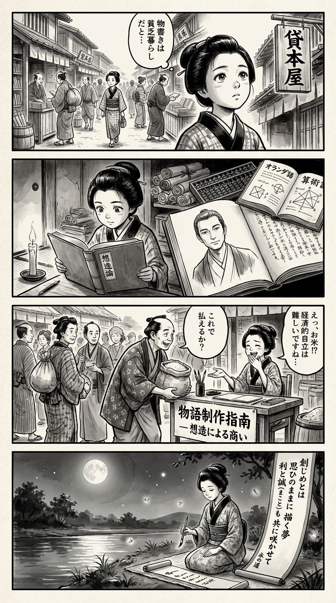

> **Language**: [日本語](../ja/小説家になって億を稼ごう（新潮新書）_review.html) | [English](../en/小説家になって億を稼ごう（新潮新書）_review.html) | [繁體中文](../zh-tw/小説家になって億を稼ごう（新潮新書）_review.html)
>
> [← Top / トップページ](../../)

## 📖 Book Information
- **Title**: 小説家になって億を稼ごう（新潮新書）  
- **Author**: 松岡圭祐  
- **ASIN**: B08XX77XLB  
- **URL**: [https://www.amazon.co.jp/dp/B08XX77XLB](https://www.amazon.co.jp/dp/B08XX77XLB)  

---

<picture>
  <source srcset="../../images/reviews/小説家になって億を稼ごう（新潮新書）_4panel.webp" type="image/webp">
  
</picture>

## Dialogue

### Panel 1
**Scene**: The townsgirl walks through a lively Edo street filled with book stalls and paper merchants. She hears someone saying, “Writers live poor lives,” and stops, looking puzzled. Her eyes sparkle with curiosity as she gazes at the sign of a lending library, capturing the vibrant yet contemplative atmosphere.
**Dialogue**: None

### Panel 2
**Scene**: In her dimly lit room, the townsgirl studies a mysterious imported book titled “想造論.” Inside, she sees a sketch of a calm, intelligent man—her imagined vision of author Matsuoka Keisuke, scholarly and composed in a simple scholar’s robe. His painted eyes seem to connect with hers, sharing wisdom about blending imagination with enterprise. The room is cluttered with scrolls, an abacus, and Dutch texts.
**Dialogue**: None

### Panel 3
**Scene**: The townsgirl sets up a small writing desk in the bustling marketplace, confidently offering “物語制作指南 — 想造による商い.” Passersby show interest as she explains how stories can become a source of income. A humorous moment occurs when a merchant attempts to pay her with rice instead of coins, prompting her laughter as she contemplates the challenge of “economic independence” even in Edo. The scene is dynamic, filled with a crowd and her assertive stance.
**Dialogue**: None

### Panel 4
**Scene**: That night, under the moonlight by the river, the townsgirl writes a waka on a hanging scroll, contemplating the blend of art and livelihood. Her brush moves gracefully as fireflies illuminate the scene. 
**Dialogue**: None  
**Tanka (translation)**: The beginning is  
A dream drawn as one wishes,  
Profit and sincerity  
Blooming together,  
On the eternal path.  
**Tanka (original)**: 創（はじ）めとは  
思ひのままに　描く夢  
利と誠（まこと）も  
共に咲かせて  
永（とこしえ）の道

## 🎯 Core of the Book
松岡圭祐's "小説家になって億を稼ごう" is a practical guide that overturns the stereotype of "novelists = poor" and redefines the profession of a writer from both creative and economic perspectives. The author refers to creation as "想造" and considers maximizing the freedom of thought as the starting point for success.

At the same time, the book presents a viewpoint that treats writers as business owners, discussing aspects like royalty negotiations, trademark registration, and incorporation, and vividly illustrating the coexistence of art and economics. It argues that understanding and acting on realistic revenue structures while protecting creative freedom is the path to becoming a true professional.

Underlying this book is a philosophy that "being a novelist is a lifelong profession of continuous creation," conveying a strong message that affirms creation as life itself.

---

## 💡 Key Insights
- **"想造" is the essence of creation**  
  The author recommends not taking notes and instead allowing stories to mature in the mind. By not fixing thoughts and letting them ferment freely, characters and worldviews begin to move autonomously, presenting a paradoxical theory of creation.

- **Independent creative stance without relying on editors**  
  The author argues that being bound by plot approvals robs creative freedom and encourages approaching negotiations with a completed manuscript. By proactively presenting their work, writers can break free from a subcontractor-like relationship.

- **Importance of royalty negotiations and economic independence**  
  It is stated that even newcomers should assert a 10% royalty, emphasizing the writer's responsibility to protect their intellectual property. Establishing economic independence is the foundation for long-term creative activities.

- **Continuous creation determines a writer's true value**  
  The author states that success lies in not being satisfied with one work but continuing to the second and third. Viewing creation as a "habit" rather than a "temporary challenge" builds trust as a writer.

- **Being a novelist is also a mentally enduring profession**  
  The book affirms the novelist's role as a job without retirement and positions creation as "eternal enjoyment." The pursuit of both economic success and mental fulfillment is at the core of this work.

---

## 🔍 Relevance to Contemporary Context
The proposals in this book are particularly insightful in today's publishing industry, which is shaken by digitalization and ethical challenges. With the younger generation's "disengagement from manga" and the expansion of free viewing culture, the revenue structure for writers has become unstable. In this context, 松岡 emphasizes "economic independence for writers" and encourages breaking free from a dependent publishing structure.

Moreover, as demonstrated by the successful model of Korean webtoons, there is a growing need for writers to manage their own intellectual property and expand into multiple media. 松岡's arguments anticipate the arrival of an era where "writers = entrepreneurs," presenting a practical vision that integrates creation and economics.

Furthermore, considering recent troubles in publishing and discussions on expression ethics, the importance of professionalism based on "belief and integrity" for writers to operate independently becomes even more pronounced.

---

## 🚀 Practical Suggestions
1. **Make "想造" a daily practice**  
   Before taking notes, ruminate on the story in your mind and "bring characters to life." Protecting the freedom of thought strengthens the source of creation.

2. **Compete with completed manuscripts**  
   Avoid compromising during the plotting stage and present finished works. This allows for writer-led negotiations and maintains creative independence.

3. **Clearly assert royalties and rights**  
   Negotiate economic conditions such as royalty rates and trademark registrations yourself. Awareness of protecting intellectual property supports long-term success.

4. **Continuously publish works**  
   Maintain the momentum after debuting and continue creating for the second and third works. Continuity breeds credibility and market value.

5. **Maintain health and moderation in life**  
   Abstain from alcohol and establish lifestyle habits that protect the brain. Sustaining creative power requires physical and mental self-care.

---

## ⭐ Overall Evaluation
"小説家になって億を稼ごう" is a rare book that merges theories of creation and management. It redefines novelists not as "artists" but as "professionals," providing strategies for living at the intersection of imagination and reality.

For beginners in creation, it offers a strict yet realistic guide, while for experienced writers, it provides an opportunity for self-reform. This book is essential reading for anyone wishing to make writing their profession. 松岡圭祐's words serve as a declaration for modern writers to protect creative freedom while achieving economic independence.

---

&copy; shioki | [CC BY-NC-SA 4.0](https://creativecommons.org/licenses/by-nc-sa/4.0/)
