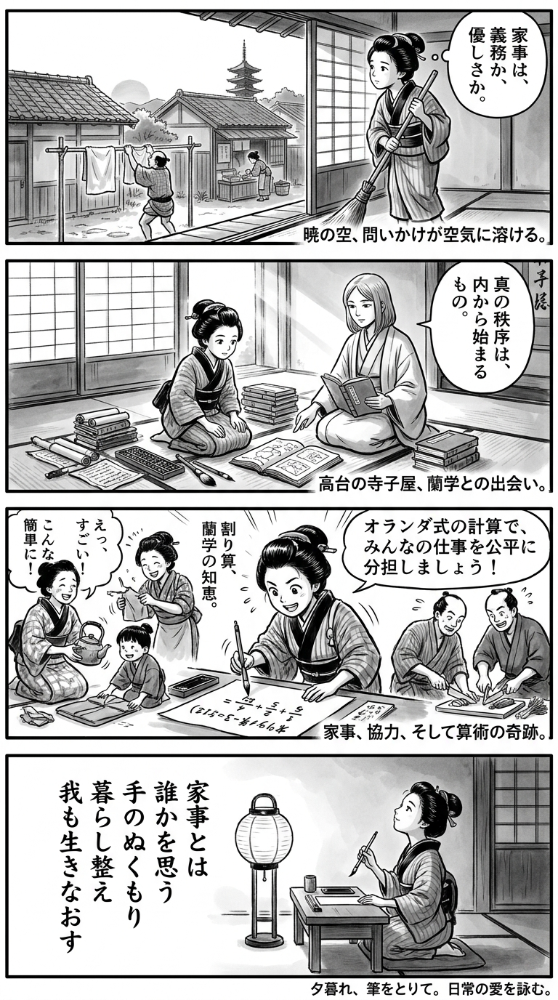

> **Language**: [日本語](../ja/山の上の家事学校_review.html) | [English](../en/山の上の家事学校_review.html) | [繁體中文](../zh-tw/山の上の家事学校_review.html)
>
> [← Top / トップページ](../../)

## 📖 Book Information
- **Title**: 山の上の家事学校  
- **Author**: 近藤史恵  
- **ASIN**: B0CY2GT83L  
- **URL**: [https://www.amazon.co.jp/dp/B0CY2GT83L](https://www.amazon.co.jp/dp/B0CY2GT83L)  

---

<picture>
  <source srcset="../../images/reviews/山の上の家事学校_4panel.webp" type="image/webp">
  
</picture>

## Dialogue

### Panel 1
**Scene**: The townsgirl is sweeping the earthen floor of her small Edo townhouse at dawn, gazing thoughtfully at the rising sun over the tiled roofs. She observes her neighbor’s husband clumsily hanging laundry while his wife works at the dye shop, pondering the nature of care.
**Dialogue**: “Is care a duty, or a kindness?”

### Panel 2
**Scene**: At a temple school’s study room high on a hill, the townsgirl meets a serene woman scholar inspired by Kondo Fumie. The scholar, with calm, intelligent eyes and shoulder-length straight hair, guides her to an old Dutch text.
**Dialogue**: “True order begins from within.”

### Panel 3
**Scene**: Back home, the townsgirl applies her learning as she and her neighbors share tasks, repairing a kettle and teaching a child to fold cloth. She humorously uses a Dutch arithmetic formula to divide the chores fairly, bringing laughter and warmth to the scene.
**Dialogue**: [No dialogue]

### Panel 4
**Scene**: In the evening, the room glows softly from a paper lantern as the townsgirl kneels by her writing desk, brush poised over paper. She reflects calmly while composing a waka that encapsulates the story's theme of care in daily life.
**Dialogue**: [No dialogue]
**Tanka (translation)**: Household chores are the warmth of hands thinking of others, arranging life anew.
**Tanka (original)**: 家事とは  
誰かを思う  
手のぬくもり  
暮らし整え  
我も生きなおす

## 🎯 The Core of This Book
『山の上の家事学校』 is a story that redefines "care," "responsibility," and "maturity" through the everyday practice of housework. The protagonist reflects on her work-centered values and learns about her relationships with others and her own way of living through housework.

The essence of this book lies in portraying housework not as "labor," but as an "expression of life." The perspective that caring for others through housework is simultaneously an act of self-organization provides readers with deep empathy and insight.

Additionally, it presents a new way of living where men take on caregiving roles, quietly questioning fixed gender roles. As a story of loneliness and regeneration, it serves as a gentle prescription for "people who have lost their way in life" in modern society.

---

## 💡 Key Insights
- **There is no right answer in housework**  
  Housework is not a task to be evaluated, but a series of judgments based on circumstances. Rather than seeking perfection, the flexibility to consider the best option at any given moment is key to enriching life.

- **Responsibility transforms housework**  
  The shift from "helping" to "taking on my own responsibility" fundamentally changes the meaning of housework. Acts performed for others eventually promote one's own maturity.

- **Redefining care and affection**  
  Love is not an emotion but an action, residing in specific acts of consideration for others. Through housework, the protagonist learns that affection and responsibility are inseparable.

- **Maturity is about caring for others**  
  It is not age or experience, but the ability to understand and empathize with others that defines maturity. The lessons learned at the housework school are depicted as a story of spiritual growth.

- **Happiness lies in small acts**  
  Small achievements in daily life, such as cooking a meal or tidying a room, support a fulfilling life. The book suggests moving away from a consumerist view of happiness and finding joy in life itself.

---

## 🔍 Connection to Contemporary Context
In modern Japan, the stereotype that "housework and childcare are women's work" remains deeply entrenched. This book quietly resists this structural issue by advocating for individual consciousness transformation.

As long working hours and economic disparities pressure daily life, reexamining the meaning of housework is not just a family issue but a social challenge. The protagonist's "relearning" serves as a response to the exhaustion and isolation faced by modern individuals.

This book highlights the importance of reconstructing human relationships through care and housework, providing philosophical hints for both men and women to "regain their lives."

---

## 🚀 Suggestions for Practice
1. **Take on housework as "your responsibility"**  
   By considering housework as "a part of life" rather than "helping," empathy for others naturally develops. Organizing your own life becomes the first step in organizing relationships with others.

2. **Find small joys in daily life**  
   By discovering "a sense of achievement" or "comfort" in activities like cooking or cleaning, one can break free from a consumerist view of happiness. It is important to consciously savor the small successes in life.

3. **Imagine others' perspectives when acting**  
   Be intentionally considerate towards those close to you, just as you would in a workplace. Thoughtful actions can significantly change the quality of home and relationships.

4. **Make flexible judgments without seeking "right answers"**  
   There is no single correct answer in housework or childcare. Choosing the best option based on the situation reduces stress and supports a sustainable lifestyle.

5. **Record changes and visualize learning**  
   By jotting down daily insights, you can feel your growth. The habit of introspection helps deepen self-understanding and improve the quality of life.

---

## ⭐ Overall Evaluation
『山の上の家事学校』 is a quiet tale of growth that rediscover the "meaning of living" through housework. While it lacks flashy developments, its careful descriptions and introspective narrative resonate deeply with readers.

In particular, depicting care and housework from a male perspective symbolizes the changing views on gender in modern society. For those looking to reevaluate their values surrounding housework or feeling the need to "rebuild their lives," this book will serve as a reliable guide.

---

&copy; shioki | [CC BY-NC-SA 4.0](https://creativecommons.org/licenses/by-nc-sa/4.0/)
