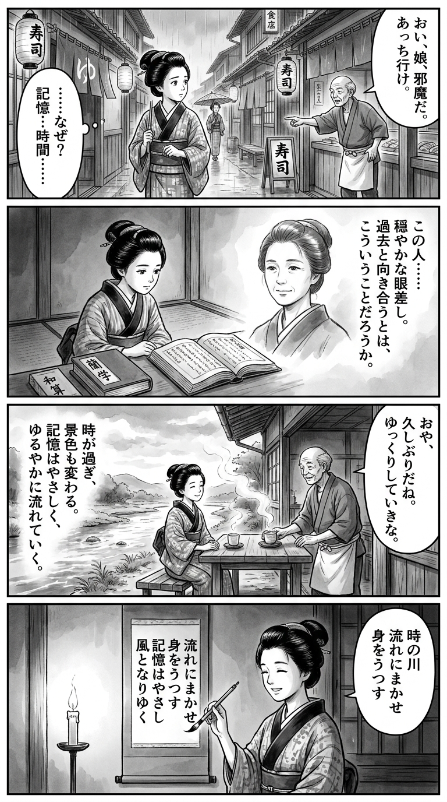

> **Language**: [日本語](../ja/巣鴨のお寿司屋で、帰れと言われたことがある_review.html) | [English](../en/巣鴨のお寿司屋で、帰れと言われたことがある_review.html) | [繁體中文](../zh-tw/巣鴨のお寿司屋で、帰れと言われたことがある_review.html)
>
> [← Top / トップページ](../../)

## 📖 Book Information
- **Title**: 巣鴨のお寿司屋で、帰れと言われたことがある  
- **Author**: 古賀及子  
- **ASIN**: B0F2M4WR1N  
- **URL**: [https://www.amazon.co.jp/dp/B0F2M4WR1N](https://www.amazon.co.jp/dp/B0F2M4WR1N)  

---

<picture>
  <source srcset="../../images/reviews/巣鴨のお寿司屋で、帰れと言われたことがある_4panel.webp" type="image/webp">
  
</picture>

## Dialogue

### Panel 1
**Scene**: The townsgirl strolls through an Edo street at dusk, passing a small sushi stall. The shopkeeper curtly tells her to leave, leaving her puzzled but contemplative. Lanterns and noren curtains hang in the background, and soft rain falls, creating an atmosphere of quiet reflection about memory and time.
**Dialogue**: None

### Panel 2
**Scene**: In her modest room, she opens a Dutch philosophy book and a wasan scroll. Inside the book, a faint portrait of a calm, thoughtful woman resembling Koga Oyako appears—middle-aged, serene, with gentle eyes and tied-back hair. The townsgirl gazes at the image, as if engaging in a dialogue, pondering the significance of revisiting the past.
**Dialogue**: None

### Panel 3
**Scene**: She visits an old riverside teahouse from her childhood. The place feels smaller yet familiar. She sits down, orders tea, and smiles gently at the same shopkeeper, who now greets her kindly. The steam from the tea curls upward, blending with the air like fading memories, emphasizing the flow of time and forgiveness.
**Dialogue**: None

### Panel 4
**Scene**: In her quiet room at night, the townsgirl writes a tanka on a hanging scroll by candlelight. The candle’s flame flickers softly as she recites the poem with a peaceful smile.
**Dialogue**: None  
**Tanka (translation)**: The river of time / I let myself flow with it / Memories reflect / Gentle as the wind / They drift away softly.  
**Tanka (original)**: 「時の川  
　流れにまかせ  
　身をうつす  
　記憶はやさし  
　風となりゆく」

## 🎯 The Core of This Book
古賀及子's 『巣鴨のお寿司屋で、帰れと言われたことがある』 is an essay that quietly reexamines "time," "memory," and "relationships" through fragments of everyday life. The author revisits past places, overlaying her former self with her current self, allowing her to embrace the flow of time and her own changes.

Themes such as family relationships, the continuity of work, travel, and chance encounters with others are woven throughout, all connecting to the question of "what it means to live." Rather than being nostalgic, this work poses the question of "how to live in the present," offering a quiet guide for reexamining the everyday.

---

## 💡 Key Insights
- **Time Heals "Unreasonable Memories"**  
  Past pains may never fully disappear, but they gradually detach from the body over time. The depiction that memories remain while emotions fade illustrates human resilience and the gentleness of time.

- **"Desiring" Creates a Cycle of Affection**  
  Expressing desires brings joy to those who give. The paradoxical form of maturity depicted here shows how honest expressions of desire, beyond mere politeness, enrich relationships with family and others.

- **Discovering the Meaning of Continuing Work**  
  The realization that "continuing" itself shapes the future resonates even in today's unstable work environment. It teaches that growth and confidence reside within continuity.

- **Places Preserve Memories**  
  The unique idea that well-maintained places can evoke memories across time suggests that the "unchanging" nature of physical environments supports emotional stability.

- **Travel as an Extension of the Everyday**  
  Viewing family trips as "carrying everyday life far away" redefines travel not as a special event, but as a richness that exists along the continuum of daily life.

---

## 🔍 Connection to Contemporary Context
The themes of this book connect to the fundamental question of "how we perceive time" in a modern world dominated by information overload and speed. In an era where social media and digital records externalize memory, the author reflects on "living memories" etched in the body and places.

Moreover, the attitude of valuing connections across generations and chance relationships with others suggests a reconstruction of human relationships in a society increasingly marked by isolation and disconnection. Through small reunions and rediscoveries in everyday life, this book helps modern individuals reclaim the "tactile sense of time" that they have begun to lose.

---

## 🚀 Suggestions for Practice
1. **Revisit Past Places**  
   Walking through stations or streets you used to frequent can help you feel the passage of time and your own changes. This act of physically reconnecting with memories deepens self-understanding.

2. **Don’t Fear "Desiring"**  
   Communicating honest desires enriches relationships with others. Choosing sharing over reservation creates a cycle of affection.

3. **Find Meaning in Continuing Work**  
   Focus on trust and growth through continuity rather than short-term results. Embrace the perspective that continuing shapes the future.

4. **Enjoy Travel as an "Extension of the Everyday"**  
   Travel with the mindset of carrying your daily life as it is, rather than seeking special experiences. You can find the value of the everyday within the extraordinary.

5. **Open Your Heart to "Strangers"**  
   Accepting aimless encounters and chance relationships allows you to feel the expansiveness of life. Interactions with others soften the boundaries of the self.

---

## ⭐ Overall Evaluation
『巣鴨のお寿司屋で、帰れと言われたことがある』 is a delicately crafted essay that portrays the nuances between the past and present, the everyday and the extraordinary. 古賀及子's writing is quiet yet effectively conveys the weight of time and the warmth of humanity.

This book resonates with anyone living with memories, teaching the value of "continuing," "feeling," and "revisiting" over special events. It is a recommended read for those who wish to pause amidst the busyness and reclaim their sense of time.

---

&copy; shioki | [CC BY-NC-SA 4.0](https://creativecommons.org/licenses/by-nc-sa/4.0/)
