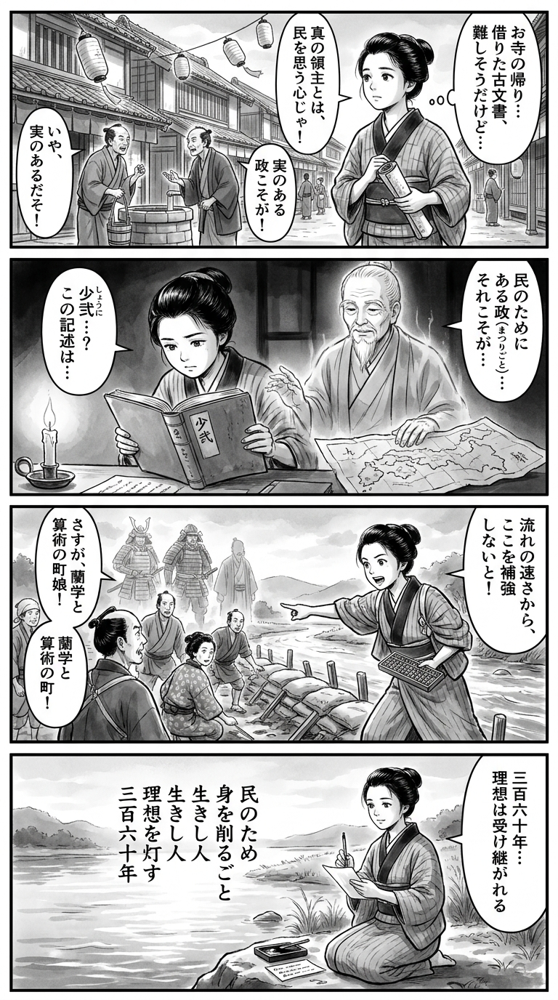

---
---
> **Language**: [日本語](../ja/帚木蓬生-少弐　民に捧げた三百六十年_review.html) | [English](../en/帚木蓬生-少弐　民に捧げた三百六十年_review.html) | [繁體中文](../zh-tw/帚木蓬生-少弐　民に捧げた三百六十年_review.html)
>
> [← Top / トップページ](../../)

## 📖 Book Information
- **Title**: 少弐　民に捧げた三百六十年  
- **Author**: 帚木蓬生  
- **ASIN**: B0FX2MKJ1M  
- **URL**: [https://www.amazon.co.jp/dp/B0FX2MKJ1M](https://www.amazon.co.jp/dp/B0FX2MKJ1M)  

---

## Dialogue

### Panel 1
**Scene**: The townsgirl walks through the lively streets of Edo, passing a shrine where villagers pray for peace. She stops before a wooden plaque that reads, “What does it mean to protect?” Evening light filters through the shrine gate, and she clutches her notebook, lost in thought.  
**Dialogue**: *“What does it mean… to protect?”*  

### Panel 2
**Scene**: In the quiet temple library, she studies an old scroll about the Shōni clan. Beside her, an elderly scholar—calm and wise, with silver hair tied back—points to the scroll, speaking softly about those who “defended not power, but people.” The air feels still and reflective, the ink lines gentle and flowing.  
**Dialogue**: *“True defenders guard hearts, not thrones.”*  

### Panel 3
**Scene**: On a hill overlooking her town, the girl raises her hands as if to shield the villagers below from an approaching storm. Wind and clouds swirl around her as she realizes that true defense is born from compassion—peace as a deliberate act of will.  
**Dialogue**: *“To protect… is to care.”*  

### Panel 4
**Scene**: That night, by the glow of a small lamp, she writes a tanka on a narrow strip of paper. Her brush trembles slightly as she writes, her face calm yet reverent in the stillness.  
**Dialogue**: *(silent, only the sound of the brush on paper)*  
**Tanka (translation)**:  
For the people’s sake,  
I sheathe the sword and pray—  
on this quiet night,  
the heart that guards with kindness  
is the true strength of the land.  
**Tanka (original)**:  
民のため  
剣をおさめて  
祈る夜に  
守る心こそ  
国の力なり

## 🎯 Core of the Book
帚木蓬生’s *少弐　民に捧げた三百六十年* is a sweeping historical epic that portrays the spirit of “warriors who live for the people” through the lineage of the Shōni clan, who ruled northern Kyushu for fifteen generations over 360 years, from the late Heian to the Sengoku period. From the first lord, Shigenori, to the fifteenth, Fuyuhisa, the family’s sense of duty and pride emerges amid wars and faith—from the Mongol invasions and the Northern and Southern Court conflicts to their downfall through vassal betrayal.  

At its heart, this is not a story of conquest, but of “what it means to protect.” Even in the face of the Mongol invasions, a national crisis, the Shōni clan valued faith and culture over sheer military might, praying for the peace of their people under divine protection. Their stance embodies a spirit of *minpon*—governance for the people—that transcends the traditional notion of bushidō.  

Through a modern narrator’s journey visiting the guardians of the clan’s graves, the narrative weaves together past and present, illuminating the importance of passing down history. This attempt to revive history as “living memory” evokes the quiet emotional resonance characteristic of Haegaki’s work.  

---

## 💡 Key Insights
- **Defense Means Protecting the People**  
  When Shigenori builds Uchimiyama Castle, his belief that “divine protection is the true defense” reflects a philosophy that goes beyond military strategy—it represents governance aimed at safeguarding the people’s peace. Even in an age of war, the aspiration for peace endured.  

- **The Samurai’s Pride in Upholding Loyalty**  
  In the Jōkyū War, Shigenori chooses faithfulness over power, embodying the essence of true loyalty. His steadfastness in turbulent times resonates with modern readers as a timeless lesson in integrity.  

- **The Power of Culture and Faith United**  
  When Shino discusses with a Korean envoy the idea of “building a peaceful nation grounded in the divine,” it reflects a worldview rooted in culture and faith. Even amid conflict, reverence for culture sustained Japan’s spiritual foundation.  

- **The People Who Keep History Alive**  
  The modern narrator’s visits to the clan’s gravekeepers symbolize how history lives on through storytelling and remembrance. Individual acts of preservation become bridges between past and future.  

- **A Chronicle of War That Teaches the Value of Peace**  
  Through the fierce battles of the Mongol invasions, the ideals expressed by Shino and Tsunesuke—to make peace and stability the nation’s guiding principle—stand out. The chronicles of war paradoxically illuminate the preciousness of peace.  

---

## 🔍 Relevance to the Modern Context
Published in 2025, this book arrives amid a renewed interest in historical fiction, particularly works set in the Kamakura and Sengoku periods. Haegaki’s depiction of “bushidō for the people” resonates with modern ideas of public service and ethical leadership.  

The emphasis on dialogue and mutual understanding across cultures also carries strong relevance in today’s globalized world. Just as Shino treated the Korean envoy with respect, the story reminds us that genuine peace is built upon mutual respect.  

Moreover, the structure—where a modern narrator rediscovers history—echoes current cultural trends that value local and family histories. The message that knowing the past empowers us to shape the future lingers quietly in the reader’s heart.  

---

## 🚀 Practical Takeaways
- **Explore Local History**  
  Like the narrator visiting the gravekeepers, exploring the history of one’s own region can make the past feel alive and tangible.  

- **Record Family and Community Stories**  
  Personal records—letters, oral histories—form the foundation of future history. Preserving family memories through writing or audio helps sustain cultural heritage.  

- **Approach Cross-Cultural Dialogue with Respect**  
  Following Shino’s diplomatic example, treating people from different backgrounds with respect fosters true understanding.  

- **Clarify What You Want to Protect**  
  Just as the Shōni clan fought to protect their people and land, being conscious of what values you stand to defend gives direction to your actions.  

- **Reflect on Peace Through History**  
  Learning about past conflicts deepens our appreciation for peace. Studying history is the first step toward preserving it.  

---

## ⭐ Overall Evaluation
*少弐　民に捧げた三百六十年* is a profound work that, while set in an age of war, portrays the dignity of humanity through those who lived for their people and upheld their faith. Haegaki’s writing transcends historical reconstruction, reviving the souls of the past for the present.  

Balancing the weight of historical fiction with a quiet message for modern readers, this book is ideal for those who wish to read history as “living wisdom.” The conviction that knowing the past empowers us to protect the future runs through every page of this remarkable work.

---

&copy; shioki | [CC BY-NC-SA 4.0](https://creativecommons.org/licenses/by-nc-sa/4.0/)
