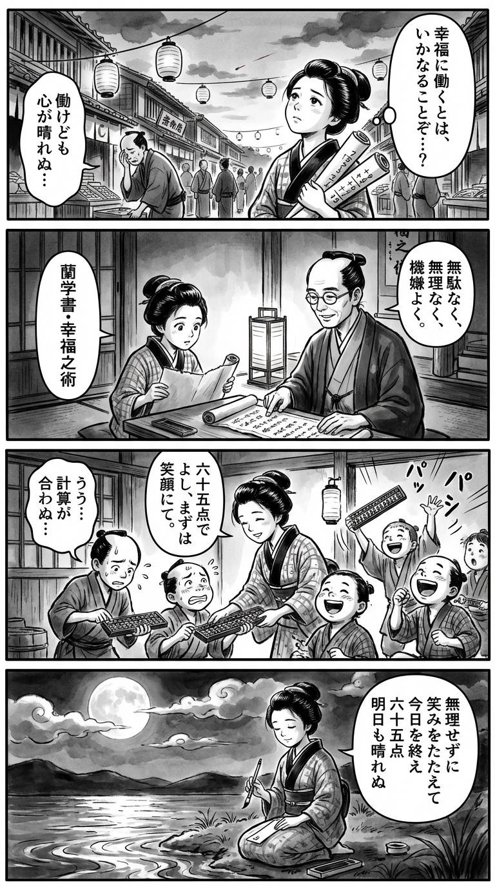

> **Language**: [日本語](../ja/幸福な退職―「その日」に向けた気持ちいい仕事術―（新潮新書）_review.html) | [English](../en/幸福な退職―「その日」に向けた気持ちいい仕事術―（新潮新書）_review.html) | [繁體中文](../zh-tw/幸福な退職―「その日」に向けた気持ちいい仕事術―（新潮新書）_review.html)
>
> [← Top / トップページ](../../)

## 📖 Book Information
- **Title**: 幸福な退職―「その日」に向けた気持ちいい仕事術―（新潮新書）  
- **Author**: スージー鈴木  
- **ASIN**: B0C2Y1Y3JC  
- **URL**: [https://www.amazon.co.jp/dp/B0C2Y1Y3JC](https://www.amazon.co.jp/dp/B0C2Y1Y3JC)  

---

<picture>
  <source srcset="../../images/reviews/幸福な退職―「その日」に向けた気持ちいい仕事術―（新潮新書）_4panel.webp" type="image/webp">
  
</picture>

## Dialogue

### Panel 1
**Scene**: The townsgirl walks through a bustling Edo street at dusk, carrying scrolls of arithmetic notes. She pauses by a merchant lamenting, “I work but my heart feels heavy…” She tilts her head thoughtfully, gazing at the red-tinted sky. In her mind, a question arises: “What does it mean to work happily…?” The background shows wooden shops and paper lanterns swaying in the wind.
**Dialogue**: “I work but my heart feels heavy…”

### Panel 2
**Scene**: In a quiet temple study, the townsgirl unrolls a mysterious imported manuscript labeled "Rangaku: The Art of Happiness." A scholarly figure appears beside her, modeled after the author Suzy Suzuki, imagined as a kind, middle-aged man with neat hair tied back, gentle eyes behind round spectacles, and a calm, insightful air. He explains principles written in kanbun: “Without waste, without strain, with a good mood.”
**Dialogue**: “Without waste, without strain, with a good mood.”

### Panel 3
**Scene**: The townsgirl applies the lesson at her small abacus school. A student frets over calculations; she smiles, saying softly, “Sixty-five points is good, first, let’s smile.” Her relaxed tone surprises the children, who begin to laugh. The composition shows motion — flying abacus beads and flickering lantern shadows — symbolizing liberation from perfectionism.
**Dialogue**: “Sixty-five points is good, first, let’s smile.”

### Panel 4
**Scene**: Night falls. The townsgirl sits by the river under the moon, brush in hand, composing a waka on a tanzaku. Her face is serene, the ink still glistening. The poem reads:
**Tanka (translation)**: “Without forcing it,  
With a smile, I conclude today,  
Sixty-five points,  
Tomorrow may not be bright.”  
**Tanka (original)**: **「無理せずに  
　笑みをたたえて  
　今日を終え  
　六十五点  
　明日も晴れぬ」**

## 🎯 The Core of This Book
This book is a practical philosophy that summarizes the wisdom gained from 30 years of corporate life, focusing on how to "work happily and retire happily." The author, スージー鈴木, presents methods to balance the quality of work and the happiness of life, centered around the simple principle of "無駄なく・無理なく・機嫌よく (MMK)."  

The book features specific concepts such as "65-point principle" and "second business card," suggesting ways to free oneself from perfectionism and dependency on the company. Furthermore, it redefines the role of management as "maximizing the happiness of subordinates," shifting the purpose of management from "results" to "happiness."  

Ultimately, the author portrays "retirement" not as an end but as "the beginning of another creative career," advocating for a lifestyle centered around hobbies and self-identity. This presents a challenging message that encourages a rethinking of work and life in modern society.  

---

## 💡 Key Insights
- **"MMK" is the core of a happy working style**  
  The principle of "無駄なく・無理なく・機嫌よく" is not just about efficiency; it is a philosophy for working healthily in the long term. The author presents this as a "brilliant methodology," positioning it as wisdom that enables the balance of work and life.  

- **Letting go of perfectionism with the "65-point principle"**  
  The idea that accumulating multiple 65-point achievements is better for maintaining creativity and flexibility than aiming for a perfect 100 is a practical prescription for today's overworked society. By reclaiming time, one can enrich life outside of work.  

- **Protecting the "self of an employee" is the first step to freedom**  
  The message "Do not dedicate your body and soul to the company" serves as a resistance to modern social pressure. By having a place outside the company through side jobs or a "second business card," one lays the groundwork for a happy retirement.  

- **The KPI for management is "subordinate's MMK"**  
  Management that prioritizes "the happiness of subordinates" over results refreshes the traditional image of management. This allows the entire team to shift towards a creative and sustainable working style.  

- **"Retirement" is a ritual of re-creation**  
  The symbolic act of creating a "purpose folder" on one's desktop depicts retirement as "a ritual to reboot one's life." This serves as a concrete response to the question of how to live in the latter half of life.  

---

## 🔍 Relevance to Modern Context
In Japanese society, aging is progressing, and the diversification of lifestyles after retirement and "second careers" is gaining attention. Recently, phenomena such as "Akeome Retirement," which symbolize a shift in work values, have been increasing, and the proposals in this book resonate with this trend.  

スージー鈴木 merges her experiences as a corporate employee with her career as a music critic, illustrating the continuity between "work and hobbies" and "organizations and individuals." This is also a rediscovery of "human-like working styles" in the age of AI.  

The concepts of "MMK" and "65-point principle" presented in this book are positioned as modern models of working that balance happiness and creativity, moving away from excessive performance orientation.  

---

## 🚀 Suggestions for Practice
1. **Introduce "MMK" into daily life**  
   By consciously working without waste, without strain, and with a good mood, stress resilience and productivity will improve. Adjusting one's "fuel efficiency" is the first step towards a happy retirement.  

2. **Set a time to finish work with the "65-point principle"**  
   Instead of seeking perfection, set specific time goals, such as leaving the office by 6 PM. This clarifies the boundary between work and personal life, creating mental space.  

3. **Create a "second business card"**  
   To visualize oneself outside the company, create business cards for hobbies or side jobs. This is a symbolic action that nurtures the "self beyond being an employee" and directly connects to post-retirement life planning.  

4. **Practice meeting techniques that ground discussions in specifics**  
   Avoid abstract discussions and use "specific examples" or "metaphors" to make discussions more tangible. This will significantly enhance the quality and speed of meetings.  

5. **Use "ですよねー" to smoothen relationships**  
   By showing empathy towards others' opinions, one can soften the atmosphere of discussions and build trust. Small verbal adjustments can greatly influence workplace happiness.  

---

## ⭐ Overall Evaluation
『幸福な退職』 is a new life design book that views retirement not as an "end" but as "another beginning." Within the author's light-hearted narrative, the real wisdom and philosophy of being a corporate employee are condensed.  

This book will serve as a practical compass for mid-career employees who are fatigued by work and for those looking towards retirement. After reading, one gains a perspective that connects "work" and "life" not as separate entities but as intertwined paths to happiness.

---

&copy; shioki | [CC BY-NC-SA 4.0](https://creativecommons.org/licenses/by-nc-sa/4.0/)
