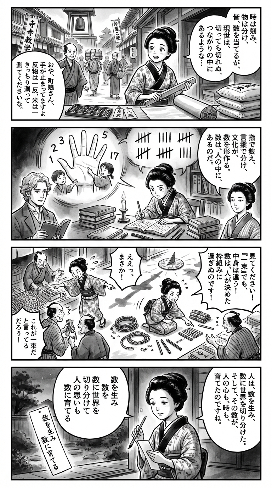

---
---
> **Language**: [日本語](../ja/数の発明――私たちは数をつくり、数につくられた_review.html) | [English](../en/数の発明――私たちは数をつくり、数につくられた_review.html) | [繁體中文](../zh-tw/数の発明――私たちは数をつくり、数につくられた_review.html)
>
> [← Top / トップページ](../../)

<picture>
  <source srcset="../../images/reviews/数の発明――私たちは数をつくり、数につくられた_4panel.webp" type="image/webp">
  
</picture>
## Dialogue

### Panel 1
**Scene**: On a bustling Edo street lined with row houses and a temple school, the young townsgirl helps measure rice and cloth at a shop. As she watches people divide time, prices, and quantities into tidy numbers, she senses that the real world—bundles, grains, and daylight—is far more fluid. Looking up at the temple bell and then at her own fingers, she wonders whether numbers truly exist in the world or are carved into it by human minds. The scene is lively, filled with townspeople, abacuses, paper tags, and bolts of fabric, while her expression glows with curiosity and sudden wonder.  
**Dialogue**: “Are numbers part of the world… or something we made to shape it?”

### Panel 2
**Scene**: In a lamplit study crowded with wasan and Dutch studies books, counting rods, and handwritten notes, she immerses herself in thought. Two mentor-like figures appear as imagined presences: a calm foreign scholar with wavy hair and a refined Japanese translator-scholar with gentle intelligence. Around her, diagrams of hands, finger-counting children, and tally systems illustrate how language, body, and culture shape exact counting. Her curiosity deepens into focused discovery.  
**Dialogue**: “Numbers live in our words, our hands, our ways of seeing.”

### Panel 3
**Scene**: In a lively, slightly comic marketplace scene, she puts her insight into practice. From above, she directs merchants and children to compare piles of beans, rope lengths, and shadows instead of relying only on labels. Two customers argue over what “one bundle” means, and she swiftly demonstrates with fingers, rods, and rearranged goods that such categories are human-made. The composition splits between the flowing, continuous world and neatly counted units, full of motion and humor.  
**Dialogue**: “See? The measure itself is something we invented!”

### Panel 4
**Scene**: At dusk on the veranda, she quietly writes a tanka on a slender tanzaku. The soft ink wash and fading light evoke a calm, reflective mood as she realizes that humans created numbers—and numbers, in turn, shaped human thought, time, and civilization. Her face glows with gentle insight.  
**Dialogue**: (softly) “Numbers gave shape to our minds.”  
**Tanka (translation)**:  
Born from our hands,  
numbers divide the vast world—  
yet through their lines,  
human thought and feeling, too,  
grow within their measure.  
**Tanka (original)**:  
数を生み  
数に世界を  
切り分けて  
人の思いも  
数に育てる

## 📖 Book Information
- **Title**: 数の発明――私たちは数をつくり、数につくられた  
- **Author**: ケイレブ・エヴェレット and 屋代通子  
- **ASIN**: B09497Z487  
- **URL**: [https://www.amazon.co.jp/dp/B09497Z487](https://www.amazon.co.jp/dp/B09497Z487)  

## 🎯 Core of the Book
The greatest strength of this book lies in how it redefines “numbers”—something we take for granted—not as a universal truth embedded in nature, but as a cognitive tool invented by humans through culture, language, and the body. Numbers are not merely convenient symbols; they are systems developed to segment, compare, remember, and share quantities. This perspective alone can dramatically change how we perceive everyday life.

The author traverses topics such as infants’ and animals’ sense of quantity, societies with limited number words, the development of number systems rooted in the body—especially the hands—and the relationship between numbers, writing, agriculture, and the formation of states. Through this wide-ranging exploration, the book illustrates how “numbers” have reshaped human thought. What emerges is a bold and convincing understanding: numbers do not simply reflect the world—they construct the very way we divide and perceive it.

Ultimately, the book presents a reciprocal view: “We created numbers, but numbers have also recreated us.” Though it may appear to be a history of mathematics, it is in fact an anthropological-scale reading experience that reexamines human intelligence, cultural evolution, and the foundations of civilization itself.

## 💡 Key Insights
- **Numbers don’t just name quantities—they make them visible**  
  The book portrays numbers not as labels that mirror preexisting reality, but as tools that draw boundaries within the continuous world of quantity. This means that numbers are not mere cognitive aids but part of cognition’s very structure, prompting us to reconsider the supposedly “objective” nature of numerical reasoning.

- **Precise numerical cognition is not innate—it’s supported by language and culture**  
  Humans and animals share a basic ability to distinguish small quantities, but that alone doesn’t lead to complex number concepts. Through examples of societies with limited number vocabularies, the book shows that precise counting is a product of cultural training, revealing that much of what we call intelligence is learned rather than inborn.

- **Even our sense of time is inseparable from the invention of numbers**  
  One of the book’s most striking arguments is that our understanding of time depends on numbers. For those of us who take divisions like “one hour” or “thirty minutes” as natural, the book reveals these as historically and culturally constructed frameworks, exposing the artificiality of our everyday sense of time.

- **The abstraction of numbers is built upon the body**  
  Through discussions of base-5 and base-10 systems and finger counting, the book shows how number systems have been deeply supported by the structure of the human body. The claim that even the most abstract mathematical thought arises from embodied experience offers a refreshing perspective for modern readers who tend to separate intellect from the body.

- **Numbers were not by-products of civilization—they were its driving force**  
  In exploring the origins of writing, agricultural management, technological innovation, and large-scale governance, the book argues that numbers were not auxiliary tools added later but foundational to civilization itself. This reframing elevates numbers from a topic confined to mathematics to a cultural technology that has shaped history.

## 🔍 Relevance to the Modern Context
The book’s questions feel especially urgent in today’s world, where data and algorithms penetrate every corner of society. We quantify everything—grades, test scores, KPIs, page views, engagement, risk scores—but this book quietly challenges that assumption, reminding us that “numbers are not reality itself, but ways of slicing reality.”

It also resonates with contemporary debates in cognitive science and linguistic relativity. The idea that numerical understanding depends on culture and language connects to questions about the limits of standardized education and how to respect diverse systems of knowledge. Thus, the book can be read not only as a work of intellectual inquiry but also as a reflection on education and society.

In the age of AI, quantification carries increasing authority. Yet the book suggests that numbers are never neutral tools—they can embody values, power, and even sacredness. In that sense, it doesn’t tell us to distrust numbers, but rather to be aware of the cultural assumptions and blind spots behind them, especially when we rely on them most.

## 🚀 Practical Suggestions
- **Pause and reconsider everyday “quantification”**  
  We manage time, age, evaluations, budgets, and rankings through numbers. But as this book reminds us, these are not mirrors of reality—they are ways of organizing it for particular purposes. Simply asking “What does this number capture, and what does it miss?” can significantly sharpen our judgment.

- **Let children and learners experience numbers physically and visually**  
  The book strongly supports the idea that numbers are easier to grasp when linked to fingers, blocks, arrangements, or number lines rather than taught as abstract symbols. Learning through touching, arranging, and comparing helps numbers become not just symbols but foundations for thought.

- **Examine the assumptions behind number-based arguments**  
  Statistics, test results, KPIs, and research metrics can be persuasive, but unless we understand how those numbers were defined and produced, we risk being swayed by their authority. As the book shows, numbers are powerful—but when misused, they can erase complexity. Sensitivity to context is essential.

- **In cross-cultural understanding, pay attention to how people count and express quantity**  
  Beyond differences in language or values, how precisely people count and measure can reveal deep cultural distinctions. From this book’s perspective, differences in number systems are not just vocabulary gaps but differences in how the world is conceptualized—offering a richer lens for intercultural learning.

## ⭐ Overall Evaluation
『数の発明』 begins with the seemingly narrow question “What are numbers?” but leads readers into vast explorations of human intelligence, culture, the body, and history. Those who once believed numbers to be absolute and natural will likely be astonished—and that astonishment becomes an opportunity to rethink the very framework of their own thought.

It is highly recommended for readers interested in cognitive science, anthropology, linguistics, education, or the history of mathematics. Yet more broadly, it speaks to anyone who has ever felt uneasy about living in a world surrounded by numbers. After finishing the book, even looking at a clock, counting, or evaluating something will feel just a little bit different.

---

&copy; shioki | [CC BY-NC-SA 4.0](https://creativecommons.org/licenses/by-nc-sa/4.0/)
