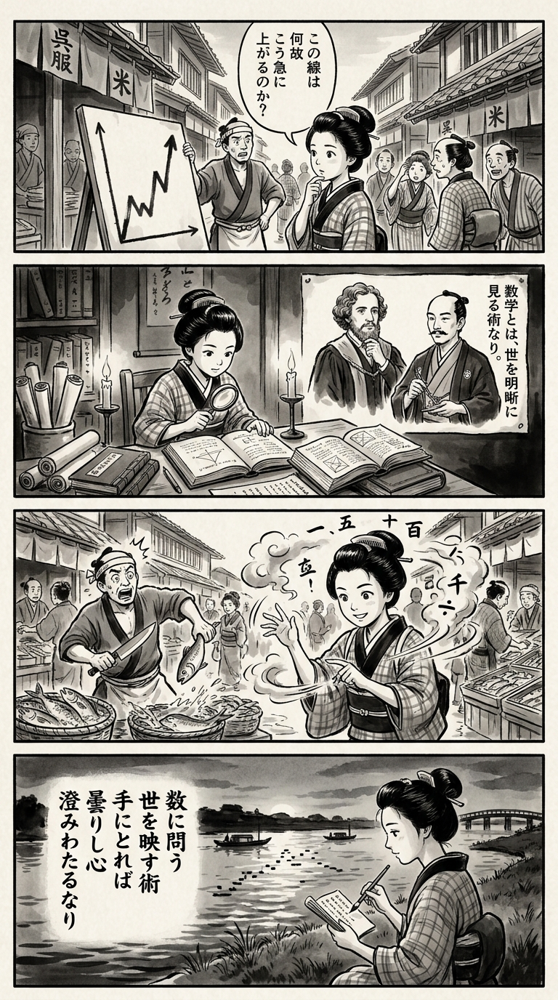

> **Language**: [日本語](../ja/数学思考のエッセンス――実装するための12講_review.html) | [English](../en/数学思考のエッセンス――実装するための12講_review.html) | [繁體中文](../zh-tw/数学思考のエッセンス――実装するための12講_review.html)
>
> [← Top / トップページ](../../)

## 📖 Book Information
- **Title**: 数学思考のエッセンス――実装するための12講  
- **Author**: オリヴァー・ジョンソン and 水谷淳  
- **ASIN**: B0D78K1QNS  
- **URL**: [https://www.amazon.co.jp/dp/B0D78K1QNS](https://www.amazon.co.jp/dp/B0D78K1QNS)  

---

<picture>
  <source srcset="../../images/reviews/数学思考のエッセンス――実装するための12講_4panel.webp" type="image/webp">
  
</picture>

## Dialogue

### Panel 1
**Scene**: In a busy Edo street, the townsgirl stops to examine a signboard displaying a peculiar graph created by a merchant. She tilts her head in curiosity, pondering, “Why does this line rise so sharply?” The background features wooden houses, shop banners, and townsfolk peeking at the graph, creating an atmosphere of intrigue and confusion.
**Dialogue**: “Why does this line rise so sharply?”

### Panel 2
**Scene**: Inside a candle-lit study filled with scrolls and foreign books, the townsgirl studies a Dutch text on numbers and models. On the wall, portraits of two imagined scholars hang: a kind-eyed foreign man with curly hair in academic robes, and a calm Japanese man in a scholar’s kimono. They seem to teach her that “mathematics is a way to see the world clearly.”
**Dialogue**: “Mathematics is a way to see the world clearly.”

### Panel 3
**Scene**: The townsgirl applies her newfound knowledge at the marketplace, estimating the daily fish sales through quick mental calculations. Her hands trace invisible formulas in the air, impressing the fishmonger. She smiles confidently, realizing that reasoning can conquer uncertainty. The dynamic composition features swirling ink around her head, blending numbers into clouds.
**Dialogue**: “I can tame uncertainty with reasoning!”

### Panel 4
**Scene**: At dusk, the townsgirl sits by the riverbank, brush and paper in hand, composing a waka. She gazes at the rippling water reflecting the fading light like data points on a graph. Her paper displays an elegantly written short poem.
**Dialogue**: 
**Tanka (translation)**: "Questioning numbers,  
A way to reflect the world,  
When held in my hands,  
A cloudy heart becomes clear."  
**Tanka (original)**: 「数に問う  
世を映す術  
手にとれば  
曇りし心  
澄みわたるなり」

## 🎯 Core of the Book
This book attempts to redefine mathematics as "a thinking technique for understanding reality and taking action." The authors argue that, against the backdrop of contemporary challenges such as AI, pandemics, and a data-driven society, mathematical thinking is no longer just for experts but has become essential as a form of social literacy.

Through themes such as modeling, Fermi estimation, exponential change, and statistical thinking, the book concretely demonstrates how mathematical sensibilities can be applied to real life and decision-making. It stands out by presenting mathematics not as abstract theory, but as practical thinking methods that anyone can practice, such as "smell tests" and "intuitive logarithmic scales."

---

## 💡 Key Insights
- **Mathematics is a Practical Thinking Tool**  
  Mathematics is not an abstract theoretical system, but a tool for understanding the real world and supporting judgment. The authors emphasize that acquiring the "thinking behind the formulas" is key to surviving in a data-driven society.

- **Good Models Balance Explanation and Prediction**  
  A good model should not only explain past data but also be able to predict the future. It is essential to avoid overfitting to the data and to understand the underlying mechanisms.

- **Fermi Estimation Makes Uncertainty Your Ally**  
  Even without complete information, surprisingly accurate estimates can be made by stacking reasonable assumptions. It is important to clarify the reasoning process without fearing errors.

- **Intuition about Exponential Change Affects Crisis Management**  
  In exponential processes like pandemics or technological innovations, most of the change concentrates at the end. Having exponential thinking serves as a buffer against misjudging social and economic risks.

- **Statistical Thinking Sharpens Judgment**  
  Understanding not just averages but also variance and confidence intervals allows for realistic judgments that take data variability and uncertainty into account.

---

## 🔍 Relevance to Contemporary Context
In an era where AI and data science form the foundation of society, mathematical thinking has taken on value not as "expert knowledge" but as "social judgment ability." In corporate and policy settings, the ability to form consensus based on numbers and risks is required, and there is a growing movement in education to redefine mathematics as "a tool for use in society."

The proposals in this book are a practical response to such trends. The "smell tests" and "Fermi estimations" advocated by the authors can be seen as methodologies for building the foundational strength to critically interpret results presented by AI and statistical models. In a complex society, mathematical thinking is being reevaluated as "a technique to support sound judgment amid uncertainty."

---

## 🚀 Suggestions for Practice
1. **Apply "Smell Tests" to Daily News**  
   Develop the habit of instinctively questioning, "Is it really that big?" when looking at numbers and graphs. This will enhance your ability to spot misinformation and misuse of statistics.

2. **Quantify Your Surroundings with Fermi Estimation**  
   Try estimating something familiar, such as "the amount of coffee I drink in a year." Being conscious of the reasoning process sharpens your quantitative intuition.

3. **Observe Exponential Changes on a Logarithmic Scale**  
   Viewing data such as infection rates or stock prices on a logarithmic scale can help you detect signs of rapid change early.

4. **Train Yourself to "Read" Graphs**  
   Instead of accepting visualizations at face value, check the axes, scales, and ranges with your own eyes. This builds your ability to critically interpret visual information.

5. **Incorporate Statistical Thinking into Decision-Making**  
   Make judgments considering not only averages but also variance and confidence intervals. This enables calm judgments that are not swayed by random fluctuations.

---

## ⭐ Overall Evaluation
『数学思考のエッセンス――実装するための12講』 is not a book that discusses the beauty of formulas, but a practical guide on "how to use mathematics." In an age overflowing with AI and data, it serves as a resource for developing the intellectual strength to think critically and verify information rather than taking it at face value.

While it is structured to be accessible to readers without a mathematical background, it does not lose depth of thought. This book encourages everyone living in a data-driven society to rediscover mathematics as "a language for thinking."

---

&copy; shioki | [CC BY-NC-SA 4.0](https://creativecommons.org/licenses/by-nc-sa/4.0/)
