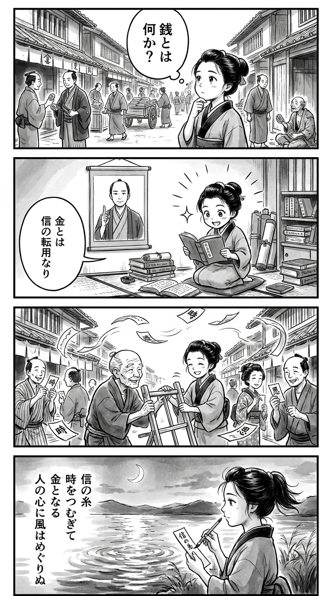

> **Language**: [日本語](../ja/新しい時代のお金の教科書_review.html) | [English](../en/新しい時代のお金の教科書_review.html) | [繁體中文](../zh-tw/新しい時代のお金の教科書_review.html)
>
> [← Top / トップページ](../../)

## 📖 Book Information
- **Title**: 新しい時代のお金の教科書  
- **Author**: 山口揚平  
- **ASIN**: B077XFLLFX  
- **URL**: [https://www.amazon.co.jp/dp/B077XFLLFX](https://www.amazon.co.jp/dp/B077XFLLFX)  

---

<picture>
  <source srcset="../../images/reviews/新しい時代のお金の教科書_4panel.webp" type="image/webp">
  
</picture>

## Dialogue

### Panel 1
**Scene**: In a bustling Edo town street, the townsgirl observes traders exchanging koban coins, her head tilted in curiosity as she wonders about the true nature of money. The contrast between luxury and poverty is evident around her, reflecting her unease and wonder.
**Dialogue**: “What truly is money?”

### Panel 2
**Scene**: Inside a small study filled with scrolls and Dutch books, the townsgirl eagerly reads a rare text about “the nature of value.” An illustration of a serene man resembling Yohei Yamaguchi appears, explaining, “Money is transferable trust.” Her eyes shine with revelation.
**Dialogue**: “Money is transferable trust.”

### Panel 3
**Scene**: In the town square, the townsgirl experiments by exchanging time instead of coins, helping an elderly vendor while others promise her future favors on slips of paper marked with time. Laughter fills the air as paper slips swirl like wind, symbolizing circulating trust and time.

### Panel 4
**Scene**: At dusk by the riverbank, the townsgirl writes a waka on a small tanzaku slip, gazing at the water's ripples reflecting the moon like flowing coins.
**Dialogue**: [No dialogue]
**Tanka (translation)**: The thread of trust weaves time into gold, circulating like the wind in people's hearts.
**Tanka (original)**: 「信の糸  
　時をつむぎて  
　金となる  
　人の心に  
　風はめぐりぬ」

## 🎯 Core of the Book
『新しい時代のお金の教科書』 is an attempt to reconstruct the fundamental question of "What is money?" by traversing economics, philosophy, and technology. The author, 山口揚平, defines money as "transferable credit" and carefully illustrates how the mechanisms of credit have evolved throughout the history of currency.

At the heart of this book lies the perspective of "decentralization of credit" brought about by new technologies such as blockchain and time currency. It presents a philosophical economic discourse that aims for a harmony between capital (inorganic power) and human relationships (organic power), transcending the limits of capitalism and offering insights that go beyond mere financial theory.

---

## 💡 Key Insights
- **The value of money is determined by "credit × universality"**  
  The power of currency is proportional to the credit of the issuing entity and the breadth of its users. This provides a perspective that sees money not merely as a substance but as "the strength of social networks."

- **Credit is "not requiring justification"**  
  Credit is a relationship of trust that does not need explanation. This definition finds the foundation of economic activity in "relationships" rather than "rationality," resonating sharply in an era of distrust in modern society.

- **Blockchain is a technology that "marks time"**  
  While the internet has expanded space, blockchain records time. It is depicted as a technology that realizes a new form of credit by leaving an immutable history.

- **The issue with currency is not inequality but "the destruction of context"**  
  The author points out that the loss of human and corporate narratives due to monetization is the fundamental problem. The critique of the "loss of meaning" brought about by the quantification of the economy serves as an important warning for contemporary capitalism.

- **Time will become a new fair currency**  
  An economy based on "time," which is not influenced by assets or status, can enable a more equitable and ethical society. The concept of time currency presents a new measure for reevaluating happiness and relationships.

---

## 🔍 Relevance to Contemporary Context
In modern society, the rise of cashless transactions and the spread of cryptocurrencies are shaking the very definition of "money." As disparities widen due to advancements in AI and the concentration of value in knowledge and skills, the shift towards an economy based on "credit and time" as discussed in this book emerges not merely as an ideal but as a realistic challenge.

Moreover, discussions around Central Bank Digital Currencies (CBDCs) and new institutional designs such as "depreciating currency" resonate with the author's perspective of "money = record of credit." The movement to redefine money as a "device for designing behavior" is prompting changes in both social systems and individual ways of living.

---

## 🚀 Practical Suggestions
1. **Reassess consumption with the "One-Two-Three Rule"**  
   By practicing the rule of buying one item at a time, making judgments from the second purchase onward, and comparing three or more options, one can curb impulsive spending and cultivate conscious purchasing behavior.

2. **Maintain a mindset of "circulating" money**  
   With the idea of paying it forward, be conscious of circulating money into society and the future. This transforms individual consumption into the creation of social value.

3. **Prioritize health as the primary investment**  
   Health is the source of time and credit, and the foundation of economic success. Investing in one’s body and mind first leads to long-term prosperity.

4. **Design a life that balances organic and inorganic activities**  
   By being aware of the harmony between capital activities (inorganic) and human/natural activities (organic), one can restore the balance between earning and living.

5. **Choose a lifestyle that builds credit**  
   Through actions that enhance expertise, reliability, and affinity, one can build long-term trust capital. Credit is the most sustainable asset.

---

## ⭐ Overall Evaluation
『新しい時代のお金の教科書』 is a rare book that can be read as both an economic text and a philosophical treatise. By redefining money in the context of "credit," "time," and "relationships," it prompts deep reflection in readers.

Going beyond financial literacy, it challenges readers to consider "how to live" and "what to believe" in the coming era, making it suitable for those seeking to understand the waves of capitalism while exploring the organic richness that lies beyond. It provides intellectual stimulation that encourages readers to contemplate both the future of the economy and humanity.

---

&copy; shioki | [CC BY-NC-SA 4.0](https://creativecommons.org/licenses/by-nc-sa/4.0/)
