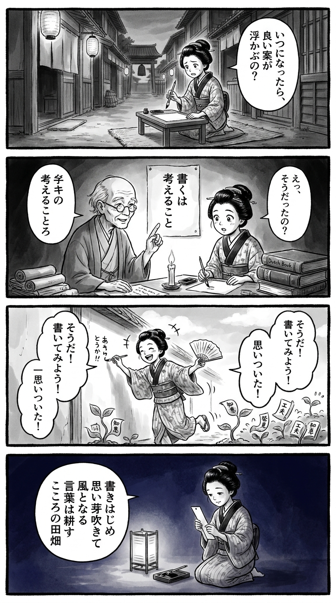

> **Language**: [日本語](../ja/書くことについて_review.html) | [English](../en/書くことについて_review.html) | [繁體中文](../zh-tw/書くことについて_review.html)
>
> [← Top / トップページ](../../)

# 📖 Book Information
- **Title**: 書くことについて  
- **Author**: 野口 悠紀雄  
- **ASIN**: B08LTZP5YK  
- **URL**: [https://www.amazon.co.jp/dp/B08LTZP5YK](https://www.amazon.co.jp/dp/B08LTZP5YK)  

---

<picture>
  <source srcset="../../images/reviews/書くことについて_4panel.webp" type="image/webp">
  
</picture>

## Dialogue

### Panel 1
**Scene**: The townsgirl sits in a quiet Edo alleyway at dusk, troubled as she gazes at a blank page with her brush hovering above it. The sounds of merchants and distant temple bells create an atmosphere of hesitation before creation.  
**Dialogue**: “When will the perfect idea come?”

### Panel 2
**Scene**: Inside a candle-lit terakoya filled with scrolls and Dutch books, the townsgirl listens intently to an elderly scholar resembling Yukio Noguchi, who explains with calm authority while gesturing to a parchment diagram that reads “書くは考えること.” His wise yet warm presence fills the room.  
**Dialogue**: [No dialogue]

### Panel 3
**Scene**: The townsgirl rushes outside, scrolls fluttering around her as she joyfully writes on any surface she can find—walls, fans, even her palm. Ideas bloom around her like fields of “idea crops,” each note sprouting tiny leaves of words, symbolizing creative energy.  
**Dialogue**: [No dialogue]

### Panel 4
**Scene**: Night falls as she kneels by lantern light, finishing a waka on a tanzaku strip, serene and inspired. The text on the tanzaku reflects her thoughts.  
**Dialogue**: [No dialogue]  
**Tanka (translation)**: "As I begin to write, thoughts sprout and become the wind; words cultivate the fields of my heart."  
**Tanka (original)**: 「書きはじめ  
思い芽吹きて  
風となる  
言葉は耕す  
こころの田畑」

## 🎯 The Core of This Book
『書くことについて』 redefines the act of "writing" not merely as a means of expression, but as an intellectual process that deepens thought. 野口悠紀雄 emphasizes the importance of "starting to write first" rather than waiting for the perfect idea, illustrating how thought evolves through trial and error.

He also introduces unique intellectual production systems such as "multi-layer filing" and "idea farms," showcasing practical methods for creativity in the digital age. Furthermore, he stresses the significance of "theme setting" and "perspective selection" that humans must undertake in the AI era, advocating for the importance of maintaining the precision of thought through the cultivation of linguistic sensitivity.

---

## 💡 Key Insights
- **"Starting Leads to Completion" — Action Breeds Creation**  
  野口 encourages beginning to write rather than waiting for the perfect concept. The paradoxical philosophy that action activates thought and that the writing process itself drives creativity is a central theme.

- **"Idea Farms" — Systematizing Intellectual Production**  
  The metaphor of storing ideas as "seeds" and nurturing them into "crops" illustrates a methodology for systematically cultivating spontaneous insights. This concept resembles intellectual agriculture that transforms creativity into a sustainable process.

- **Optimizing Thought with "External Brain"**  
  By externalizing memory and tasks, one can focus the brain on creative thinking. This strategy is essential for intellectual production in the digital age, freeing oneself from information overload.

- **"Critical Reading" Cultivates Creativity**  
  By not passively accepting others' knowledge, but instead questioning and engaging in dialogue, one can develop their own thinking. Approaching reading with a "combative" attitude serves as a provocative method for nurturing creative intelligence.

- **The Precision of Language Determines the Precision of Thought**  
  野口 posits that linguistic disorder leads to dull thinking, framing the preservation of linguistic purity as an ethical responsibility for creators. This remains a vital intellectual integrity that humans must uphold in an era where AI generates language.

---

## 🔍 Relevance to Contemporary Context
With the rise of generative AI, the meaning of writing has shifted from "creation" to "thinking and editing." In an age where AI can generate text, the human's active judgment on what to write and how to think is increasingly questioned. The importance of "theme setting" and "perspective selection" emphasized in this book is a sharp response to this change.

Additionally, the establishment of remote work and asynchronous communication has made writing the foundation for work and decision-making. 野口's proposals of "external brain" and "multi-layer filing" are effective as infrastructure design for intellectual production in this era. Furthermore, cultivating linguistic sensitivity in today's information-saturated environment serves as a cultural resistance to safeguard the quality of thought.

---

## 🚀 Practical Suggestions
1. **Record "seeds" daily and build one block each day**  
   Capture fragments of thought without missing them, systematizing them through daily accumulation. Continuing in small units fosters the sustainability of creativity.

2. **Utilize Google Docs and voice input**  
   Create an environment where you can write anytime and anywhere to maximize the spontaneity of thought. Voice input, in particular, is a powerful tool for externalizing ideas without losing them.

3. **Free your mind with ToDo notes**  
   By externalizing memory burdens, you can concentrate on creative thinking. This brings about a balance between mental ease and productivity.

4. **Practice critical reading**  
   Challenge others' ideas and refine your own perspectives, transforming passive reading into active thought training.

5. **Organize your information environment to maintain the purity of thought**  
   Keep away from television and unnecessary information, ensuring time and space for concentration. The quality of thought heavily depends on environmental design.

---

## ⭐ Overall Evaluation
『書くことについて』 serves as a practical guide to strengthen "thinking power" through the act of writing, while also questioning the intellectual ethics of the AI era. 野口悠紀雄's proposals should be viewed not merely as writing techniques, but as methodologies for redesigning the structure of thought.

In particular, in an age of information overload and automated generation, the book's true value lies in reaffirming the importance of "thinking in one's own words." It is a must-read for all intellectual workers who wish to refine their daily thinking creatively.

---

&copy; shioki | [CC BY-NC-SA 4.0](https://creativecommons.org/licenses/by-nc-sa/4.0/)
