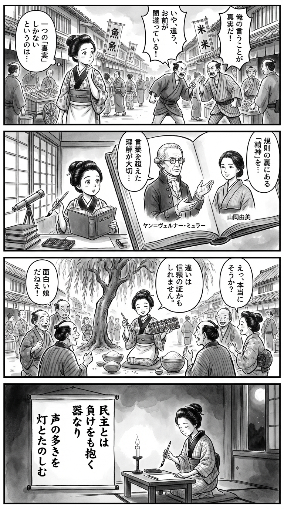

---
---
> **Language**: [日本語](../ja/民主主義のルールと精神――それはいかにして生き返るのか_review.html) | [English](../en/民主主義のルールと精神――それはいかにして生き返るのか_review.html) | [繁體中文](../zh-tw/民主主義のルールと精神――それはいかにして生き返るのか_review.html)
>
> [← Top / トップページ](../../)

## 📖 Book Information
- **Title**: 民主主義のルールと精神――それはいかにして生き返るのか  
- **Author**: ヤン=ヴェルナー・ミュラー and 山岡由美  
- **ASIN**: B0B9H9LMVW  
- **URL**: [https://www.amazon.co.jp/dp/B0B9H9LMVW](https://www.amazon.co.jp/dp/B0B9H9LMVW)  

---

## Dialogue

### Panel 1
**Scene**: On a lively Edo street, the young townsgirl walks past merchants and banners fluttering in the breeze. She overhears neighbors arguing about who is “truly right” in a local dispute. Tilting her head, she feels uneasy about the idea that only one voice can hold the truth. The ink wash captures the bustle and layered chatter of the town.  
**Dialogue**: (thinking) “Can truth belong to just one person?”

### Panel 2
**Scene**: In her small study, softly lit through shoji paper, she opens a Dutch-bound book. On the page appear two imagined figures: a calm European scholar with round spectacles and a composed Japanese translator in a simple kimono. Their portraits seem to speak from the page about “the spirit behind rules.” The townsgirl listens, brush hovering midair, eyes wide with wonder.  
**Dialogue**: (from the book) “Rules live only when guided by spirit.”  
(thinking) “So even laws breathe through hearts…”

### Panel 3
**Scene**: Beneath a willow tree, the townsgirl joins a lively neighborhood meeting. She gently suggests that disagreement itself can be a sign of mutual trust. Some townsfolk look surprised; others begin to smile. Using her abacus, she divides rice fairly among the groups, turning tension into laughter. Ink splashes convey the rhythm and warmth of shared understanding.  
**Dialogue**: “If we can argue and still share rice, perhaps that’s our strength.”

### Panel 4
**Scene**: Night deepens. By candlelight, the townsgirl kneels before a hanging scroll, writing a waka with calm resolve. Her brush moves with quiet confidence, the flame flickering beside her.  
**Dialogue**: (softly) “May many voices light the night.”  
**Tanka (translation)**:  
Democracy—  
a vessel that holds  
even defeat;  
finding joy in the glow  
of many voices shared.  
**Tanka (original)**:  
民主とは  
負けをも抱く  
器なり  
声の多きを  
灯とたのしむ

## 🎯 Core of the Book
This book is an attempt to reconsider democracy not merely as a set of institutions and rules, but as a living “spirit” that sustains them. The author, ヤン=ヴェルナー・ミュラー, argues that institutional reform alone cannot revive democracy; it also requires a renewed understanding of the values behind it—equality, freedom, and the acceptance of uncertainty.  

In an era when authoritarian populism seeks to monopolize the idea of the “true people,” Müller’s insight that the essence of democracy lies in “accepting diversity and accepting defeat” is particularly sharp. He sees the decline of intermediary institutions such as political parties and the media, as well as citizens’ withdrawal from politics, as structural crises—and calls for a revival of the “gathered citizenry” as the true foundation of democracy.  

---

## 💡 Key Insights
- **The essence of democracy is the “institutionalization of uncertainty.”**  
  Democracy is a system that accepts electoral defeat and trusts in the next opportunity. A regime that guarantees certain victory is no longer democratic; it is the culture of “accepting loss” that sustains democratic institutions.  

- **Populism causes the “shrinking of the people.”**  
  Populists claim that only they represent the “real people,” thereby destroying inclusiveness. This exclusion of diverse opinions and positions undermines equality under the law.  

- **The collapse of intermediary institutions weakens democracy.**  
  When political parties and the media lose their connection with citizens, the formation of public opinion becomes impossible. Rebuilding these intermediaries as the “infrastructure” of democracy is essential for its renewal.  

- **Civil disobedience as the last line of defense.**  
  When democracy is in crisis, resistance beyond the law can be justified. This is not an act of disorder, but a way to “fight fire with fire” in defense of the democratic spirit.  

- **Hope resides in “citizens coming together.”**  
  The revival of democracy depends not on institutions or leaders, but on the collective efforts of citizens. When people re-engage in public life, the spirit of democracy breathes again.  

---

## 🔍 Relevance to the Contemporary Context
In the mid-2020s, reports of democratic backsliding have emerged across the globe. Data from V-Dem and Freedom House show how the rise of populism and authoritarianism erodes institutional rules, while AI and social media manipulation blur the boundaries between “truth” and “publicness.” Müller’s argument—that both the “rules” and the “spirit” of democracy must be revived—has become all the more urgent in this age of confusion.  

In Japan, too, growing political distrust and apathy among younger generations signal a decline in the “spirit” of democracy. The author’s concept of a “double withdrawal” aptly describes the political hollowing-out of contemporary Japan. The re-engagement of citizens beyond institutional frameworks will determine the future of democracy.  

---

## 🚀 Suggestions for Practice
- **Relearn the “spirit” of democracy.**  
  Beyond understanding electoral systems and institutional mechanisms, reaffirming values such as “equality,” “freedom,” and “acceptance of uncertainty” is the first step toward democratic renewal.  

- **Support sincere opposition and healthy conflict.**  
  Backing “honest opposition parties” that criticize without denying the legitimacy of government helps sustain a healthy political culture. A long-term perspective that prioritizes institutional continuity over short-term victories is essential.  

- **Rebuild intermediary institutions.**  
  Citizens must demand transparency and accountability from political parties and the media, while actively monitoring and supporting them. The circulation of trustworthy information strengthens the foundation of democracy.  

- **Cultivate a culture of “losing well.”**  
  Accepting defeat as a sign of trust in the system is a mark of democratic maturity. Respecting outcomes and believing in the next opportunity helps prevent social division.  

---

## ⭐ Overall Evaluation
『民主主義のルールと精神』 is an intellectual challenge that seeks to rediscover democracy as a “living spirit.” In an age of institutional fatigue and polarization, the author clearly presents a path for citizens to once again become the true agents of democracy.  

Though written as a work of political theory, it also poses an ethical question that invites readers to reflect on their own stance. For those who wish not merely to lament the crisis of democracy but to take responsibility for its renewal, this book offers profound insight.

---

&copy; shioki | [CC BY-NC-SA 4.0](https://creativecommons.org/licenses/by-nc-sa/4.0/)
