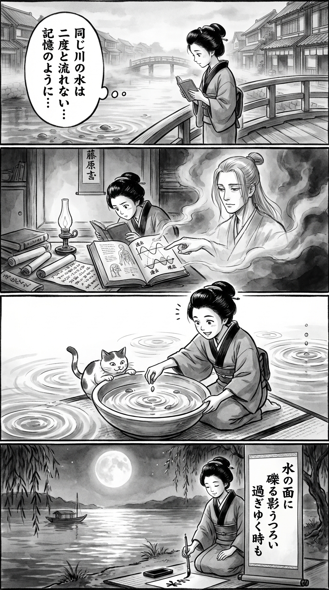

> **Language**: [日本語](../ja/水と礫_review.html) | [English](../en/水と礫_review.html) | [繁體中文](../zh-tw/水と礫_review.html)
>
> [← Top / トップページ](../../)

## 📖 Book Information
- **Title**: 水と礫  
- **Author**: 藤原無雨  
- **ASIN**: B08N4Z7WMT  
- **URL**: [https://www.amazon.co.jp/dp/B08N4Z7WMT](https://www.amazon.co.jp/dp/B08N4Z7WMT)  

---

<picture>
  <source srcset="../../images/reviews/水と礫_4panel.webp" type="image/webp">
  
</picture>

## Dialogue

### Panel 1
**Scene**: The townsgirl walks along a misty riverside at dawn in Edo, holding a small book. She pauses to gaze at the reflection of pebbles beneath the water, contemplating the idea that “the same river never flows twice.” The tranquil townscape and wooden bridges create a serene backdrop, evoking themes of memory and landscape.
**Dialogue**: "The same river never flows twice..."

### Panel 2
**Scene**: In her small study illuminated by an oil lamp, the townsgirl studies a Dutch science book and a philosophical scroll. A spectral figure resembling the book’s author, Fujiwara Muu, appears in the ink illustration, guiding her with a calm demeanor. He silently points to a diagram of overlapping waves labeled “past” and “present.”
**Dialogue**: [No dialogue]

### Panel 3
**Scene**: The townsgirl experiments by placing pebbles into a bowl of water, observing the ripples as they merge. A smile of realization spreads across her face as she sees the ripples overlap like generations and memories. A curious cat watches the water beside her, adding a touch of humor to the scene.
**Dialogue**: "They overlap like generations and memories."

### Panel 4
**Scene**: In the evening, she kneels by the riverside once more, brush in hand, writing a tanka on a hanging scroll as the moonlight reflects on the water. Her expression is serene, illuminated by the moonlight.
**Dialogue**: [No dialogue]
**Tanka (translation)**: "On the surface of the water, the pebbles shift, reflecting shadows. Even as time passes, it connects our souls."
**Tanka (original)**: 「  
水の面（も）に  
礫（つぶて）うつろい  
映る影  
過ぎゆく時も  
魂をつなぐ  
」

## 🎯 The Core of This Book
『水と礫』 is a work that depicts the memories of "landscape" and "soul" passed down through generations. Through the journeys of characters such as クザーノ, コイーバ, and ロメオ, the landscape functions not merely as a backdrop but as a spiritual medium connecting the past and present, as well as the dead and the living.

Conflicting themes such as life and death, faith and ethics, and father and son unfold like the folds of time. The author portrays the interconnectedness of existence beyond the individual through a skepticism of the very word "life."

This book poses a philosophical question to readers: rather than fearing death and loss, it is through "sharing the landscape" that one truly lives.

---

## 💡 Key Insights
- **The Landscape is the Memory of the Soul**  
  The landscape is not just a natural description but a layer of spirit passed down through generations. The landscapes shared by the characters function as a "connection of souls" that transcends individual death, allowing readers to feel the continuity of life and death.

- **Travel is a Cycle of Death and Rebirth**  
  As the metaphor suggests, "In the driest place in the world, new water renews old water," travel is a renewal of the self and a ritual of rebirth along the continuum of death. Through travel, the meaning of life is reexamined.

- **Ethics is More Human than Faith**  
  The relationship between the pastor and ほのか is depicted as morally transgressive yet an act of saving others. The author presents ethics as rooted in human relationships rather than in institutions or faith.

- **Time Overlaps Like Folds**  
  The entire narrative is characterized by a structure that does not perceive time linearly. The past and future overlap, with the grandfather's memories influencing the actions of the grandchild. Within the folds of time, the souls of generations resonate.

- **Skepticism Towards the Word "Life"**  
  The resistance to simplifying the world with the word "life" underlies this book. It presents the view that life exists only within the web of shared experiences with others and landscapes, rather than as an individual narrative.

---

## 🔍 Relevance to Contemporary Context
In modern society, the "loss of landscape" due to environmental pollution and climate change is becoming increasingly serious. 藤原無雨's depiction of "inheritance of landscape" resonates not just as a literary metaphor but as a realistic challenge of environmental memory restoration.

As scientific research progresses on how soil and water "remember" past weather and human activities, the motif of "landscape = record of the soul" in this book can be read as a new expression of environmental ethics. Protecting the landscape is not merely about preserving nature; it is also an act of safeguarding the continuity of the human soul.

Additionally, as haiku and poetry are being reevaluated internationally as a "language of harmony with nature," the poetic structure and ethical questions of this book contribute to the reconstruction of global perspectives on nature and life and death.

---

## 🚀 Suggestions for Practice
1. **Record Your Own Landscape**  
   Document everyday landscapes through photos or writing and share them with family and friends, allowing personal memories to remain in the souls of others. This is the first step in practicing "inheritance of landscape."

2. **Pause Before Using the Word "Life"**  
   When speaking about your life, recall "who you have shared landscapes with." This can shift your perspective from a self-centered view of life to one that lives within relationships.

3. **Approach Travel as Renewal**  
   View travel not as an escape but as an act of renewing the old self. When visiting new places, be conscious of what to let go of and what to inherit, transforming travel into a space for spiritual rebirth.

4. **Pass Down Family Memories**  
   By sharing family stories, connect past landscapes to the future. Storytelling transforms memories into landscapes, making them a part of the next generation's soul.

5. **Consider Ethics in Terms of Relationships**  
   Rather than relying on faith or institutions, think concretely about who your actions save and who they harm. Redefining ethics as something chosen within relationships aligns with the spirit of this book.

---

## ⭐ Overall Evaluation
『水と礫』 is a grand poetic narrative revolving around time, landscape, and soul, challenging readers with the fundamental question of "what it means to live." While philosophical, the vivid descriptions of landscapes and the emotions of the characters leave a profound stillness after reading.

The perspective of finding life within relationships with others, transcending individual death and loss, offers strong insights for today's isolated society. For readers interested in environmental issues, memory, and family stories, this book provides a rediscovery of the meaning of "sharing the landscape."

---

&copy; shioki | [CC BY-NC-SA 4.0](https://creativecommons.org/licenses/by-nc-sa/4.0/)
