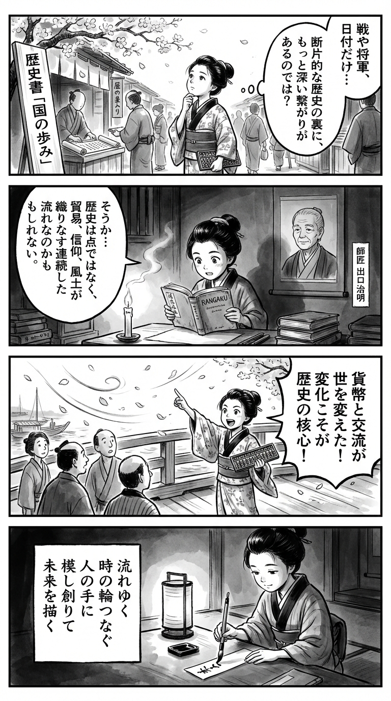

---
---
> **Language**: [日本語](../ja/治明-一気読み日本史_review.html) | [English](../en/治明-一気読み日本史_review.html) | [繁體中文](../zh-tw/治明-一気読み日本史_review.html)
>
> [← Top / トップページ](../../)

## 📖 Book Information
- **Title**: 一気読み日本史  
- **Author**: 出口 治明  
- **ASIN**: B0G6YZXHXQ  
- **URL**: [https://www.amazon.co.jp/dp/B0G6YZXHXQ](https://www.amazon.co.jp/dp/B0G6YZXHXQ)  

---

## Dialogue

### Panel 1
**Scene**: In the bustling Edo marketplace, the young townsgirl pauses before a scroll seller’s stall displaying “Chronicles of the Realm.” Cherry blossoms drift above as she wonders why history is told only through fragments—wars, shoguns, and dates—and whether a deeper thread connects it all. Around her, merchants call out and townsfolk trade under wooden signboards.  
**Dialogue**: “Is history only a list of battles and rulers… or is there something that binds it all together?”

### Panel 2
**Scene**: Inside a dimly lit temple school, she studies by candlelight. On the wall hangs a portrait of her imagined mentor, Prof. Deguchi Haruaki—an elderly scholar with calm eyes and simple robes. Reading a Dutch-bound book beside a Japanese chronicle, she begins to see history as a continuous flow shaped by trade, belief, and climate rather than isolated events.  
**Dialogue**: “Perhaps history moves like a river—its current shaped by many unseen forces.”

### Panel 3
**Scene**: By the Sumida River, she uses a merchant’s abacus to explain to curious townsfolk how the spread of coinage and exchange transformed society. A gust of wind scatters cherry petals as she gestures passionately, sleeves flowing, her excitement bridging past and present.  
**Dialogue**: “Change is the heart of history!”

### Panel 4
**Scene**: Night falls. By the soft glow of a paper lantern, she writes a waka poem on a tanzaku slip. The brush moves gracefully, her expression serene, reflecting the insight she has gained about continuity and transformation.  
**Dialogue**: (none)  
**Tanka (translation)**:  
Flowing through time,  
The circle of moments joined  
By human hands—  
Imitating creation,  
We sketch the world to come.  
**Tanka (original)**:  
「流れゆく  
時の輪つなぐ  
人の手に  
模し創りて  
未来を描く」

## 🎯 Core of the Book
*一気読み日本史* is an ambitious, comprehensive history that portrays Japan’s past—from the origins of the universe to the modern era—not as a series of breaks, but as a continuum of transformation. It traces the formation of the Japanese archipelago from the birth of the Earth and life itself, through the Jomon and Yayoi periods, and into ancient, medieval, early modern, and modern times. Throughout, it weaves together political, economic, religious, and climatic factors into an organic whole.  

Author 出口治明 emphasizes that Japan has always evolved through interaction with the outside world, offering fresh perspectives on Buddhism, the monetary economy, and the political roles of women. He underscores the importance of reading history as a “structure,” reconstructing Japanese history not as a list of dates to memorize but as an intellectual framework for understanding the mechanisms of social change.  

The book’s ultimate goal is not merely to know the past, but to cultivate the ability to *read change*—to use historical thinking as a tool for interpreting today’s world.  

---

## 💡 Key Insights
- **The Japanese people have diverse roots**  
  Genetically and culturally, the Japanese archipelago was shaped by the fusion of multiple ethnic groups, challenging the myth of a homogeneous nation. This perspective invites reflection on multicultural coexistence and identity in contemporary society.  

- **Buddhism was introduced as a “technology of governance”**  
  Rather than purely a matter of faith, Buddhism functioned as a system of statecraft. This redefines the relationship between religion and politics and highlights the structural power of ideas—an insight that resonates with modern governance theory.  

- **The monetary economy generated social dynamism**  
  The circulation of Song dynasty coins disrupted feudal hierarchies and revitalized society. The notion that economic systems drive political and cultural change is a universal principle that also applies to today’s digital economy.  

- **The medieval period was an “age of freedom”**  
  The coexistence of multiple power centers allowed commoners to choose which authority to align with. This pluralistic structure offers valuable parallels for thinking about decentralized societies and individual freedom today.  

- **History is a continuum of imitation and reconstruction**  
  Innovation builds upon inheritance rather than rupture. This perspective is key to understanding institutional and cultural evolution—and it offers lessons applicable to modern organizational reform and technological innovation.  

---

## 🔍 Relevance to the Modern Context
In recent years, there has been growing demand for learning history through thematic overviews, and this book stands at the forefront of that trend. 出口治明’s multidimensional approach—encompassing economics, warfare, religion, organization, and geopolitics—has drawn attention as a new form of cultural literacy for understanding business and international relations.  

Moreover, in an age of globalization and AI, the book’s argument that progress arises from “imitation and reconstruction” of past systems and cultures aligns closely with contemporary theories of innovation. By showing how knowledge of history can empower us to design the future, this work transcends the boundaries of conventional historical writing—it is a *future-oriented history book*.  

---

## 🚀 Suggestions for Practice
- **Develop the habit of reading history through structures**  
  Instead of focusing solely on events or individuals, pay attention to underlying factors such as climate, economy, and power structures to gain deeper insight into modern social change.  

- **Embrace external influences with flexibility**  
  Just as Japanese history evolved through cultural exchange, individuals and organizations can grow by actively absorbing knowledge from other cultures and disciplines.  

- **Adopt a mindset of “reconstruction” toward systems and customs**  
  Learn from past frameworks and adapt them to your own environment. Sustainable reform comes not from total originality, but from intelligent adaptation.  

- **Observe economic change as a mirror of society**  
  Just as the introduction of a monetary economy transformed society, understanding trends in digital currency and AI-driven economies can help anticipate the future.  

- **Reevaluate the historical role of female leaders**  
  Studying figures such as Empress Jitō and Empress Shōtoku—women who held central political power—encourages a rethinking of gender equality and leadership diversity today.  

---

## ⭐ Overall Evaluation
*一気読み日本史* serves as an intellectual map for interpreting history not as a record of the past, but as a *structure of change*. 出口治明’s lucid narrative and bold structural analysis give readers a new lens through which to understand the present through history.  

For those who wish to rediscover Japanese history as a form of cultural literacy, or to grasp the structural dynamics of economics and politics from a broader perspective, this book is an ideal introduction—and a powerful tool for updating one’s thinking.

---

&copy; shioki | [CC BY-NC-SA 4.0](https://creativecommons.org/licenses/by-nc-sa/4.0/)
