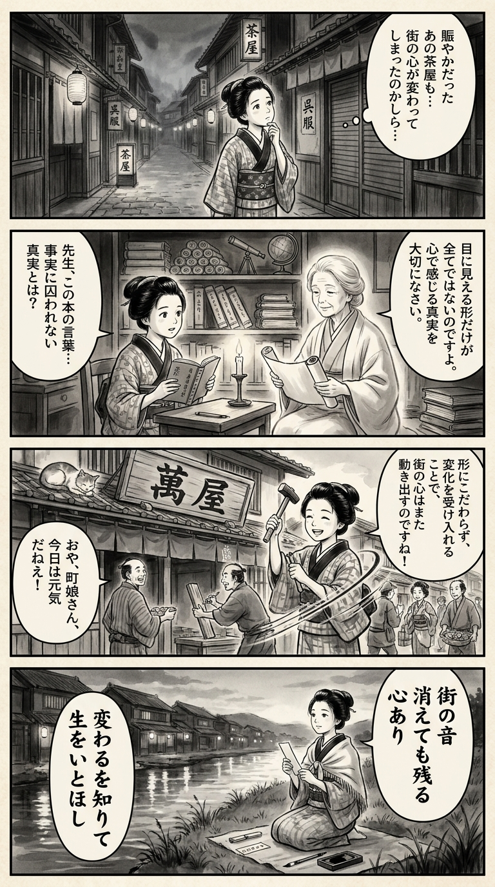

> **Language**: [日本語](../ja/私と街たち（ほぼ自伝）_review.html) | [English](../en/私と街たち（ほぼ自伝）_review.html) | [繁體中文](../zh-tw/私と街たち（ほぼ自伝）_review.html)
>
> [← Top / トップページ](../../)

## 📖 Book Information
- **Title**: 私と街たち（ほぼ自伝）  
- **Author**: 吉本ばなな  
- **ASIN**: B0FGHS9JPJ  
- **URL**: [https://www.amazon.co.jp/dp/B0FGHS9JPJ](https://www.amazon.co.jp/dp/B0FGHS9JPJ)  

---

<picture>
  <source srcset="../../images/reviews/私と街たち（ほぼ自伝）_4panel.webp" type="image/webp">
  
</picture>

## Dialogue

### Panel 1
**Scene**: The townsgirl strolls through a quiet Edo street at dusk, observing a once vibrant teahouse now closed. She pauses, tilting her head in contemplation, murmuring about how even streets can lose their "heart." The background features narrow alleys, lanterns, and aging wooden signs, creating a pensive yet gentle atmosphere.
**Dialogue**: "Even streets can lose their heart..."

### Panel 2
**Scene**: Inside a small study illuminated by candlelight, the townsgirl reads a mysterious imported book by a serene woman, imagined as the author Yoshimoto Banana. The teacher, depicted in simple robes with soft features, exudes warmth and quiet wisdom. Her expression conveys compassion as she speaks of "truth beyond fact." Surrounding them are shelves filled with scrolls and Dutch texts.
**Dialogue**: "There is truth beyond fact..."

### Panel 3
**Scene**: The following morning, the townsgirl greets her neighbors while helping to repair an old shop sign. Remembering the lesson about letting go of rigid attachments, she smiles, suggesting that freedom comes from embracing change. A cat dozes on the roof, and the townspeople resume their daily lives, revitalizing the street's "heart." Dynamic brush lines illustrate movement and renewal.
**Dialogue**: "Freedom lies in embracing change."

### Panel 4
**Scene**: At twilight, the townsgirl sits by the riverbank with her writing brush, composing a waka on a small tanzaku slip. The reflection of the town lights dances on the water. Her expression is serene, embodying acceptance of impermanence with quiet strength. The short poem encapsulates the essence of the book's message—truth, change, and gentle courage.
**Tanka (translation)**: "Even when the sounds of the town fade away, the heart remains. Knowing how to change, I cherish life."
**Tanka (original)**: 「  
街の音　  
消えても残る　  
心あり  
変わるを知りて  
生をいとほし  
」

## 🎯 The Core of This Book
『私と街たち（ほぼ自伝）』 is a work in which the author, 吉本ばなな, quietly reflects on her life while examining her relationships with cities, people, family, and creation. Although it is an autobiography, it is narrated as "fiction that feels autobiographical," maintaining a sincere distance between fact and story.

Through the changing landscapes of cities and the lives of people, the author depicts the fading memories of human warmth and community. At the same time, she delves into universal themes such as freedom and loneliness, aging and change, family and loss, with a gentle and transparent writing style.

This work is not merely a memoir; it is an attempt to reconstruct "the act of living" as literature, quietly posing the question of "how to live in the present" to the reader.

---

## 💡 Key Insights
- **Sincere Narration of "Fiction that Feels Autobiographical"**  
  Rather than depicting her life as it is, the author weaves it into a narrative with consideration for others. This attitude embodies a literary sincerity that values "truth" over mere "facts."

- **Resonance of Urban Change and Human Memory**  
  The decline of local shops and downtown culture is expressed as "the heart of the city stopping," illustrating the loss of human connections behind economic changes. Losing a city is akin to losing human memory.

- **Freedom is Letting Go of Attachments**  
  Symbolized by the phrase "only attachments kill freedom," the author advocates for the value of living without strain. Accepting aging and not fearing change demonstrates the beauty of maturity.

- **Redefining Family and Love**  
  The author describes the time spent raising children as "the best days of life," valuing life itself over creation. Through her relationships with family, she portrays the strength of humans in accepting the cycles of love and loss.

- **The Power of Literature and Renewal**  
  The reading experience described as "the world regained its colors" shows that literature has the power to restore life. It teaches that creation and reading are acts that lead to the renewal of life.

---

## 🔍 Connection to Contemporary Context
The themes of this book resonate deeply with the "urban loneliness" and "loss of place" in modern society. In the wake of the COVID-19 pandemic, as local shops and community ties decline, the metaphor of "the heart of the city stopping" depicted by 吉本ばなな is shared as a social reality.

Moreover, the author's stance of confronting society with her own words aligns with contemporary trends of re-examining gender norms. The "free yet lonely woman" portrayed by 吉本ばなな anticipates the struggles of modern individuals caught between self-expression and social solidarity.

Additionally, themes of family, care, loss, and recovery hold even more urgent significance today, as interest in mental health and diverse family structures rises. As a work that reconsiders the relationships between cities and people, individuals and society, this book remains relevant.

---

## 🚀 Practical Suggestions
1. **Maintain Small Courtesies**  
   Value everyday politeness, such as adding a kind word when visiting a shop introduced by a friend. Such actions can serve as the foundation of trust within the community.

2. **Let Go of Attachments to Become Free**  
   Obsession with perfection or past glories can bind the heart. By accepting change and going with the flow, a more flexible way of living becomes possible.

3. **Support Local Small Endeavors**  
   By utilizing local shops and businesses, one can help protect the "capillaries" of the city. It is important to cultivate an awareness of participating in the preservation of local culture through consumption.

4. **Consciously Choose to Rest**  
   Rather than boasting about busyness, intentionally set aside "perfect days off." Rest is a necessary condition for regaining creativity and happiness.

5. **Celebrate Aging and Change**  
   Incorporate the feeling of "just being alive is a great fortune" into daily life. Embracing change and savoring the present moment is a form of mature happiness.

---

## ⭐ Overall Evaluation
『私と街たち（ほぼ自伝）』 is a mature work written by the author at a turning point in her life, not to nostalgically reflect on the past, but to cherish the present. Her acceptance of changes in cities, people, family, and herself embodies a quiet strength and kindness.

This book is an essay directed towards those who feel lonely in the city, those who are bewildered by change, and anyone searching for their place. Through the words of 吉本ばなな, readers will be reminded of "the quiet courage of living."

---

&copy; shioki | [CC BY-NC-SA 4.0](https://creativecommons.org/licenses/by-nc-sa/4.0/)
