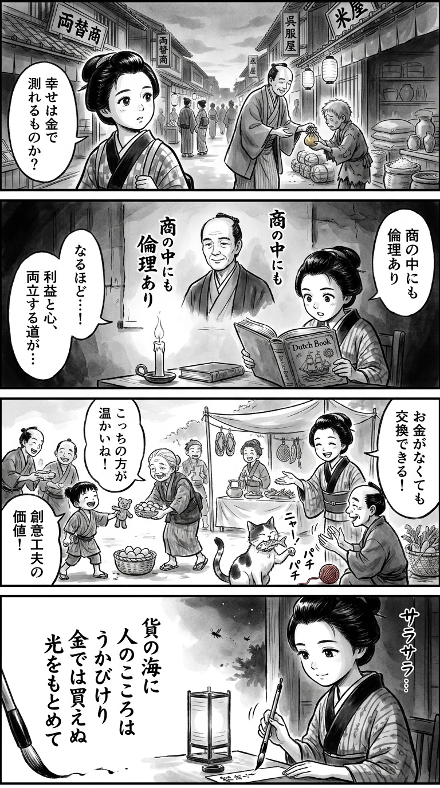

> **Language**: [日本語](../ja/資本主義の中で生きるということ_review.html) | [English](../en/資本主義の中で生きるということ_review.html) | [繁體中文](../zh-tw/資本主義の中で生きるということ_review.html)
>
> [← Top / トップページ](../../)

## 📖 Book Information
- **Title**: 資本主義の中で生きるということ  
- **Author**: 岩井克人  
- **ASIN**: B0DJ2C78R2  
- **URL**: [https://www.amazon.co.jp/dp/B0DJ2C78R2](https://www.amazon.co.jp/dp/B0DJ2C78R2)  

---

<picture>
  <source srcset="../../images/reviews/資本主義の中で生きるということ_4panel.webp" type="image/webp">
  
</picture>

## Dialogue

### Panel 1
**Scene**: The townsgirl walks through a bustling Edo marketplace, observing merchants exchanging coins and goods. She stops to gaze at a beggar child and a wealthy merchant bowing to each other, reflecting on the contrast between wealth and poverty. A soft question appears in her eyes: “Can money measure happiness?” The background features wooden signboards, narrow streets, and the serene evening light in ink wash tones.
**Dialogue**: “Can money measure happiness?”

### Panel 2
**Scene**: Inside a dimly lit terakoya, the townsgirl studies a Dutch book on trade and ethics. A portrait of a scholarly man with gentle eyes and a thoughtful expression hangs on the wall, imagined to resemble Iwai Katsuhito. He appears middle-aged, calm, dressed in traditional scholar’s robes, with a faint smile of introspection. His presence seems to whisper ideas about “ethics within commerce.” The girl’s eyes sparkle with realization.
**Dialogue**: [No dialogue]

### Panel 3
**Scene**: The townsgirl applies her learning by setting up a small exchange corner where villagers trade handmade goods without using coins, valuing creativity and kindness instead. Laughter fills the air as children and elders enjoy the moment. A humorous twist occurs when a cat “barters” a fishbone for a piece of red yarn, prompting applause from the crowd. The brushwork captures the lively movement and joyful energy of the scene.
**Dialogue**: [No dialogue]

### Panel 4
**Scene**: As night falls, the townsgirl sits by lantern light, brush in hand, writing a waka on a thin paper strip. Her expression is serene yet determined, focusing on the ink flow and the quiet sound of her brush. The short poem is displayed on the tanzaku.
**Dialogue**: [No dialogue]
**Tanka (translation)**: In the sea of goods,  
The heart of man floats freely,  
Seeking light that can't  
Be bought with gold or silver,  
A treasure beyond measure.  
**Tanka (original)**: 「貨の海に  
　人のこころは  
　うかびけり  
　金では買えぬ  
　光をもとめて」

## 🎯 Core of the Book
This book is a philosophical exploration of how humans can live "ethically" within the system of capitalism. 岩井克人 identifies the essence of capitalism in "difference" and "commerce," theoretically illustrating the transition from industrial capitalism to post-industrial capitalism.

The author redefines capitalism not merely as an economic structure but as a space for ethical and cultural self-reflection. He argues that within the harshness of the market lies the germ of human rights, and that "love" and "culture," which transcend the logic of money, support human freedom.

At its foundation is the question of how to realize the universal truth that "happiness cannot be bought with money" in contemporary society. The book's core is an intellectual attempt to bridge economics and ethics, institutions and freedom, individuals and society.

---

## 💡 Key Insights
- **Self-Critical Nature of Capitalism**  
  Capitalism is inherently self-alienating, thus containing the potential for self-criticism. Rather than eliminating contradictions, its structure encourages ethical reflection, enabling societal renewal.

- **Human Rights Emerging from the Market**  
  The paradox that the disparities and hierarchies created by market globalization can give rise to the idea of universal human rights is presented. Human rights are not generated externally but are ethical outcomes produced from within the market.

- **Freedom Created by Language, Law, and Money**  
  Humans are not merely biological beings; they gain freedom through external systems such as language, law, and money. Understanding these mediators is key to preserving human dignity.

- **Humans as the Main Actors in Post-Industrial Capitalism**  
  In an era where "values that cannot be bought with money," such as knowledge and creativity, shift to the center of the economy, human freedom and ethics become the new foundation of capitalism. The future of the economy hinges on how humans express themselves.

- **Ethical Role of Culture**  
  Culture transcends the boundaries of states and capital, enabling human freedom and dialogue. Art and literature function as the last bastion for maintaining ethical independence within capitalism.

---

## 🔍 Relevance to Contemporary Context
In contemporary society, AI and global capital are redefining human labor and value. 岩井's arguments directly address the fundamental challenge of how to maintain "human dignity" in such an era.

Particularly in today's "knowledge capitalism," where creativity and knowledge are central, the importance of human free will and ethics is increasing. The perspective of rediscovering human rights and ethics within the market serves as an ethical compass in an age accelerated by technology.

Moreover, the proposal to share universal values through culture and art provides significant insights for reconstructing the foundations of dialogue and coexistence in a globally divided society.

---

## 🚀 Practical Suggestions
1. **Reconsider the Economy from an Ethical Perspective**  
   Place the ethical principle that "happiness cannot be bought with money" at the center of economic activities, rather than focusing solely on profit and efficiency. This can restore human-centered values in economic policies and corporate management.

2. **Cultivate Human Rights within the Market**  
   Rather than simply denying market inequalities, strive to find the potential for human dignity within them. There are opportunities to deepen universal human rights awareness within the global economy.

3. **Expand Freedom through Institutions**  
   Understand societal institutions such as language, law, and money, and use them to contextualize oneself. Learning about institutions is an intellectual practice for expanding freedom.

4. **Create Organizations that Respect Creativity**  
   Fostering an environment where knowledge and creativity can flourish is key to post-industrial capitalism. Treating employees as "agents" rather than "capital" will determine future competitiveness.

5. **Engage in Cultural Dialogue**  
   Conduct ethical dialogues mediated by culture, transcending national borders and economic systems. This is the most realistic way to protect human freedom and dignity within capitalism.

---

## ⭐ Overall Evaluation
『資本主義の中で生きるということ』 is an intellectual adventure that attempts to redefine the ethics of capitalism while traversing economics, philosophy, and cultural studies. It is not merely a critique of capitalism but uniquely uncovers the possibilities of "freedom" and "ethics" that lie within it.

For readers who wish to stand at the intersection of economics and ethics, or for those seriously contemplating "values that cannot be bought with money," this book will provoke deep reflection. It offers a reading experience that prompts one to ponder what it means to live within capitalism.

---

&copy; shioki | [CC BY-NC-SA 4.0](https://creativecommons.org/licenses/by-nc-sa/4.0/)
