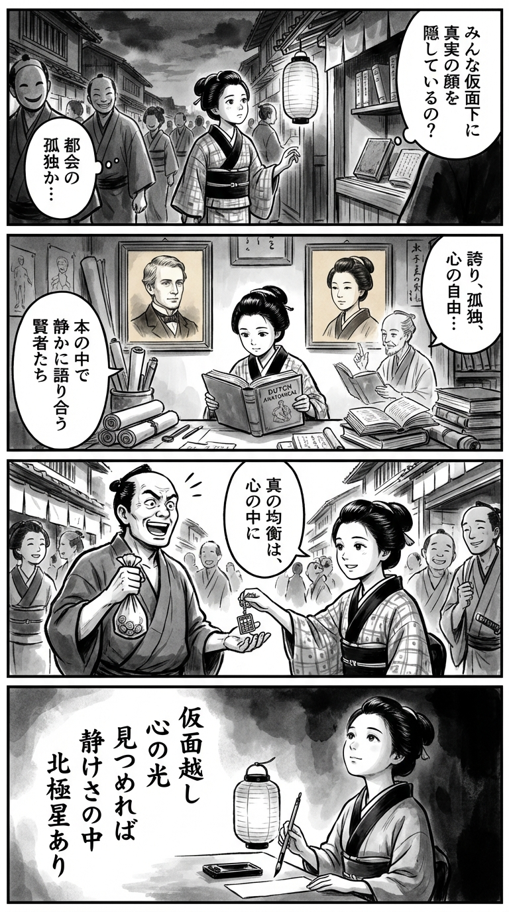

> **Language**: [日本語](../ja/賢者たちの街_review.html) | [English](../en/賢者たちの街_review.html) | [繁體中文](../zh-tw/賢者たちの街_review.html)
>
> [← Top / トップページ](../../)

## 📖 Book Information
- **Title**: 賢者たちの街  
- **Author**: エイモア トールズ and 宇佐川 晶子  
- **ASIN**: B08B3XSYYB  
- **URL**: [https://www.amazon.co.jp/dp/B08B3XSYYB](https://www.amazon.co.jp/dp/B08B3XSYYB)  

---

<picture>
  <source srcset="../../images/reviews/賢者たちの街_4panel.webp" type="image/webp">
  
</picture>

## Dialogue

### Panel 1
**Scene**: The townsgirl strolls through an Edo street at dusk, observing the bustling crowd behind their polite masks. She stops by a lantern-lit shop window, contemplating whether everyone hides their true selves behind a "social mask." The scene captures both the beauty and loneliness of the city, reflecting the book's theme of the "city of sages."
**Dialogue**: [No dialogue]

### Panel 2
**Scene**: In her small study filled with scrolls and foreign books, the townsgirl opens a Dutch text and a moral essay. A portrait of a foreign scholar resembling Amor Towles hangs on the wall, alongside a Japanese female scholar inspired by Asako Usagawa. They seem to engage in a silent conversation with her about pride, solitude, and inner freedom through the pages.
**Dialogue**: [No dialogue]

### Panel 3
**Scene**: Inspired, the townsgirl visits the marketplace. When a merchant boasts about his wealth, she gently shares her newfound insight by offering him a small handmade abacus charm, saying that "true balance is found within." The crowd chuckles softly, impressed by her cleverness, while dynamic brushstrokes convey her moral clarity amidst the lively chaos of Edo's streets.
**Dialogue**: "True balance is found within."

### Panel 4
**Scene**: At night, under a paper lantern, the townsgirl writes a waka poem on a strip of paper, her expression calm and radiant. The poem, written vertically beside her brush, reflects her inner thoughts.
**Dialogue**: [No dialogue]
**Tanka (translation)**: "If you gaze beyond the mask, you will find the light of the heart; within the stillness, the North Star shines."
**Tanka (original)**: 「仮面越し  
　心の光  
　見つめれば  
　静けさの中  
　北極星あり」

## 🎯 Core of the Book
『賢者たちの街』 is a work set in 1930s New York, depicting the loneliness and rebirth of people living under social masks. In the chaos following the Great Depression, the characters continue to search for their "true selves" within constraints of class, gender, and ethics.

The urban setting is portrayed as a place where glamour and emptiness, freedom and bondage intersect. Here, values such as love, pride, and intelligence are tested, prompting the characters to reevaluate their beliefs. Tolls quietly presents the importance of preserving inner sincerity and small happiness over superficial societal success.

---

## 💡 Key Insights
- **Humanity Behind the Masks**  
  Urban dwellers survive by playing social roles, but these masks deepen their loneliness. The perspective that sees through the superficiality of relationships resonates with insights relevant to today's social media society.

- **Pride and Social Traps**  
  While pride symbolizes independence, society seeks to exploit it. To protect one's values, it is essential to have an internal standard that does not depend on others' evaluations.

- **Intellectual Resistance of Women**  
  Katie's remark that "reading is the cheapest form of entertainment" illustrates that knowledge is a path to freedom. Intellectual activity serves as the quietest form of resistance against social constraints.

- **Value of Everyday Happiness**  
  The ability to find joy in ordinary daily life is what supports stability in life. The warning that underestimating small happiness is the first step toward ruin touches upon a universal truth.

- **Struggle Between Ethics and Desire**  
  The characters oscillate between love and ethics. The difficulty of maintaining conscience amidst desire elevates the story into a narrative of moral growth.

---

## 🔍 Relevance to Contemporary Context
The themes of "urban loneliness," "intellectual independence," and "social masks" in this book resonate sharply in the knowledge society of the AI era. In today's cities, social media and digital platforms serve as new "masks," obscuring individual identities.

Moreover, the "isolation of knowledge" faced by modern intellectuals and creators parallels the loneliness of the characters in this book. In an age where AI produces knowledge en masse, human sincerity and ethical judgment are once again being questioned. 『賢者たちの街』 should be reevaluated as a parable emphasizing the importance of not losing sight of one's inner "North Star" even in a world overwhelmed by technology.

---

## 🚀 Suggestions for Practice
1. **Consciously Savor Small Happiness**  
   Do not overlook the quiet joys in daily life. Finding value in a cup of coffee or time spent reading can foster mental stability.

2. **Define Your Own Pride**  
   Clarify your standards for pride that are not based on social success or others' approval. This is the first step toward mental freedom.

3. **Continue Intellectual Activities**  
   Dedicate time to deepen your thoughts through reading and reflection. Knowledge becomes an "inner capital" that is not swept away by societal currents.

4. **Do Not Fear Ethical Choices**  
   Have the courage to act based on conscience, rather than succumbing to external pressures or self-interest. Sincerity is the strongest defense.

5. **Seek Your North Star**  
   Do not leave your goals and ideals vague; clarify your life’s guiding principles. Even if you lose sight of them, the attitude of continuing to search supports the meaning of life.

---

## ⭐ Overall Evaluation
『賢者たちの街』 is a work that questions human sincerity and intelligence across time. The portrayal of characters living under social masks resonates deeply with modern urban dwellers.

This work does not present a glamorous tale of success or love but quietly challenges readers with ethical questions of "how to live" and "what to protect." For those who value inner sincerity or are weary of the clamor of modern society, this book will serve as a means to regain inner tranquility.

---

&copy; shioki | [CC BY-NC-SA 4.0](https://creativecommons.org/licenses/by-nc-sa/4.0/)
