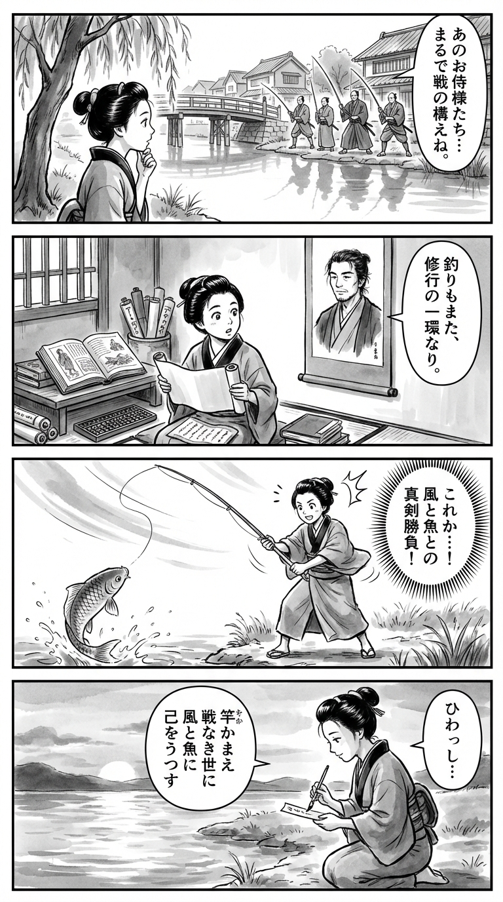

---
---
> **Language**: [日本語](../ja/釣り侍_review.html) | [English](../en/釣り侍_review.html) | [繁體中文](../zh-tw/釣り侍_review.html)
>
> [← Top / トップページ](../../)

## 📖 Book Information
- **Title**: 釣り侍  
- **Author**: 佐藤賢一  
- **ASIN**: B0GFCQQV29  
- **URL**: [https://www.amazon.co.jp/dp/B0GFCQQV29](https://www.amazon.co.jp/dp/B0GFCQQV29)  

---

## Dialogue

### Panel 1
**Scene**: Along the quiet riverside of Edo, the young townsgirl watches a group of idle samurai fishing with solemn concentration, their posture as disciplined as if they were on a battlefield. She tilts her head, fascinated by how seriously they treat such a peaceful pastime. The background shows willows swaying beside a wooden bridge, with Edo townhouses mirrored in the calm water.  
**Dialogue**: (thinking) “They fish as though waging war…”

### Panel 2
**Scene**: Back in her small study cluttered with scrolls and Dutch books, she reads a story by a dignified scholar resembling Sato Kenichi — a middle-aged man with calm eyes, unkempt hair tied back, and a rugged scholarly air. His portrait on a hanging scroll seems to speak to her, the ink lines radiating quiet wisdom.  
**Dialogue**: (from the portrait) “Fishing can be a form of discipline.”

### Panel 3
**Scene**: Inspired, the townsgirl goes to the riverbank to fish herself. She grips the rod with the stance of a swordsman; a gust of wind lifts her sleeve, and the line quivers. In that instant, she feels the same tension as in a duel. When a koi leaps from the water, she smiles, realizing that the true opponent is within her own heart.  
**Dialogue**: (thinking) “So this is the battle he meant…”

### Panel 4
**Scene**: At sunset, she kneels by the water, brush in hand, writing a waka poem on a small slip of paper. The rippling surface reflects her face as she softly recites her verse, capturing the spirit of what she has learned.  
**Dialogue**: (whispering) “To face the wind and the fish… is to face myself.”  
**Tanka (translation)**:  
Poised with my rod,  
In a world without war,  
I still take up challenge—  
In wind and in fish,  
I see my own reflection.  
**Tanka (original)**:  
竿かまえ  
戦なき世に  
なお挑む  
風と魚に  
己をうつす

## 🎯 Core of the Book
*釣り侍* portrays samurai living in an era of peace who seek to reclaim their pride through the seemingly tranquil act of fishing. The story revolves around the question of how a warrior can find meaning in a world without war.  

The protagonist, Maehara Matazaemon, regards fishing as a form of “battle” and spiritual training, disciplining himself as he faces nature. Themes of friendship, loyalty, family, and aging intertwine throughout the narrative, where quiet prose conceals fierce inner conflict.  

Through fishing, the novel redefines bushido, while also expressing a universal human truth: that to keep challenging oneself is to truly live. It is a masterful fusion of Sato Kenichi’s signature historical realism and philosophical insight.  

---

## 💡 Key Insights
- **Fishing as “Battle” and “Discipline”**  
  The idea of honing the samurai spirit through fishing is an attempt to restore the tension of battle to everyday life. The image of gripping a fishing rod as one would a sword symbolizes the vitality lost in times of peace.  

- **The Samurai’s Struggle in an Era of Peace**  
  The theme of how samurai preserve their pride in a world without war reflects the universal anguish of those who have lost their social roles. Fishing becomes both a ritual to fill that void and a means of self-affirmation.  

- **Balancing Aging and Challenge**  
  Even as Matazaemon loses the vigor of youth, his continued willingness to face challenges teaches the value of accepting aging while still striving forward. His persistence evokes a quiet sense of inspiration.  

- **Dialogue with Nature as a Mirror of Humanity**  
  Through his “battles” with the sea, wind, and fish, the story explores the limits of human power and reverence for nature. Rather than conquering nature, the novel advocates coexistence—a perspective that resonates with modern environmental awareness.  

- **Pride Amidst Absurdity**  
  The eccentric premise of “deciding a feudal lord through fishing” humorously exposes the absurdity of social systems, while highlighting the earnestness of those who live within them. The coexistence of pride and contradiction leaves a lasting impression.  

---

## 🔍 Connection to Contemporary Context
Through its historical setting, this novel tells a story of “loss and renewal of self” that resonates with modern readers. The samurai’s struggle in an age of peace mirrors the modern individual’s search for purpose in a stable yet unfulfilling society. Portraying fishing as a form of discipline offers insight into a lifestyle that seeks meaning in the everyday.  

Moreover, its vivid depiction of the Shonai domain, based on historical fact, aligns with current trends of revaluing local culture and returning to tradition. By reexamining the relationship between humans and nature through fishing, the novel speaks freshly to today’s growing environmental and slow-living sensibilities.  

---

## 🚀 Practical Takeaways
- **View Everyday Actions as “Discipline”**  
  By treating work or hobbies not merely as tasks but as opportunities for self-cultivation, one can bring greater depth to daily life. Like Matazaemon, straightening one’s “posture” is the first step toward regaining one’s inner compass.  

- **Make Time to Engage with Nature**  
  Whether through fishing or other quiet moments outdoors, spending time in nature helps organize emotions and reconstruct thoughts. Nature remains the best teacher for those seeking to rediscover themselves amid modern noise.  

- **Embrace Aging While Continuing to Challenge Yourself**  
  Rather than stopping because of age or circumstance, it’s vital to keep moving forward while accepting change. Viewing aging not as an “end” but as “maturity” enriches one’s life.  

- **Balance Pride with Flexibility**  
  Holding firm to one’s beliefs while adapting to changing times is essential. Matazaemon’s attitude serves as a guide for modern individuals navigating between tradition and reality.  

---

## ⭐ Overall Evaluation
*釣り侍* is a story of an “inner battle” told with serene yet powerful prose. Instead of grand battles or political intrigue, it captures the samurai’s soul and human pride through the act of fishing—showcasing Sato Kenichi’s refined literary mastery.  

Though a historical novel, it carries universal themes that deeply resonate with modern readers. For those seeking to rediscover a sense of “challenge” in everyday life or rekindle a quiet passion, this book will help you cast your line once more into the waters of the heart.

---

&copy; shioki | [CC BY-NC-SA 4.0](https://creativecommons.org/licenses/by-nc-sa/4.0/)
