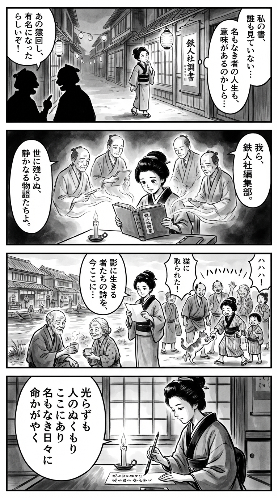

---
---
> **Language**: [日本語](../ja/鉄人社編集部-バズらない人生 ３００人それぞれの理由～調査ルポ この日本の片隅で_review.html) | [English](../en/鉄人社編集部-バズらない人生 ３００人それぞれの理由～調査ルポ この日本の片隅で_review.html) | [繁體中文](../zh-tw/鉄人社編集部-バズらない人生 ３００人それぞれの理由～調査ルポ この日本の片隅で_review.html)
>
> [← Top / トップページ](../../)

## 📖 Book Information
- **Title**: バズらない人生 ３００人それぞれの理由～調査ルポ この日本の片隅で  
- **Author**: 鉄人社編集部  
- **ASIN**: B0FT27H4VV  
- **URL**: [https://www.amazon.co.jp/dp/B0FT27H4VV](https://www.amazon.co.jp/dp/B0FT27H4VV)  

---

## Dialogue

### Panel 1
**Scene**: In a quiet Edo alley, the young townsgirl walks past merchants gossiping about who became famous after a street performance. She pauses, puzzled, gazing at her own calligraphy hanging unnoticed outside her home. Wooden houses and lanterns line the peaceful evening street. She wonders if a life unseen can still hold meaning.  
**Dialogue**: (thinking) “If no one sees it… does it still matter?”

### Panel 2
**Scene**: Inside her small study, lit by a single candle, she opens a Dutch-style bound book titled “Tetsujin-sha Records.” From its pages, the imagined figures of humble editors appear—spirits of chroniclers with ink-stained hands and thoughtful eyes. They represent a circle of storytellers who record the lives of the unnoticed. The townsgirl listens closely, her eyes shining with empathy.  
**Dialogue**: (softly) “So even quiet lives are worth recording…”

### Panel 3
**Scene**: The next morning by the riverside, she reads aloud a verse about “life in the shadows” to laborers, elders, and children. She shares tea with a lonely old man. A stray cat steals her rice ball, making everyone laugh—a fleeting but warm moment of connection in an overlooked corner of the city.  
**Dialogue**: (laughing) “Even the cat wants to join our story!”

### Panel 4
**Scene**: That night, she sits by the paper window, brush in hand, composing a waka that captures the spirit of what she learned. The candle flickers softly as she writes on a tanzaku strip of paper.  
**Dialogue**: (thinking) “To shine quietly… that is enough.”  
**Tanka (translation)**:  
“Though unseen, warmth of people still remains—  
In nameless days, life itself shines bright.”  
**Tanka (original)**:  
「光らずも　人のぬくもり　ここにあり  
　名もなき日々に　命かがやく」

## 🎯 Core of the Book
This book is a reportage that carefully gathers the voices of 300 people who have slipped through the cracks of the social values of “buzz” and “success” in the age of social media. What emerges are fragments of life that no one can avoid—poverty, loneliness, aging, loss, and small moments of happiness.  

Rather than focusing on sensational incidents or celebrities, the editorial team at 鉄人社 shines a light on “ordinary people” living on the margins of society. Their stories serve as a mirror reflecting the distortions of modern life, presenting the paradox that the truth of humanity lies precisely in what doesn’t “go viral.”  

At its heart, this book is a quiet ode to human existence—making visible the struggles everyone carries, while showing that people continue to live on, holding onto small pieces of pride and hope.  

---

## 💡 Key Insights
- **“Normal” and “Success” Are Illusions**  
  The book reveals how fragile society’s standards of “success” really are, and how easily anyone can fall from them. Even when we seek stability, life rarely goes as planned. Accepting that uncertainty is the wisdom needed to survive today.  

- **Loneliness Creeps In Quietly**  
  The breakdown of human relationships doesn’t happen through dramatic separations but through gradual distance. This highlights the importance of consciously maintaining small, everyday connections.  

- **Human Dignity Persists in Any Circumstance**  
  Even in the voices of the homeless or the elderly, humor and pride remain alive. At the very bottom of society, in laughter, conversation, and the will to live, lies the essence of what it means to be human.  

- **Truth Resides in the “Unviral”**  
  Happiness doesn’t come from social media attention. Rather, it hides quietly in the unnoticed corners of daily life—in the ordinary moments no one sees.  

- **Awareness of Death Illuminates the Meaning of Life**  
  By imagining the end, we are forced to reconsider with whom, where, and how we want to live. The awareness of death paradoxically becomes a light that reveals the value of life.  

---

## 🔍 Connection to Contemporary Context
Looking at publishing trends from 2024 to 2025, there’s a clear shift toward embracing a life that doesn’t “go viral.” People exhausted by social media fatigue and the endless pursuit of approval are beginning to seek “quiet happiness” and “modest fulfillment.”  

Other works from 鉄人社, such as *『後ろ向き名言100選』* and *『鳥貴族で飲める友人が1人いれば人生は勝ったようなもの』*, also symbolize this cultural shift.  

This book captures that emerging mood, empirically illustrating the value found in a “non-viral life.” The voices of those living in rural or marginalized areas will deeply resonate with readers weary of urban, success-driven ideals, offering both empathy and solace.  

---

## 🚀 Suggestions for Practice
- **Don’t Postpone Meeting the People You Want to See**  
  Many interviewees regret not reaching out sooner. Recognizing life’s finitude and acting without delay leads to a life with fewer regrets.  

- **Don’t Fear Loneliness—Cherish Small Connections**  
  Simple interactions, like chatting at a soup kitchen or in a park, can sustain life. Rather than avoiding loneliness, we should consciously nurture small ties with others.  

- **Define “Normal” and “Success” for Yourself**  
  The more we conform to others’ standards, the more painful life becomes. Reflecting on what a “good life” means to you is the first step toward reclaiming inner freedom.  

- **Have the Courage to Ask for Help**  
  Speaking up when you’re cornered is not shameful. Seeking help is not weakness—it’s an act of strength and a will to keep living.  

- **Savor the Small Joys of Everyday Life**  
  Instead of chasing grand success, notice the small pleasures in daily life. The aroma of coffee or the color of the sunset can enrich the quality of your days.  

---

## ⭐ Overall Evaluation
*バズらない人生* is a quiet, sincere record of human lives far removed from flashy success stories. It captures both the pain everyone carries and the tenacity to keep living despite it.  

This is a book for those exhausted by the noise of social media or those who have lost sight of life’s meaning. After reading, what lingers is not the emptiness of comparison, but a quiet question in your heart: “How do I want to live my own life?”

---

&copy; shioki | [CC BY-NC-SA 4.0](https://creativecommons.org/licenses/by-nc-sa/4.0/)
