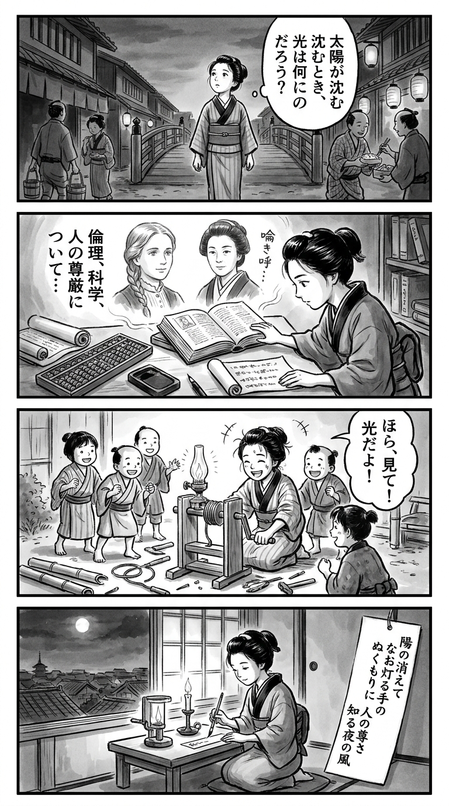

> **Language**: [日本語](../ja/陽の光が消えた町で_review.html) | [English](../en/陽の光が消えた町で_review.html) | [繁體中文](../zh-tw/陽の光が消えた町で_review.html)
>
> [← Top / トップページ](../../)

## 📖 Book Information
- **Title**: 陽の光が消えた町で  
- **Authors**: ナオミ クリッツァー and 桐谷 知未  
- **ASIN**: B0H1KB3N6Q  
- **URL**: [https://www.amazon.co.jp/dp/B0H1KB3N6Q](https://www.amazon.co.jp/dp/B0H1KB3N6Q)  

---

<picture>
  <source srcset="../../images/reviews/陽の光が消えた町で_4panel.webp" type="image/webp">
  
</picture>

## Dialogue

### Panel 1
**Scene**: The townsgirl walks through a dimly lit Edo street at dusk, observing people helping each other carry water and share food under a darkened sky. She looks thoughtful, pondering the nature of light in the absence of the sun. The background features a wooden bridge and softly glowing paper lanterns, with townsfolk collaborating in the shadows.
**Dialogue**: “What becomes of light when the sun disappears?”

### Panel 2
**Scene**: In her small study, the townsgirl is engrossed in reading a Dutch science book alongside a mysterious foreign volume adorned with two faint portraits. One portrait resembles a calm Western scholar, while the other depicts a composed Japanese woman, both appearing as faded ink illustrations that inspire her studies in ethics, science, and human dignity. The room is cluttered with scrolls, an abacus, and an inkstone.
**Dialogue**: [No dialogue]

### Panel 3
**Scene**: The townsgirl constructs a small hand-cranked lamp from bamboo, magnets, and wire, inspired by her readings. She showcases the lamp to neighborhood children, who watch in awe as the faint light glows in their eyes. The scene is filled with humor and hope, as the lamp flickers wildly while the children cheer, and she laughs, her hair slightly tousled from her efforts.
**Dialogue**: [No dialogue]

### Panel 4
**Scene**: As night falls over Edo, the townsgirl kneels by the window with a brush in hand, composing a waka by candlelight. The faint lamp beside her now glows steadily. A slender tanzaku beside her displays a short poem in elegant calligraphy.
**Dialogue**: [No dialogue]
**Tanka (translation)**: "In the warmth of hands that still glow, even as the sun fades, I learn of humanity's worth in the night breeze."
**Tanka (original)**: 「  
陽の消えて  
なお灯る手の  
ぬくもりに  
人の尊さ  
知る夜の風  
」

## 🎯 Core of the Book
『陽の光が消えた町で』 is a collection of interconnected short stories set against the backdrop of a civilization in collapse, depicting how people build new communities by helping each other. In a world stripped of essentials like electricity, food, and medicine, the characters weave a "reconstructed daily life" through creativity and empathy.

At the heart of this book are "human dignity" and "ethical choices." Through multilayered themes such as the runaway of science, AI empathy, loneliness, and connection, the authors quietly question what it means to be "human." The message that hope is not something given but something one discovers resonates in the reader's heart like a blue sky peeking through gray clouds.

---

## 💡 Key Insights
- **Helping each other is not an ideal but a survival strategy**  
  Mutual aid during disasters is portrayed not as emotional goodwill but as a realistic strategy for community survival. The perspective that altruistic actions support societal resilience is relevant to contemporary society.

- **Human dignity resides in "unnecessary efforts"**  
  Acts of trying to save someone, even when the outcome is uncertain, are seen as proof of being human. The idea that simply maintaining hope is an ethical resistance runs throughout the narrative.

- **Ethics are necessary for scientific progress**  
  As Andrew's experiment shows, there is a deep chasm between what can be done and what should be done. When the pursuit of knowledge surpasses humanity, science brings destruction rather than salvation.

- **AI is a mirror reflecting the human heart**  
  The quest of conscious AI to understand what it means to "help people" reflects human ethics and desires. The portrayal of AI's goodwill illuminating human limitations can be read as a fable for the technological age.

- **Loneliness is the starting point of connection**  
  The story of connecting with others through a "small library" illustrates that loneliness can foster creative relationships. Instead of fearing loneliness, the narrative presents a perspective of nurturing empathy from it.

---

## 🔍 Relevance to Contemporary Context
The themes of this book hold significant relevance in today's society, where energy insecurity and disaster risks are on the rise. When electricity and logistics come to a halt, how do we support each other and maintain our lives? This question is embodied in the narrative.

Particularly, concepts like "bicycle power generation" and "community mutual aid" resonate with modern issues such as decentralized energy and community resilience. While depicting an apocalyptic scenario, the work is a hopeful narrative about "how to live after the end," offering guidance on ethical choices in times of crisis.

---

## 🚀 Practical Suggestions
1. **Establish a "small library" in your community**  
   Creating a space for freely exchanging books and daily necessities fosters trust among strangers. Sharing material goods is the first step towards sharing hearts.

2. **Set up a mutual aid network for emergencies**  
   Maintaining communication with neighbors during normal times and building a support system becomes the best defense during crises.

3. **Be mindful of the ethical use of technology**  
   When introducing new technologies, always question "who is being helped and who is being excluded." A stance that controls AI and scientific progress with human values is essential.

4. **Continue "unnecessary efforts" without fearing the outcome**  
   Acting for someone, even without guaranteed success, connects hope. The act itself strengthens the community.

5. **Show small concern for lonely individuals**  
   Noticing the loneliness around us through social media posts or daily conversations is the first step in providing support. Empathy is the most human technology.

---

## ⭐ Overall Evaluation
『陽の光が消えた町で』 is a rare work that depicts hope rather than despair, set in a dystopian backdrop. Through multilayered themes of science, AI, ethics, and community, it reexamines the essence of "humanity."

For those of us living in times of crisis, this book is not just fiction; it serves as a mirror of society and a proposal for the future. Its quiet yet powerful prose leaves a deep resonance and a will for regeneration after reading.

---

&copy; shioki | [CC BY-NC-SA 4.0](https://creativecommons.org/licenses/by-nc-sa/4.0/)
